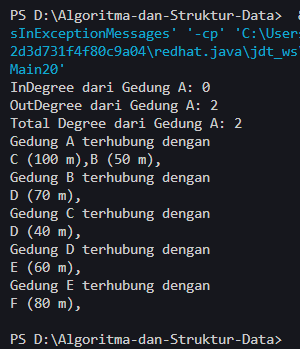

# <p align ="center"> LAPORAN PRAKTIKUM ALGORITMA DAN STRUKTUR DATA </p>

<br><br><br><br>

<p align="center">
    </p>

<br><br><br><br><br>

<p align = "center"> Nama : Muhammad Irsyad Dimas Abdillah </p>
<p align = "center"> Absen: 20 </p>
<p align = "center"> NIM  : 2341720088 </p>
<p align = "center"> Prodi: TEKNIK INFOMATIKA</p>
<p align = "center"> Kelas: 1B </p>

<br><br><br>

# Praktikum 1: Implementasi Graph menggunakan Linked List

Code<br>

```java
package JobsheetXIIGraph;

public class Node20 {
    int data;
    Node20 prev, next;
    int jarak;

    Node20(Node20 prev, int data, int jarak, Node20 next) {
        this.prev = prev;
        this.data = data;
        this.next = next;
        this.jarak = jarak;
    }
}

```

```java
package JobsheetXIIGraph;

public class DoubleLinkedList20 {
    Node20 head;
    int size;

    public DoubleLinkedList20() {
        head = null;
        size = 0;
    }

    public boolean isEmpty() {
        return head == null;
    }

    public int size() {
        return size;
    }

    public void clear() {
        head = null;
        size = 0;
    }

    public void addFirst(int item, int jarak) {
        if (isEmpty()) {
            head = new Node20(null, item, jarak, null);
        } else {
            Node20 newNode20 = new Node20(null, item, jarak, head);
            head.prev = newNode20;
            head = newNode20;
        }
        size++;
    }

    public int getJarak(int index) throws Exception {
        if (isEmpty() || index >= size) {
            throw new Exception("Nilai indeks di luar batas");
        }
        Node20 tmp = head;
        for (int i = 0; i < index; i++) {
            tmp = tmp.next;
        }
        return tmp.jarak;
    }

    public void remove(int index) {
        Node20 current = head;
        while (current != null) {
            if (current.data == index) {
                if (current.prev == null) { // current is the head node
                    head = current.next; // move head to the next node
                    if (head != null) {
                        head.prev = null;
                    }
                } else {
                    current.prev.next = current.next;
                    if (current.next != null) {
                        current.next.prev = current.prev;
                    }
                }
                size--;
                break;
            }
            current = current.next;
        }
    }

    public int get(int index) throws Exception {
        if (isEmpty() || index >= size) {
            throw new Exception("Nilai indeks di luar batas");
        }
        Node20 tmp = head;
        for (int i = 0; i < index; i++) {
            tmp = tmp.next;
        }
        return tmp.data;
    }
}
```

```java
package JobsheetXIIGraph;

public class Graph20 {
    int vertex;
    DoubleLinkedList20[] list;

    public Graph20(int v) {
        vertex = v;
        list = new DoubleLinkedList20[v];
        for (int i = 0; i < vertex; i++) {
            list[i] = new DoubleLinkedList20();
        }
    }

    public void addEdge(int asal, int tujuan, int jarak) {
        list[asal].addFirst(tujuan, jarak);
    }

    public void degree(int asal) throws Exception {
        int totalIn = 0, totalOut = 0;
        for (int i = 0; i < vertex; i++) {
            // inDegree
            for (int j = 0; j < list[i].size(); j++) {
                if (list[i].get(j) == asal) {
                    totalIn++;
                }
            }
            // out degree
            if (i == asal) {
                totalOut = list[i].size();
            }
        }
        System.out.println("InDegree dari Gedung " + (char) ('A' + asal) + ": " + totalIn);
        System.out.println("OutDegree dari Gedung " + (char) ('A' + asal) + ": " + totalOut);
        System.out.println("Total Degree dari Gedung " + (char) ('A' + asal) + ": " + (totalIn + totalOut));
    }

    public void removeEdge(int asal, int tujuan) throws Exception {
        for (int i = 0; i < vertex; i++) {
            if (i == tujuan) {
                list[asal].remove(tujuan);
            }
        }
    }

    public void removeAllEdges(int asal) throws Exception {
        for (int i = 0; i < vertex; i++) {
            list[i].clear();
        }
        System.out.println("Graph berhasil dikosongkan");
    }

    public void printGraph() throws Exception {
        for (int i = 0; i < vertex; i++) {
            if (list[i].size() > 0) {
                System.out.println("Gedung " + (char) ('A' + i) + " terhubung dengan ");
                for (int j = 0; j < list[i].size(); j++) {
                    System.out.print((char) ('A' + list[i].get(j)) + " (" + list[i].getJarak(j) + " m),");
                }
                System.out.println(" ");
            }
        }
        System.out.println(" ");
    }
}
```

```java
package JobsheetXIIGraph;

public class GraphMain20 {
    public static void main(String[] args) {
        Graph20 gedung = new Graph20(6);
        gedung.addEdge(0, 1, 50);
        gedung.addEdge(0, 2, 100);
        gedung.addEdge(1, 3, 70);
        gedung.addEdge(2, 3, 40);
        gedung.addEdge(3, 4, 60);
        gedung.addEdge(4, 5, 80);

        try {
            gedung.removeEdge(1, 3);
            gedung.printGraph();
        } catch (Exception e) {
            e.printStackTrace();
        }
    }
}

```

Output Langkah 14<br>  <br> Output Langkah 17 <br> 

## Pertanyaan

1. Perbaiki kode program Anda apabila terdapat error atau hasil kompilasi kode tidak sesuai! <br>
   Jawab: Output error setelah melakukan run pada langkah 17 <br> <br> Hal tersebut karena ada kesalahan pada methods remove pada class DoubleLinkedList20.java. Dibawah ini adalah perbaikan kodenya: <br>

```java
    public void remove(int index) {
        Node20 current = head;
        while (current != null) {
            if (current.data == index) {
                if (current.prev == null) {
                    head = current.next;
                    if (head != null) {
                        head.prev = null;
                    }
                } else {
                    current.prev.next = current.next;
                    if (current.next != null) {
                        current.next.prev = current.prev;
                    }
                }
                size--;
                break;
            }
            current = current.next;
        }
    }
```

2. Pada class Graph, terdapat atribut list[] bertipe DoubleLinkedList. Sebutkan tujuan pembuatan variabel tersebut! <br>
   Jawab: tujuan dari pembuatan variabel DoubleLinkedList[] list; adalah untuk menyimpan dan mengelola adjacency list dalam representasi graf. <br>
3. Jelaskan alur kerja dari method removeEdge! <br>
   Jawab: Pertama methods ini menerima 2 parameter asal dan tujuan untuk menghapus edge yang ingin dihapus. Kemudian di dalam loop, ada pengecekan kondisi if (i == tujuan). Kondisi ini memeriksa apakah i sama dengan tujuan. Jika kondisi if terpenuhi (yaitu, i sama dengan tujuan), maka metode remove dari list[asal] dipanggil dengan parameter tujuan. Ini berarti edge dari asal ke tujuan akan dihapus dari daftar adjacency (adjacency list) vertex asal.<br>
4. Apakah alasan pemanggilan method addFirst() untuk menambahkan data, bukan method add jenis lain saat digunakan pada method addEdge pada class Graph? <br>
   Jawab: penggunaan addFirst dinilai lebih cepat dan efisien dibanding dengan method add, karena biasanya pada graph tidak memperdulikan urutan dari sebuah simpul dalam list. <br>
5. Modifikasi kode program sehingga dapat dilakukan pengecekan apakah terdapat jalur antara suatu node dengan node lainnya, seperti contoh berikut (Anda dapat memanfaatkan Scanner). <br>
   Jawab: pada program ini saya menambahkan method checkbertetangga untuk melakukan check jika gedung bertetangga atau tidak.

```java
    public void checkBertentangga(Graph20 graph, int asal, int tujuan) {
        boolean bertetangga = false;
        try {
            for (int i = 0; i < graph.list[asal].size(); i++) {
                if (graph.list[asal].get(i) == tujuan) {
                    bertetangga = true;
                    break;
                }
            }
            if (bertetangga) {
                System.out.println(
                        "Gedung " + (char) ('A' + asal) + " dan Gedung " + (char) ('A' + tujuan) + " bertetangga");
            } else {
                System.out.println("Gedung " + (char) ('A' + asal) + " dan Gedung " + (char) ('A' + tujuan)
                        + " tidak bertetangga.");
            }
        } catch (Exception e) {
            System.out.println(e.getMessage());
        }
    }
```

<br> OUTPUT <br><br>

# Praktikum 2: Implementasi Graph menggunakan Matriks

Code<br>

```java
package JobsheetXIIGraph;

public class GraphMatriks20 {
    int vertex;
    int[][] matriks;

    public GraphMatriks20(int v) {
        vertex = v;
        matriks = new int[v][v];
    }

    public void makeEdge(int asal, int tujuan, int jarak) {
        matriks[asal][tujuan] = jarak;
    }

    public void removeEdge(int asal, int tujuan) {
        matriks[asal][tujuan] = -1;
    }

    public void printGraph() {
        for (int i = 0; i < vertex; i++) {
            System.out.println("Gedung " + (char) ('A' + i) + ": ");
            for (int j = 0; j < vertex; j++) {
                if (matriks[i][j] != -1) {
                    System.out.print("Gedung " + (char) ('A' + j) + " (" + matriks[i][j] + " m), ");
                }
            }
            System.out.println();
        }
    }
}
```

Output<br>

## Pertanyaan

1. Perbaiki kode program Anda apabila terdapat error atau hasil kompilasi kode tidak sesuai! <br>
   Jawab: program tidak memiliki kesalahan, hasil kompilasi benar saat dilakukan verifikasi. <br>
2. Apa jenis graph yang digunakan pada Percobaan 2?<br>
   Jawab: kode program diatas merupakan directed weighted graph yang direpresentasikan menggunakan adjancency matrix. Menggunakan directed graph karena edge dibuat satu arah pada method makeEdge. Weighted graph karena ada bobot pada setiap edge yang ditambahkan. <br>
3. Apa maksud dari dua baris kode berikut?<br>

```java
gdg.makeEdge(1,2,70);
gdg.makeEdge(2,1,80);
```

Jawab: kode 'gdg.makeEdge(1,2,70)' merupakan kode untuk membuat edge dari vertex 1 ke 2 dengan bobot(jarak) 70. sedangkan pada kode baris ke dua membuat edge dari vertex 2 ke 1 dengan bobot(80). Kedua program sama membuat edge tetapi memiliki arah yang berbeda. <br> 4. Modifikasi kode program sehingga terdapat method untuk menghitung degree, termasuk inDegree dan outDegree!<br>
Jawab:

```java
    public int inDegree(int vertex) {
        int inDegree = 0;
        for (int i = 0; i < this.vertex; i++) {
            if (matriks[i][vertex] != -1) {
                inDegree++;
            }
        }
        return inDegree;
    }

    public int OutDegree(int vertex) {
        int outDegree = 0;
        for (int i = 0; i < this.vertex; i++) {
            if (matriks[vertex][i] != -1) {
                outDegree++;
            }
        }
        return outDegree;
    }

    public int totalDegree(int vertex) {
        return inDegree(vertex) + OutDegree(vertex);
    }
```

<br> OUTPUT <br>

# Latihan Praktikum

1. Modifikasi kode program pada class GraphMain sehingga terdapat menu program yang bersifat dinamis, setidaknya terdiri dari: <br>
   a) Add Edge <br>
   b) Remove Edge <br>
   c) Degree <br>
   d) Print Graph <br>
   e) Cek Edge <br>
   Pengguna dapat memilih menu program melalui input Scanner <br>
   Jawab: terdapat methods baru untuk cek degree<br>

```java
   public int inDegree(int vertex) {
        int inDegree = 0;
        try {
            for (int i = 0; i < this.vertex; i++) {
                for (int j = 0; j < list[i].size(); j++) {
                    if (list[i].get(j) == vertex) {
                        inDegree++;
                        break;
                    }
                }
            }
        } catch (Exception e) {
            System.out.println(e.getMessage());
        }
        return inDegree;
    }

    public int outDegree(int vertex) {
        return list[vertex].size();
    }

    public int totalDegree(int vertex) {
        return inDegree(vertex) + outDegree(vertex);
    }

```

OUTPUT <br>  <br> 2. Tambahkan method updateJarak pada Percobaan 1 yang digunakan untuk mengubah jarak antara dua node asal dan tujuan! <br>
jawab: <br>

```java
   public void updateJarak(int asal, int tujuan, int jarakBaru) {
        try {
            int index = -1;
            // Mencari index tujuan di dalam list[asal]
            for (int i = 0; i < list[asal].size(); i++) {
                if (list[asal].get(i) == tujuan) {
                    index = i;
                    break;
                }
            }
            if (index != -1) {
                // Update jarak
                list[asal].setJarak(index, jarakBaru);
                System.out.println("Jarak antara Gedung " + (char) ('A' + asal) + " dan Gedung " + (char) ('A' + tujuan)
                        + " berhasil diupdate menjadi " + jarakBaru + " m");
            } else {
                System.out.println(
                        "Gedung " + (char) ('A' + asal) + " tidak terhubung dengan Gedung " + (char) ('A' + tujuan));
            }
        } catch (Exception e) {
            System.out.println(e.getMessage());
        }
    }
```

Output<br> <br> 3. Tambahkan method hitungEdge untuk menghitung banyaknya edge yang terdapat di dalam graf! <br>
jawab: <br>

```java
 public int hitungEdge() {
        int totalEdge = 0;
        for (int i = 0; i < vertex; i++) {
            totalEdge += list[i].size();
        }
        return totalEdge;
    }
```

OUTPUT <br>
