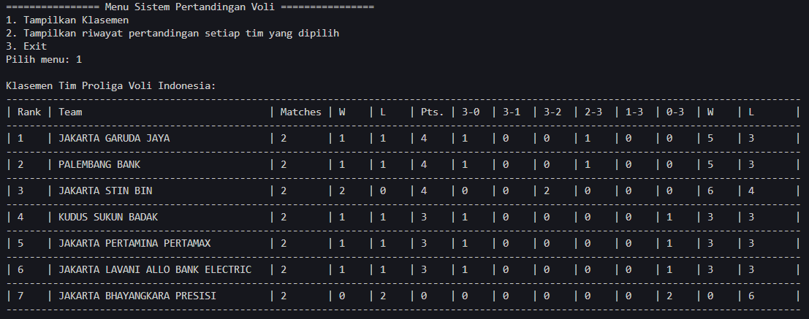

# 
 LAPORAN KUIS 2 ALGORITMA DAN STRUKTUR DATA 

    

    

     

 Nama : Muhammad Irsyad Dimas Abdillah 

 Absen: 20 

 NIM  : 2341720088 

 Prodi: TEKNIK INFOMATIKA

 Kelas: 1B 

   

# Deskripsi Program

Ini merupakan program yang berfungsi untuk menghitung setiap poin dari tim berdasarkan Win Lose sebuah tim.  

# Sistem Perhitungan Poin

Poin dihitung berdasarkan Set Win-Lose setiap tim. Dibawah ini adalah perolehan poinnya:  

1. jika Win 3-0 atau 3-1, maka mendapatkan +3 poin.  
2. jika Win 3-2, maka mendapatkan +2 poin.  
3. jika Lose 2-3, maka mendapatkan +1 poin. 
4. jika Lose 1-3 atau 0-3, maka mendapat +0 poin.  

# Output Kode Program

## Memasukkan data pertandingan setiap tim

           

## Melihat Klasemen Setiap Tim yang Sudah Bermain

  

## Melihat data atau riwayat pertandingan setiap tim

             
