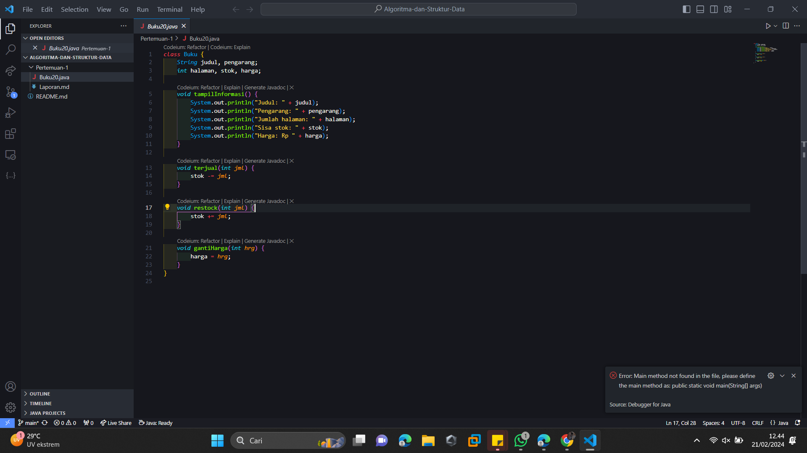
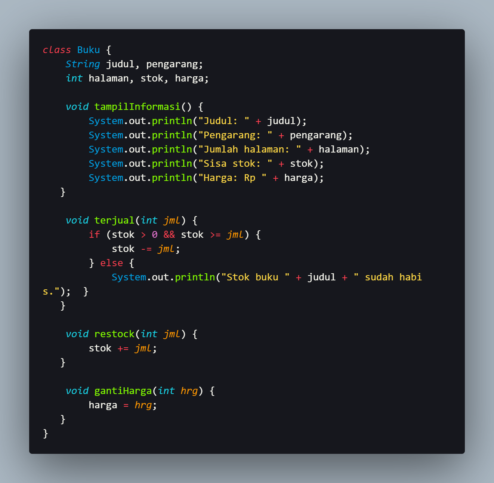
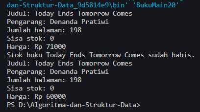
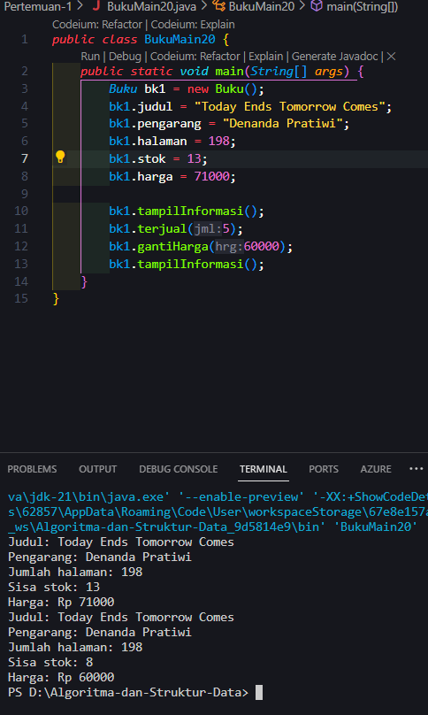
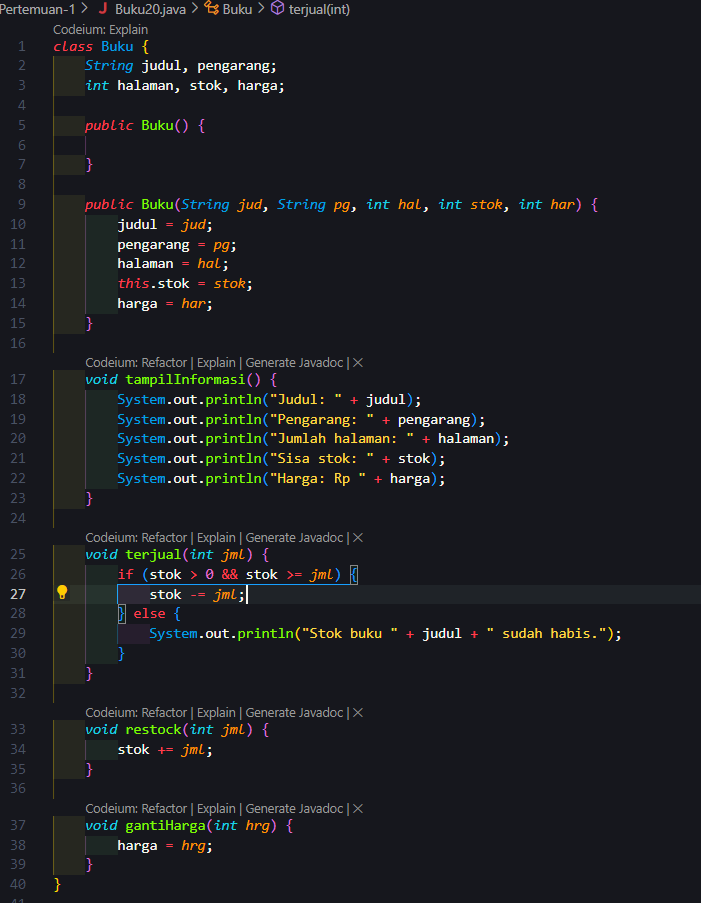
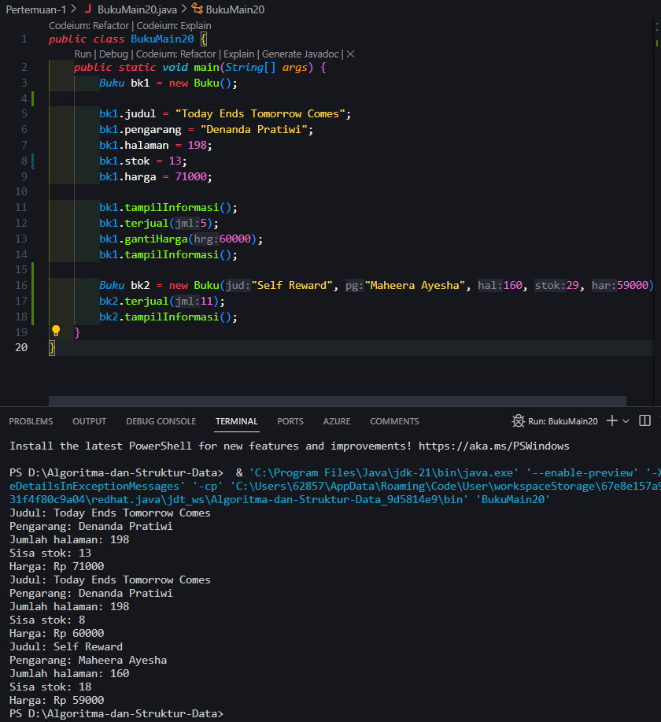
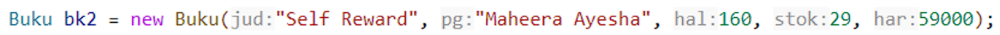
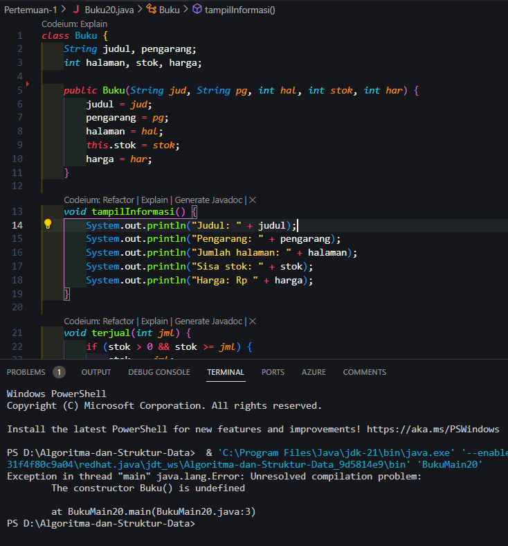
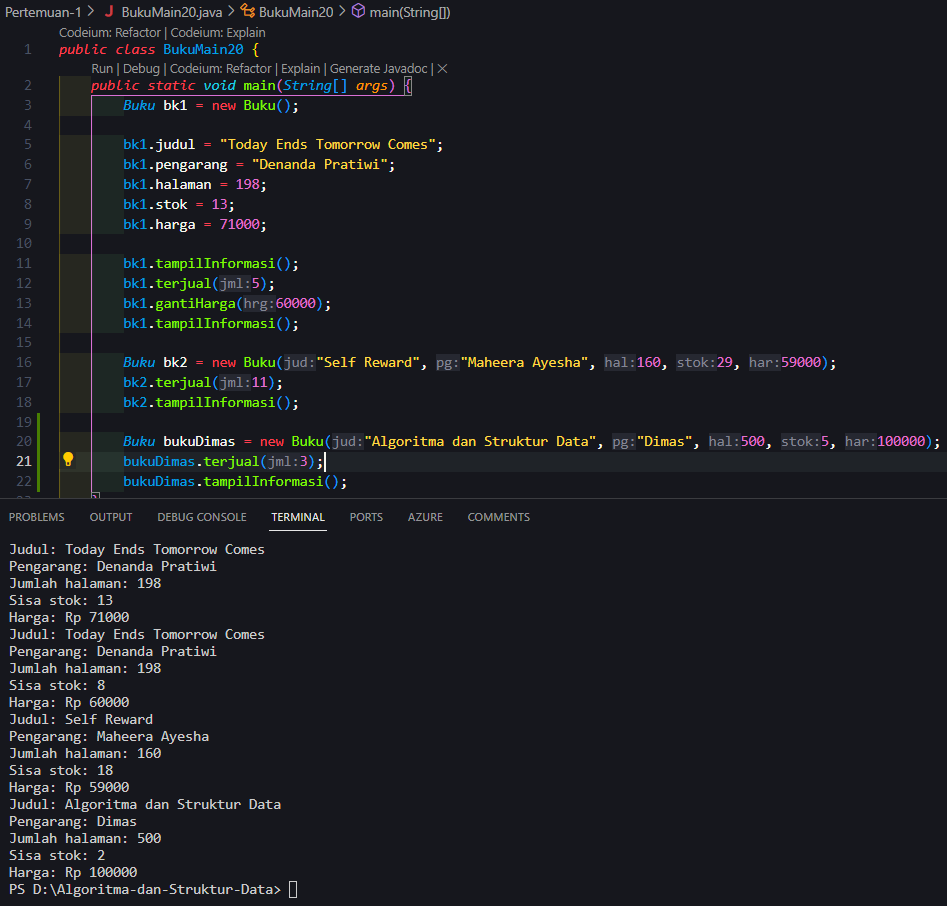
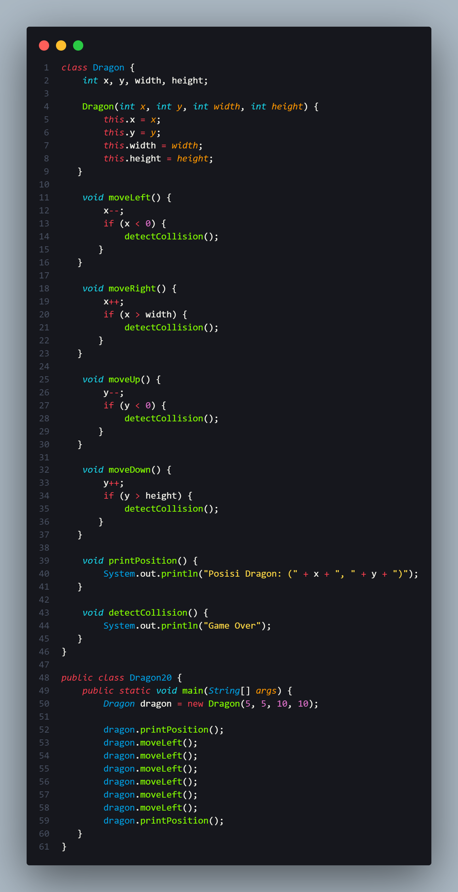

# 
 LAPORAN PRAKTIKUM ALGORITMA DAN STRUKTUR DATA 

    

    

     

 Nama : Muhammad Irsyad Dimas Abdillah 

 Absen: 20 

 NIM  : 2341720088 

 Prodi: TEKNIK INFOMATIKA

 Kelas: 1B 

# Percobaan 1: Deklarasi Class, Atribut dan Method

## Pertanyaan

1.  Sebutkan dua karakteristik class atau object! 
    jawab: object memiliki krakteristik atribut dan behavior. 
2.  Perhatikan class Buku pada Praktikum 1 tersebut, ada berapa atribut yang dimiliki oleh class
    Buku? Sebutkan apa saja atributnya! 
    jawab: ada 5 atribut pada class Buku, yaitu judul, pengarang, halaman, stok, dan harga.  
3.  Ada berapa method yang dimiliki oleh class tersebut? Sebutkan apa saja methodnya! 
    jawab: ada 4 method, yaitu tampilInformasi(); terjual(int jml); restock(int jml); gantiHarga(int hrg);  
4.  Perhatikan method terjual() yang terdapat di dalam class Buku. Modifikasi isi method tersebut
    sehingga proses pengurangan hanya dapat dilakukan jika stok masih ada (lebih besar dari 0)! 
    jawab:  kode hasil modifikasi  
    output run
    
5.  Menurut Anda, mengapa method restock() mempunyai satu parameter berupa bilangan int? 
    jawab: agar pengguna hanya dibatasi dengan input nilai berupa bilangan bulat.   

# Percobaan 2: Instansiasi Object, serta Mengakses Atribut dan Method

## pertanyaan

1. Pada class BukuMain, tunjukkan baris kode program yang digunakan untuk proses instansiasi! Apa nama object yang dihasilkan? 
   jawab: **Buku bk1 = new Buku();** adalah program yang digunakan untuk proses instasiasi.  
   Dan nama objek yang dihasilkan adalah bk1.  
   

2. Bagaimana cara mengakses atribut dan method dari suatu objek? 
   jawab: cara memanggil atribut dan method dari suatu objek adalah dengan cara memanggil nama diikuti dengan titik (.) dan nama atribut atau nama method yang ingin dipanggil.
3. Mengapa hasil output pemanggilan method tampilInformasi() pertama dan kedua berbeda? 
   jawab: Karena method terjual() dan gantiHarga() mengubah nilai atribut stok dan harga.  

# Percobaan 3: Membuat Konstruktor

## Pertanyaan

1. Pada class Buku di Percobaan 3, tunjukkan baris kode program yang digunakan untuk
   mendeklarasikan konstruktor berparameter! 
   jawab: pada class Buku yang menjadi konstruktor berparameter adalah **public Buku(String jud, String pg, int hal, int stok, int har) {
   judul = jud;
   pengarang = pg;
   halaman = hal;
   this.stok = stok;
   harga = har;
   }**.

2. Perhatikan class BukuMain. Apa sebenarnya yang dilakukan pada baris program berikut?
    
   jawab: baris program tersebut membuat objek baru dari class buku dengan nama bk2. objek bk2 memiliki nilai sebagai berikut: judul= Self Reward, pengarang= Maheera Ayesha, halaman= 160, stok= 29, harga= 59000.
3. Hapus konstruktor default pada class Buku, kemudian compile dan run program. Bagaimana hasilnya? Jelaskan mengapa hasilnya demikian! 
   jawab: Hasilnya akan menunjukkan error. The constructor Buku() is undifined. Hal itu bisa terjadi karena tidak ada konstruktor yang cocok dengan arguen yang diberikan.   
4. Setelah melakukan instansiasi object, apakah method di dalam class Buku harus diakses
   secara berurutan? Jelaskan alasannya! 
   jawab: Tidak, method di dalam class Buku tidak harus diakses secara berurutan. Akses terhadap method di dalam class Buku tidak bergantung pada urutan instansiasi object.
5. Buat object baru dengan nama buku<NamaMahasiswa> menggunakan konstruktor
   berparameter dari class Buku! 
   jawab:   

# Latihan Praktikum

1. Latihan praktikum 1 
     
2. Membuat program dengan nama class Dragon
     **Code**  
     **Output**  
