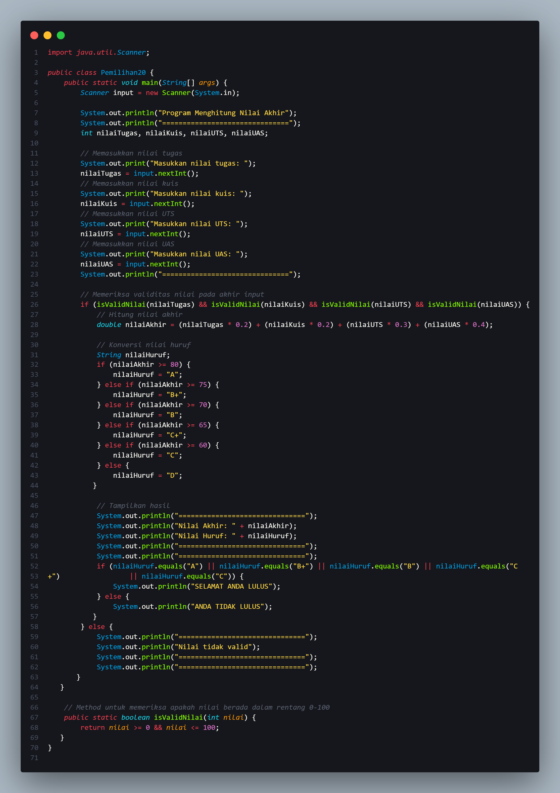
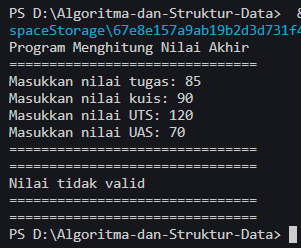
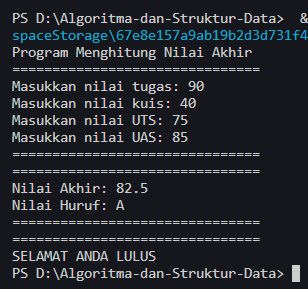
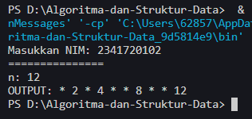
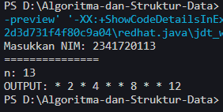

# 
 LAPORAN PRAKTIKUM ALGORITMA DAN STRUKTUR DATA 

    

    

     

 Nama : Muhammad Irsyad Dimas Abdillah 

 Absen: 20 

 NIM  : 2341720088 

 Prodi: TEKNIK INFOMATIKA

 Kelas: 1B 

# Praktikum Pemilihan

 Kode Program   
Output invalid    
Output valid     

# Praktikum Perulangan

  Kode Program   
Output n = 12     
Output n = 13     

# Praktikum Array

  Kode  

# Praktikum Fungsi

# Tugas
