# <p align ="center"> LAPORAN PRAKTIKUM ALGORITMA DAN STRUKTUR DATA </p>

<br><br><br><br>

<p align="center">
    </p>

<br><br><br><br><br>

<p align = "center"> Nama : Muhammad Irsyad Dimas Abdillah </p>
<p align = "center"> Absen: 20 </p>
<p align = "center"> NIM  : 2341720088 </p>
<p align = "center"> Prodi: TEKNIK INFOMATIKA</p>
<p align = "center"> Kelas: 1B </p>

# Percobaan 1: Membuat Array dari Object, Mengisi dan Menampilkan

Code <br>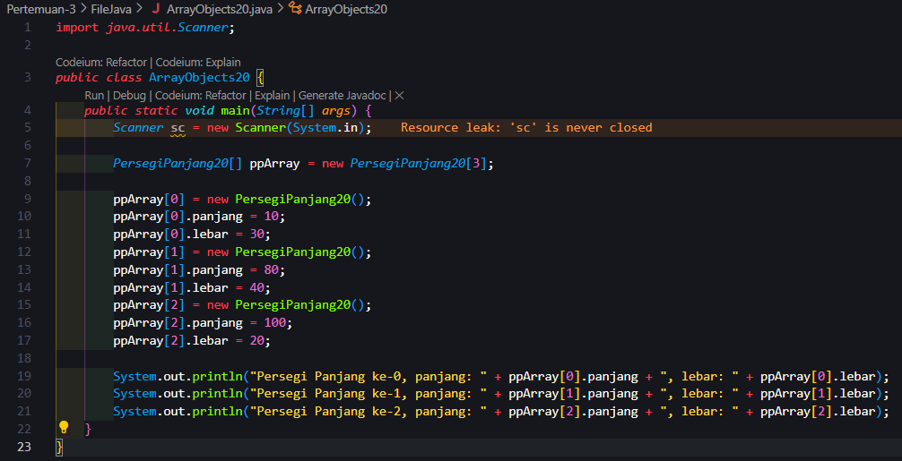<br> 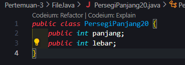<br>
Output <br>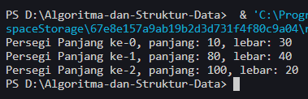<br>

## Pertanyaan

1. Berdasarkan uji coba 3.2, apakah class yang akan dibuat array of object harus selalu memiliki
   atribut dan sekaligus method?Jelaskan!<br>
   jawab: Tidak, class yang akan menjadi array of object tidak harus memiliki atribut dan method secara wajib. tergantung pada kebutuhan fungsionalitas data yang diinginkan.

2. Apakah class PersegiPanjang memiliki konstruktor?Jika tidak, kenapa dilakukan pemanggilan
   konstruktur pada baris program berikut :

```java
ppArray[1] = new PersegiPanjang20();
```

jawab: tidak, baris kode ppArray[1] = new PersegiPanjang20(); memanggil konstruktor default dari kelas PersegiPanjang20 untuk membuat objek baru dan menugaskannya ke elemen kedua dalam array ppArray.

3. Apa yang dimaksud dengan kode berikut ini:

```java
PersegiPanjang20[] ppArray = new PersegiPanjang20[3];
```

jawab: kode tersebut menginisiasi sebuah array bernama ppArray yang dapat mmenyimpan tiga objek dari tipe PersegiPanjang20.

4. Apa yang dimaksud dengan kode berikut ini:

```java
ppArray[1] = new PersegiPanjang20();
        ppArray[1].panjang = 80;
        ppArray[1].lebar = 40;
```

jawab: <br>
a. ppArray[1] = new PersegiPanjang20();: Baris ini membuat objek baru dari class PersegiPanjang20 dan menyimpannya pada indeks ke-1 dari array ppArray. <br>
b. ppArray[1].panjang = 80; melakukan input nilai dari variabel panjang dalam objek PersegiPanjang20 menjadi 80. <br>
c. ppArray[1].lebar = 40; melakukan input nilai dari variabel lebar dalam objek PersegiPanjang20 menjadi 40. <br>

5. Mengapa class main dan juga class PersegiPanjang dipisahkan pada uji coba 3.2? <br>
   jawab: Karena dapat lebih mudah pengembangan dan pemeliharaan program dan juga mengikuti konsep desain dan struktur program yang baik. <br>

# Percobaan 2: Menerima Input Isian Array Menggunakan Looping

Code <br> 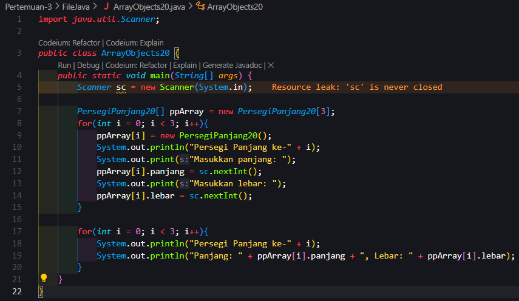<br>
Output <br> 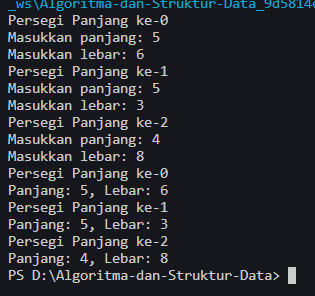<br>

## Pertanyaan

1. Apakah array of object dapat diimplementasikan pada array 2 Dimensi? <br>
   jawab: ya, array of objects dapat diimplementasikan pada array 2 dimensi.<br><br>
2. Jika jawaban soal no satu iya, berikan contohnya! Jika tidak, jelaskan!<br>
   jawab:

```java
class Produk {
    String nama;
    double harga;

    public Produk(String nama, double harga) {
        this.nama = nama;
        this.harga = harga;
    }
}

public class Main {
    public static void main(String[] args) {
        Produk[][] daftarProduk = new Produk[2][3];

        // Menginisialisasi objek-objek Produk ke dalam array 2 dimensi
        daftarProduk[0][0] = new Produk("Buku", 20.0);
        daftarProduk[0][1] = new Produk("Pensil", 5.0);
        daftarProduk[0][2] = new Produk("Penggaris", 7.5);

        daftarProduk[1][0] = new Produk("Pensil Warna", 10.0);
        daftarProduk[1][1] = new Produk("Spidol", 8.0);
        daftarProduk[1][2] = new Produk("Kertas", 15.0);

        // Menampilkan produk yang telah diinisialisasi
        for (int i = 0; i < daftarProduk.length; i++) {
            for (int j = 0; j < daftarProduk[i].length; j++) {
                System.out.println("Nama Produk: " + daftarProduk[i][j].nama + ", Harga: " + daftarProduk[i][j].harga);
            }
        }
    }
}

```

<br> pada contoh diatas merupakan implementasi dari array 2 dimensi pada objek "produk".

<br>

3. Jika diketahui terdapat class Persegi yang memiliki atribut sisi bertipe integer, maka kode dibawah ini akan memunculkan error saat dijalankan. Mengapa?<br>

```java
Persegi[] pgArray = new Persegi[100];
pgArray[5].sisi = 20;
```

jawab: pada kode tersebut kita hanya memberikan alokasi memori untuk objek, namun belum membuat objek itu sendiri. Sehingga saat mencoba mengakses atribut sisi dari null, yang akan menghasilkan kesalahan NullPointerException. <br>

4. Modifikasi kode program pada praktikum 3.3 agar length array menjadi inputan dengan Scanner! <br>
   jawab:

```java
   import java.util.Scanner;
public class ArrayObjects20 {
    public static void main(String[] args) {
        Scanner sc = new Scanner(System.in);

        System.out.print("Masukkan jumlah Persegi Panjang: ");
        int jumlahPP = sc.nextInt();

        PersegiPanjang20[] ppArray = new PersegiPanjang20[jumlahPP];
        for (int i = 0; i < jumlahPP; i++) {
            ppArray[i] = new PersegiPanjang20();
            System.out.println("Persegi Panjang ke-" + i);
            System.out.print("Masukkan panjang: ");
            ppArray[i].panjang = sc.nextInt();
            System.out.print("Masukkan lebar: ");
            ppArray[i].lebar = sc.nextInt();
        }

        for (int i = 0; i < jumlahPP; i++) {
            System.out.println("Persegi Panjang ke-" + i);
            System.out.println("Panjang: " + ppArray[i].panjang + ", Lebar: " + ppArray[i].lebar);
        }
    }
}
```

Output <br>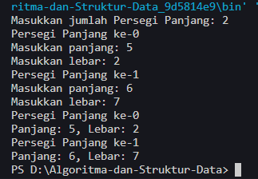<br><br>

5. Apakah boleh Jika terjadi duplikasi instansiasi array of objek, misalkan saja instansiasi dilakukan pada ppArray[i] sekaligus ppArray[0]?Jelaskan ! <br>
   jawab: duplikasi instansiasi boleh dilakukan, namun tidak dianjurkan karena akan menimbulkan kebingungan, inefisiensi, dan ketidakkonsistenan data.

# Percobaan 3: Penambahan Operasi Matematika di Dalam Method

Code <br>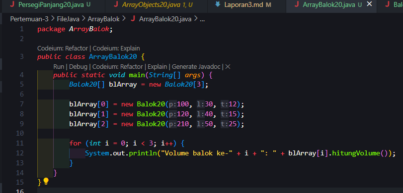 <br> 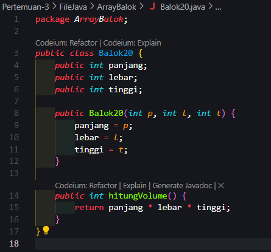 <br>
Output <br> 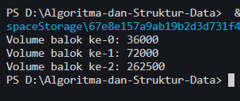<br>

## Pertanyaan

1. Dapatkah konstruktor berjumlah lebih dalam satu kelas? Jelaskan dengan contoh!<br>
   jawab: ya, pada satu class bisa memiliki lebih dari satu konstruktor yang disebut overloading constructor. setiap konstruktor bisa memiliki parameter yang berbeda atau jumlah parameter yang berbeda.

   ```java
   public class Buku {
    private String judul;
    private String pengarang;

    // Konstruktor tanpa parameter
    public Buku() {
        judul = "Belum Ditentukan";
        pengarang = "Belum Ditentukan";
    }

    // Konstruktor dengan parameter judul dan pengarang
    public Buku(String judul, String pengarang) {
        this.judul = judul;
        this.pengarang = pengarang;
    }
    }
   ```

   <br>

2. Jika diketahui terdapat class Segitiga seperti berikut ini:

```java
public class Segitiga{
   public int alas;
   public int tinggi;
}
```

Tambahkan konstruktor pada class Segitiga tersebut yang berisi parameter int a, int t
yang masing-masing digunakan untuk mengisikan atribut alas dan tinggi.
<br> jawab:

```java
public class Segitiga {
    public int alas;
    public int tinggi;


    public Segitiga(int a, int t) {
        alas = a;
        tinggi = t;
    }
}
```

<br>

3. Tambahkan method hitungLuas() dan hitungKeliling() pada class Segitiga
   tersebut. Asumsi segitiga adalah segitiga siku-siku. (Hint: Anda dapat menggunakan bantuan
   library Math pada Java untuk mengkalkulasi sisi miring)
   <br> jawab:

   ```java
       public double hitungLuas() {
        return 0.5 * alas * tinggi;
    }

    public double hitungKeliling() {
        double sisiMiring = Math.sqrt(alas * alas + tinggi * tinggi);
        return alas + tinggi + sisiMiring;
    }
   ```

   <br>

4. Pada fungsi main, buat array Segitiga sgArray yang berisi 4 elemen, isikan masing-masing
   atributnya sebagai berikut:
   sgArray ke-0 alas: 10, tinggi: 4 <br>
   sgArray ke-1 alas: 20, tinggi: 10 <br>
   sgArray ke-2 alas: 15, tinggi: 6 <br>
   sgArray ke-3 alas: 25, tinggi: 10 <br>
   jawab:

```java
public class SegitigaSgArray20 {
    public static void main(String[] args) {
        Segitiga20[] sgArray = new Segitiga20[4];

        sgArray[0] = new Segitiga20(10, 4);
        sgArray[1] = new Segitiga20(20, 10);
        sgArray[2] = new Segitiga20(15, 6);
        sgArray[3] = new Segitiga20(25, 10);
    }
}
```

<br>

5. Kemudian menggunakan looping, cetak luas dan keliling dengan cara memanggil method
   hitungLuas() dan hitungKeliling().
   <br> jawab:

```java
public class SegitigaSgArray20 {
    public static void main(String[] args) {
        Segitiga20[] sgArray = new Segitiga20[4];

        sgArray[0] = new Segitiga20(10, 4);
        sgArray[1] = new Segitiga20(20, 10);
        sgArray[2] = new Segitiga20(15, 6);
        sgArray[3] = new Segitiga20(25, 10);

        for (int i = 0; i < sgArray.length; i++) {
            System.out.println("Segitiga ke-" + i);
            System.out.println("Luas: " + sgArray[i].hitungLuas());
            System.out.println("Keliling: " + sgArray[i].hitungKeliling());
            System.out.println();
        }
    }
}
```

Output<br>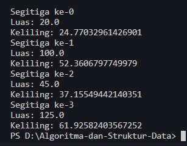<br><br>

# Latihan

```
1. Buatlah program yang dapat menghitung luas permukaan dan volume bangun ruang kerucut,
limas segi empat sama sisi, dan bola. Buatlah 3 (tiga) class sesuai dengan jumlah jenis bangun
ruang. Buatlah satu main class untuk membuat array of objects yang menginputkan atribut-atribut yang ada menggunakan konstruktor semua bangun ruang tersebut. Dengan ketentuan,
a. Buat looping untuk menginputkan masing-masing atributnya, kemudian tampilkan
luas permukaan dan volume dari tiap jenis bangun ruang tersebut.
b. Pada kerucut, inputan untuk atribut hanya jari-jari dan sisi miring
c. Pada limas segi empat sama sisi, inputan untuk atribut hanya panjang sisi alas dan
tinggi limas
d. Pada bola, inpuntan untuk atribut hanya jari-jari
```

jawab:<br>
**kerucut20**

```java
package Latihan1;

public class Kerucut20 {
    double jariJari;
    double sisiMiring;

    public Kerucut20(double jariJari, double sisiMiring) {
        this.jariJari = jariJari;
        this.sisiMiring = sisiMiring;
    }

    public double hitungLuas() {
        return Math.PI * jariJari * jariJari;
    }

    public double hitungVolume() {
        return (1.0 / 3.0) * Math.PI * jariJari * jariJari * sisiMiring;
    }
}
```

**Limas Segi Empat20**

```java
package Latihan1;

public class LimasSegiEmpat20 {
    double sisiAlas;
    double tinggi;

    public LimasSegiEmpat20(double sisiAlas, double tinggi) {
        this.sisiAlas = sisiAlas;
        this.tinggi = tinggi;
    }

    public double hitungLuasPermukaan() {
        double luasAlas = sisiAlas * sisiAlas;
        double luasSegitiga = (sisiAlas * tinggi) / 2;
        return luasAlas + 4 * luasSegitiga;
    }

    public double hitungVolume() {
        return (sisiAlas * sisiAlas * tinggi) / 3;
    }
}
```

**Bola20**

```java
package Latihan1;

public class Bola20 {
    double jariJari;

    public Bola20(double jariJari) {
        this.jariJari = jariJari;
    }

    public double hitungLuasPermukaan() {
        return 4 * Math.PI * jariJari * jariJari;
    }

    public double hitungVolume() {
        return (4.0 / 3.0) * Math.PI * jariJari * jariJari * jariJari;
    }
}
```

**Main20**

```java
package Latihan1;

import java.util.Scanner;

public class ArrayofObjects20 {
    public static void main(String[] args) {
        Scanner sc = new Scanner(System.in);

        System.out.print("Masukkan jumlah kerucut: ");
        int jumlahKerucut = sc.nextInt();
        Kerucut20[] kerucutArray = new Kerucut20[jumlahKerucut];

        System.out.print("Masukkan jumlah limas segi empat: ");
        int jumlahLimasSegiEmpat = sc.nextInt();
        LimasSegiEmpat20[] limasSegiEmpatArray = new LimasSegiEmpat20[jumlahLimasSegiEmpat];

        System.out.print("Masukkan jumlah bola: ");
        int jumlahBola = sc.nextInt();
        Bola20[] bolaArray = new Bola20[jumlahBola];

        // Input atribut untuk setiap kerucut
        for (int i = 0; i < jumlahKerucut; i++) {
            System.out.println("Atribut kerucut ke-" + (i + 1));
            System.out.print("Masukkan jari-jari: ");
            int jariJari = sc.nextInt();
            System.out.print("Masukkan sisi miring: ");
            int sisiMiring = sc.nextInt();
            kerucutArray[i] = new Kerucut20(jariJari, sisiMiring);
            System.out.println();
        }

        // Input atribut untuk setiap limas segi empat
        for (int i = 0; i < jumlahLimasSegiEmpat; i++) {
            System.out.println("Atribut limas segi empat ke-" + (i + 1));
            System.out.print("Masukkan panjang sisi alas: ");
            int panjangSisiAlas = sc.nextInt();
            System.out.print("Masukkan tinggi: ");
            int tinggi = sc.nextInt();
            limasSegiEmpatArray[i] = new LimasSegiEmpat20(panjangSisiAlas, tinggi);
            System.out.println();
        }

        // Input atribut untuk setiap bola
        for (int i = 0; i < jumlahBola; i++) {
            System.out.println("Atribut bola ke-" + (i + 1));
            System.out.print("Masukkan jari-jari: ");
            int jariJariBola = sc.nextInt();
            bolaArray[i] = new Bola20(jariJariBola);
            System.out.println();
        }

        // Output untuk setiap kerucut
        System.out.println("\nHasil Perhitungan Kerucut:");
        for (int i = 0; i < jumlahKerucut; i++) {
            System.out.println("Luas kerucut ke-" + (i + 1) + ": " + kerucutArray[i].hitungLuas());
            System.out.println("Volume kerucut ke-" + (i + 1) + ": " + kerucutArray[i].hitungVolume());
            System.out.println();
        }

        // Output untuk setiap limas segi empat
        System.out.println("\nHasil Perhitungan Limas Segi Empat:");
        for (int i = 0; i < jumlahLimasSegiEmpat; i++) {
            System.out.println(
                    "Luas limas segi empat ke-" + (i + 1) + ": " + limasSegiEmpatArray[i].hitungLuasPermukaan());
            System.out.println("Volume limas segi empat ke-" + (i + 1) + ": " + limasSegiEmpatArray[i].hitungVolume());
            System.out.println();
        }

        // Output untuk setiap bola
        System.out.println("\nHasil Perhitungan Bola:");
        for (int i = 0; i < jumlahBola; i++) {
            System.out.println("Luas bola ke-" + (i + 1) + ": " + bolaArray[i].hitungLuasPermukaan());
            System.out.println("Volume bola ke-" + (i + 1) + ": " + bolaArray[i].hitungVolume());
            System.out.println();
        }
    }
}
```

**Output**<br>
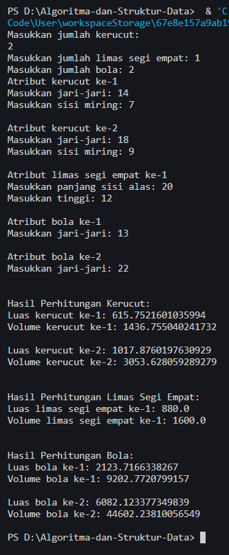

<br><br>

2. Sebuah kampus membutuhkan program untuk menampilkan informasi mahasiswa berupa nama, nim, jenis kelamin dan juga IPK mahasiswa. Program dapat menerima input semua informasi tersebut, kemudian menampilkanya kembali ke user. Implementasikan program tersebut jika
   dimisalkan terdapat 3 data mahasiswa yang tersedia. Contoh output program: <br>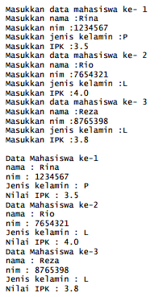<br>
   jawab: <br>
   **Main**

```java
package Latihan2;

import java.util.Scanner;

public class informasiMahasiswa20 {
    public static void main(String[] args) {
        Scanner sc = new Scanner(System.in);

        Mahasiswa20[] mahasiswas = new Mahasiswa20[3];

        for (int i = 0; i < 3; i++) {
            System.out.println("Masukkan data mahasiswa ke-" + (i + 1));
            System.out.print("Masukkan nama: ");
            String nama = sc.nextLine();
            System.out.print("Masukkan NIM: ");
            String nim = sc.nextLine();
            System.out.print("Masukkan Jenis Kelamin: ");
            String jenisKelamin = sc.nextLine();
            System.out.print("Masukkan IPK: ");
            double ipk = sc.nextDouble();
            sc.nextLine();

            mahasiswas[i] = new Mahasiswa20(nama, nim, jenisKelamin, ipk);
        }
        System.out.println();

        // Menampilkan informasi mahasiswa yang telah diinputkan
        for (int i = 0; i < 3; i++) {
            System.out.println("Data Mahasiswa ke-" + (i + 1));
            System.out.println("Nama: " + mahasiswas[i].nama);
            System.out.println("NIM: " + mahasiswas[i].nim);
            System.out.println("Jenis Kelamin: " + mahasiswas[i].jenisKelamin);
            System.out.println("IPK: " + mahasiswas[i].ipk);
        }
    }
}
```

**Class Mahasiswa**

```java
package Latihan2;

public class Mahasiswa20 {
    public String nama, nim, jenisKelamin;
    public double ipk;

    public Mahasiswa20(String nama, String nim, String jenisKelamin, double ipk) {
        this.nama = nama;
        this.nim = nim;
        this.jenisKelamin = jenisKelamin;
        this.ipk = ipk;
    }
}
```

**Output**<br>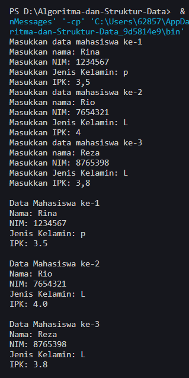
<br>

3. Modifikasi program Latihan no.2 di atas, sehingga bisa digunakan untuk menghitung rata-rata IPK, serta menampilkan data mahasiswa dengan IPK terbesar! (gunakan method untuk masing-masing proses tersebut) <br>
   jawab: <br>
   **Main**

```java
package Latihan2;
import java.util.Scanner;

public class informasiMahasiswa20 {
    public static void main(String[] args) {
        Scanner sc = new Scanner(System.in);

        Mahasiswa20[] mahasiswa = new Mahasiswa20[3];

        for (int i = 0; i < 3; i++) {
            System.out.println("Masukkan data mahasiswa ke-" + (i + 1));
            System.out.print("Masukkan nama: ");
            String nama = sc.nextLine();
            System.out.print("Masukkan NIM: ");
            String nim = sc.nextLine();
            System.out.print("Masukkan Jenis Kelamin: ");
            String jenisKelamin = sc.nextLine();
            System.out.print("Masukkan IPK: ");
            double ipk = sc.nextDouble();
            sc.nextLine();

            mahasiswa[i] = new Mahasiswa20(nama, nim, jenisKelamin, ipk);
        }
        System.out.println();

        // Menampilkan informasi mahasiswa yang telah diinputkan
        for (int i = 0; i < 3; i++) {
            System.out.println("Data Mahasiswa ke-" + (i + 1));
            System.out.println("Nama: " + mahasiswa[i].nama);
            System.out.println("NIM: " + mahasiswa[i].nim);
            System.out.println("Jenis Kelamin: " + mahasiswa[i].jenisKelamin);
            System.out.println("IPK: " + mahasiswa[i].ipk);
        }

        // Menghitung rata-rata IPK
        System.out.println();
        double rataIPK = Mahasiswa20.hitungRataIPK(mahasiswa);
        System.out.println("Rata-rata IPK: " + rataIPK);
        System.out.println();

        // Menampilkan data mahasiswa dengan IPK terbesar
        Mahasiswa20 terbaik = Mahasiswa20.mahasiswaTerbaik(mahasiswa);
        System.out.println("Mahasiswa dengan IPK terbesar:");
        System.out.println("Nama: " + terbaik.nama);
        System.out.println("NIM: " + terbaik.nim);
        System.out.println("Jenis Kelamin: " + terbaik.jenisKelamin);
        System.out.println("IPK: " + terbaik.ipk);
    }
}
```

**Class mahasiswa**

```java
package Latihan2;

public class Mahasiswa20 {
    public String nama, nim, jenisKelamin;
    public double ipk;

    public Mahasiswa20(String nama, String nim, String jenisKelamin, double ipk) {
        this.nama = nama;
        this.nim = nim;
        this.jenisKelamin = jenisKelamin;
        this.ipk = ipk;
    }

    // Method untuk menghitung rata-rata IPK
    public static double hitungRataIPK(Mahasiswa20[] mhs) {
        double totalIPK = 0;
        for (Mahasiswa20 mahasiswa : mhs) {
            totalIPK += mahasiswa.ipk;
        }
        return totalIPK / mhs.length;
    }

    // Method untuk menampilkan data mahasiswa dengan IPK terbesar
    public static Mahasiswa20 mahasiswaTerbaik(Mahasiswa20[] mhs) {
        Mahasiswa20 terbaik = mhs[0];
        for (Mahasiswa20 mahasiswa : mhs) {
            if (mahasiswa.ipk > terbaik.ipk) {
                terbaik = mahasiswa;
            }
        }
        return terbaik;
    }
}
```

**Output**<br> 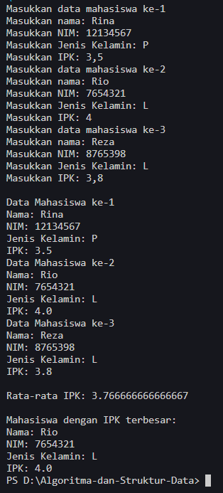
