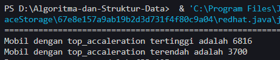
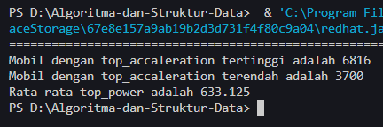

# <p align ="center"> LAPORAN PRAKTIKUM ALGORITMA DAN STRUKTUR DATA </p>

<br><br><br><br>

<p align="center">
    </p>

<br><br><br><br><br>

<p align = "center"> Nama : Muhammad Irsyad Dimas Abdillah </p>
<p align = "center"> Absen: 20 </p>
<p align = "center"> NIM  : 2341720088 </p>
<p align = "center"> Prodi: TEKNIK INFOMATIKA</p>
<p align = "center"> Kelas: 1B </p>

# Percobaan 1: Menghitung Nilai Faktorial dengan Algoritma Brute Force dan Divide and Conquer

Code<br>

```java
public class Faktorial {
    public int nilai;

    int faktorialBF(int n) {
        int fakto = 1;
        for (int i = 1; i <= n; i++) {
            fakto = fakto * i;
        }
        return fakto;
    }

    int faktorialDC(int n) {
        if (n == 1) {
            return 1;
        } else {
            int fakto = n * faktorialDC(n - 1);
            return fakto;
        }
    }
}
```

```java
import java.util.Scanner;

public class MainFaktorial {
    public static void main(String[] args) {
        Scanner sc = new Scanner(System.in);

        System.out.println("---------------------------------");
        System.out.print("Masukkan jumlah elemen: ");
        int iJml = sc.nextInt();

        Faktorial[] fk20 = new Faktorial[10];
        for (int i = 0; i < iJml; i++) {
            fk20[i] = new Faktorial();
            System.out.println("Masukkan nilai data ke-" + (i + 1) + ":");
            fk20[i].nilai = sc.nextInt();
        }

        System.out.println("HASIL - BRUTE FORCE");
        for (int i = 0; i < iJml; i++) {
            System.out
                    .println("Hasil perhitungan menggunakan Brute Force adalah " + fk20[i].faktorialBF(fk20[i].nilai));
        }

        System.out.println("HASIL - DIVIDE AND CONQUER");
        for (int i = 0; i < iJml; i++) {
            System.out.println(
                    "Hasil perhitungan menggunakan Divide and Conquer adalah " + fk20[i].faktorialDC(fk20[i].nilai));
        }
    }
}
```

Output<br> 

## Pertanyaan

1. Pada base line Algoritma Divide Conquer untuk melakukan pencarian nilai faktorial, jelaskan perbedaan bagian kode pada penggunaan if dan else! <br>
   jawab: Pada blok program if digunakan untuk memeriksa apakah nilai n sama dengan 1. Sedangkan blok pprogram else digunakan untuk memeriksa apakah nilai n tidak sama dengan 1. Blok if: Mengembalikan nilai 1 (basis rekursi) jika n sama dengan 1. Sedangkan blok else: Menghitung nilai faktorial dengan mengalikan n dengan hasil rekursi dari faktorialDC(n - 1). <br> <br>

2. Apakah memungkinkan perulangan pada method faktorialBF() dirubah selain menggunakan for?Buktikan! <br>
   jawab: Ya bisa, kita bisa mengganti perulangan for menggunakan perulangan lain seperti while dibawah ini. <br>

```java

public class Faktorial {
    public int nilai;

    int faktorialBF(int n) {
        int fakto = 1;
        int i = 1;
        while (i <= n) {
            fakto = fakto * i;
            i++;
        }
        return fakto;
    }

    int faktorialDC(int n) {
        if (n == 1) {
            return 1;
        } else {
            int fakto = n * faktorialDC(n - 1);
            return fakto;
        }
    }
}
```

<br>

3. Jelaskan perbedaan antara fakto *= i; dan int fakto = n*faktorialDC(n-1)! <br>
   jawab: **fakto \* = i;** merupakan singkatan dari faktor = fakto * i; yang berarti nilai 'fakto' akan dikali dengan 'i' pada setiap iterasi looping. Sedangkan \*\*fakto = n*faktorialDC(n-1);\*\* merupakan operasi rekursif untuk menghhitung nilai faktorial. Operasi akan menghitung dengan mengkalikan 'n' dengan nilai faktorial 'n-1' yang terus berlanjut hingga mencapai base case.
   <br><br>

# Percobaan 2: Menghitung Hasil Pangkat dengan Algoritma Brute Force dan Divide and Conquer

Code<br>

```java
public class Pangkat20 {
    public int nilai, pangkat;

    int pangkatBF(int a, int n) {
        int hasil = 1;
        for (int i = 0; i < n; i++) {
            hasil *= a;
        }
        return hasil;
    }

    int pangkatDC(int a, int n) {
        if (n == 0) {
            return 1;
        } else {
            if (n % 2 == 1) {
                return (pangkatDC(a, n / 2) * pangkatDC(a, n / 2) * a);
            } else {
                return (pangkatDC(a, n / 2) * pangkatDC(a, n / 2));
            }
        }
    }
}

```

```java
import java.util.Scanner;

public class MainPangkat {
    public static void main(String[] args) {
        Scanner sc = new Scanner(System.in);

        System.out.println("====================================");
        System.out.print("Masukkan jumlah elemen yang dihitung: ");
        int elemen = sc.nextInt();

        Pangkat20[] png20 = new Pangkat20[elemen];
        for (int i = 0; i < elemen; i++) {
            png20[i] = new Pangkat20();
            System.out.println("Masukkan nilai yang hendak dipangkatkan: ");
            png20[i].nilai = sc.nextInt();
            System.out.println("Masukkan nilai pemangkat: ");
            png20[i].pangkat = sc.nextInt();
        }

        System.out.println("HASIL PANGKAT - BRUTE FORCE");
        for (int i = 0; i < elemen; i++) {
            System.out.println("Hasil dari " + png20[i].nilai + " pangkat " + png20[i].pangkat + " adalah "
                    + png20[i].pangkatBF(png20[i].nilai, png20[i].pangkat));
        }

        System.out.println("HASIL PANGKAT - DIVIDE AND CONQUER");
        for (int i = 0; i < elemen; i++) {
            System.out.println("Hasil dari " + png20[i].nilai + " pangkat " + png20[i].pangkat + " adalah "
                    + png20[i].pangkatDC(png20[i].nilai, png20[i].pangkat));
        }
    }
}

```

Output<br> 

## Pertanyaan

1.Jelaskan mengenai perbedaan 2 method yang dibuat yaitu PangkatBF() dan PangkatDC()! <br>
jawab:
pangkatBF() menggunakan pendekatan iteratif loop 'for' untuk melakukan perkalian sebanyak 'n' kali secara langsung. Sedangkan pangkatDC() menggunakan pendekatan rekursif, yang membagi masalah perpangkatan menjadi sub-masalah yang lebih kecil dan melakukan combine hasil diakhir. <br> <br> 2. Apakah tahap combine sudah termasuk dalam kode tersebut?Tunjukkan! <br>
jawab: Ya, tahap combine terjadi ketika hasil dari dua penggunaan rekursif pangkatDC(a, n/2) dikalikan. Jika n adalah bilangan ganjil maka hasil tersebut juka dikalikan dengan a.

```java
if (n % 2 == 1) {
    return (pangkatDC(a, n / 2) * pangkatDC(a, n / 2) * a);
} else {
    return (pangkatDC(a, n / 2) * pangkatDC(a, n / 2));
}
```

<br>
3. Modifikasi kode program tersebut, anggap proses pengisian atribut dilakukan dengan konstruktor. <br>
jawab:<br>

```java
public class Pangkat20 {
    public int nilai, pangkat;

    //Menbambahkan konstruktor untuk menginisialisasi nilai dan pangkat
    public Pangkat20(int nilai, int pangkat) {
        this.nilai = nilai;
        this.pangkat = pangkat;
    }

    int pangkatBF(int a, int n) {
        int hasil = 1;
        for (int i = 0; i < n; i++) {
            hasil *= a;
        }
        return hasil;
    }

    int pangkatDC(int a, int n) {
        if (n == 0) {
            return 1;
        } else {
            if (n % 2 == 1) {
                return (pangkatDC(a, n / 2) * pangkatDC(a, n / 2) * a);
            } else {
                return (pangkatDC(a, n / 2) * pangkatDC(a, n / 2));
            }
        }
    }
}

```

```java
import java.util.Scanner;

public class MainPangkat {
    public static void main(String[] args) {
        Scanner sc = new Scanner(System.in);

        System.out.println("====================================");
        System.out.print("Masukkan jumlah elemen yang dihitung: ");
        int elemen = sc.nextInt();

        Pangkat20[] png20 = new Pangkat20[elemen];
        for (int i = 0; i < elemen; i++) {
            System.out.println("Masukkan nilai yang hendak dipangkatkan: ");
            int nilai = sc.nextInt();
            System.out.println("Masukkan nilai pemangkat: ");
            int pangkat = sc.nextInt();
            png20[i] = new Pangkat20(nilai, pangkat);
        }

        System.out.println("HASIL PANGKAT - BRUTE FORCE");
        for (int i = 0; i < elemen; i++) {
            System.out.println("Hasil dari " + png20[i].nilai + " pangkat " + png20[i].pangkat + " adalah "
                    + png20[i].pangkatBF(png20[i].nilai, png20[i].pangkat));
        }

        System.out.println("HASIL PANGKAT - DIVIDE AND CONQUER");
        for (int i = 0; i < elemen; i++) {
            System.out.println("Hasil dari " + png20[i].nilai + " pangkat " + png20[i].pangkat + " adalah "
                    + png20[i].pangkatDC(png20[i].nilai, png20[i].pangkat));
        }
    }
}

```

<br>
4. Tambahkan menu agar salah satu method yang terpilih saja yang akan dijalankan menggunakan switch-case! <br>
jawab:
Code

```java
import java.util.Scanner;

public class MainPangkat {
    public static void main(String[] args) {
        Scanner sc = new Scanner(System.in);

        System.out.println("====================================");
        System.out.print("Masukkan jumlah elemen yang dihitung: ");
        int elemen = sc.nextInt();

        Pangkat20[] png20 = new Pangkat20[elemen];
        for (int i = 0; i < elemen; i++) {
            System.out.println("Masukkan nilai yang hendak dipangkatkan: ");
            int nilai = sc.nextInt();
            System.out.println("Masukkan nilai pemangkat: ");
            int pangkat = sc.nextInt();
            png20[i] = new Pangkat20(nilai, pangkat);
        }

        System.out.println("================================================");
        System.out.println("Pilih metode perpangkatan yang ingin digunakan: ");
        System.out.println("1. Brute Force");
        System.out.println("2. Divide and Conquer");
        System.out.print("Pilihan: ");
        int pilihan = sc.nextInt();

        switch (pilihan) {
            case 1:
                System.out.println("HASIL PANGKAT - BRUTE FORCE");
                for (int i = 0; i < elemen; i++) {
                    System.out.println("Hasil dari " + png20[i].nilai + " pangkat " + png20[i].pangkat + " adalah "
                            + png20[i].pangkatBF(png20[i].nilai, png20[i].pangkat));
                }
                break;
            case 2:
                System.out.println("HASIL PANGKAT - DIVIDE AND CONQUER");
                for (int i = 0; i < elemen; i++) {
                    System.out.println("Hasil dari " + png20[i].nilai + " pangkat " + png20[i].pangkat + " adalah "
                            + png20[i].pangkatDC(png20[i].nilai, png20[i].pangkat));
                }
                break;
            default:
                System.out.println("Pilihan tidak tersedia");
                break;
        }

    }
}

```

Output<br>

<br><br>

# Percobaan 3: Menghitung Sum Array dengan Algoritma Brute Force dan Divide and Conquer

Code<br>

```java
public class Sum20 {
    int elemen;
    double keuntungan[], total;

    Sum20(int elemen) {
        this.elemen = elemen;
        this.keuntungan = new double[elemen];
        this.total = 0;
    }

    double totalBF(double arr[]) {
        for (int i = 0; i < elemen; i++) {
            total = total + arr[i];
        }
        return total;
    }

    double totalDC(double arr[], int l, int r) {
        if (l == r) {
            return arr[l];
        } else if (l < r) {
            int mid = (l + r) / 2;
            double lsum = totalDC(arr, l, mid);
            double rsum = totalDC(arr, mid + 1, r);
            return lsum + rsum;
        }
        return 0;
    }
}
```

```java
import java.util.Scanner;

public class MainSum {
    public static void main(String[] args) {
        Scanner sc = new Scanner(System.in);
        System.out.println("============================================================");
        System.out.println("Program Menghitung Keuntungan Total (Satuan Juta, Misal 5,9)");
        System.out.print("Masukkan jumlah bulan : ");
        int elm = sc.nextInt();

        Sum20 sm = new Sum20(elm);
        System.out.println("============================================================");
        for (int i = 0; i < sm.elemen; i++) {
            System.out.print("Masukkan untung bulan ke - " + (i + 1) + " = ");
            sm.keuntungan[i] = sc.nextDouble();
        }

        System.out.println("============================================================");
        System.out.println("Algoritma Brute Force");
        System.out.println(
                "Tatal keuntungan perusahaan selama " + sm.elemen + " bulan adalah = " + sm.totalBF(sm.keuntungan));
        System.out.println("============================================================");
        System.out.println("Algoritma Divide Conquer");
        System.out.println("Total keuntungan perusahaan selama " + sm.elemen + " bulan adalah = "
                + sm.totalDC(sm.keuntungan, 0, sm.elemen - 1));
    }
}
```

Output<br> 

## Pertanyaan

1. Mengapa terdapat formulasi return value berikut?Jelaskan!<br>

   ```java
   return lsum + rsum + arr[mid];
   ```

   jawab: baris kode tersebut digunakan untuk menambahkan total semua nilai dari 'lsum' yang merupakan total dari sub-array disebelah kiri, 'rsum' adalah total dari sub-array di sebelah kanan, dan 'arr[mid]' adalah elemen tengah dari array.
   <br>

2. Kenapa dibutuhkan variable mid pada method TotalDC()? <br>
   jawab: Variabel 'mid' digunakan untuk membagi sub-array menjadi 2 bagian yang sama besar yaitu: 'lsum' untuk kiri dan 'rsum' untuk kanan.
   <br>

3. Program perhitungan keuntungan suatu perusahaan ini hanya untuk satu perusahaan saja. Bagaimana cara menghitung sekaligus keuntungan beberapa bulan untuk beberapa perusahaan.(Setiap perusahaan bisa saja memiliki jumlah bulan berbeda-beda)? Buktikan dengan program!<br>
   jawab:disini saya menambahkan atribut perusahaan, dan merubah atribut array keuntungan yang awalnya 1 dimensi menjadi 2 dimensi untuk menyimpan banyak keuntungan dari banyak perusahaan. <br>
   CODE

```java
public class Sum20 {
    int elemen;
    double keuntungan[][], total[];

    Sum20(int perusahaan, int bulan) {
        this.elemen = bulan;
        this.keuntungan = new double[perusahaan][bulan];
        this.total = new double[perusahaan];
    }

    double totalBF(double arr[], int noPerusahaan) {
        for (int i = 0; i < elemen; i++) {
            total[noPerusahaan] = total[noPerusahaan] + arr[i];
        }
        return total[noPerusahaan];
    }

    double totalDC(double arr[], int l, int r) {
        if (l == r) {
            return arr[l];
        } else if (l < r) {
            int mid = (l + r) / 2;
            double lsum = totalDC(arr, l, mid);
            double rsum = totalDC(arr, mid + 1, r);
            return lsum + rsum;
        }
        return 0;
    }
}
```

```java
import java.util.Scanner;

public class MainSum {
    public static void main(String[] args) {
        Scanner sc = new Scanner(System.in);
        System.out.println("============================================================");
        System.out.println("Program Menghitung Keuntungan Total (Satuan Juta, Misal 5,9)");
        System.out.println("Masukkan banyaknya perusahaan : ");
        int perusahaan = sc.nextInt();
        System.out.print("Masukkan jumlah bulan : ");
        int bulan = sc.nextInt();

        Sum20 sm = new Sum20(perusahaan, bulan);
        System.out.println("============================================================");
        for (int i = 0; i < perusahaan; i++) {
            for (int j = 0; j < sm.elemen; j++) {
                System.out.print("Masukkan keuntungan perusahaan ke - " + (i + 1) + " bulan ke - " + (j + 1) + " : ");
                sm.keuntungan[i][j] = sc.nextDouble();
            }
        }

        System.out.println("============================================================");
        System.out.println("Algoritma Brute Force");
        for (int k = 0; k < perusahaan; k++) {
            System.out.println(
                    "Total keuntungan perusahaan " + (k + 1) + " selama " + sm.elemen + " bulan adalah = "
                            + sm.totalBF(sm.keuntungan[k], k));
        }

        System.out.println("============================================================");
        System.out.println("Algoritma Divide Conquer");
        for (int i = 0; i < perusahaan; i++) {
            System.out.println("Total keuntungan perusahaan " + (i + 1) + " selama " + sm.elemen + " bulan adalah = "
                    + sm.totalDC(sm.keuntungan[i], 0, sm.elemen - 1));
        }
    }
}
```

<br> OUTPUT <br> 
<br>

# Latihan Praktikum

1. Sebuah showroom memiliki daftar mobil dengan data sesuai tabel dibawah ini<br>
    <br>
   Tentukan: <br>
   a) top_acceleration tertinggi menggunakan Divide and Conquer! <br>
   jawab: <br>
   CODE

```java
public class dataMobil20 {
    String merk[] = { "BMW", "Ford", "Nissan", "Subaru", "Toyota", "Volkswagen" };
    String tipe[] = { "M2 Coupe", "Fiesta ST", "370Z", "BRZ", "Impreza WRX STI", "AE86 Trueno", "86/GT86", "Golf GTI" };
    int tahun[] = { 2016, 2014, 2009, 2014, 2013, 1986, 2014, 2014 };
    int topAcceleration[] = { 6816, 3291, 4360, 4058, 6255, 3700, 4180, 4180 };
    int topPower[] = { 728, 575, 657, 609, 703, 553, 609, 631 };

    int maxAcceleration(int arr[], int l, int r) {
        if (l == r) {
            return arr[l];
        } else {
            int mid = (l + r) / 2;
            int left = maxAcceleration(arr, l, mid);
            int right = maxAcceleration(arr, mid + 1, r);

            int maksAcceleration;
            if (left > right) {
                maksAcceleration = left;
            } else {
                maksAcceleration = right;
            }
            return maksAcceleration;
        }
    }
```

```java
public class mainMobil20 {
    public static void main(String[] args) {

        dataMobil20 outputMobil = new dataMobil20();
        System.out.println("============================================================");
        System.out.println("Mobil dengan top_accaleration tertinggi adalah "
                + outputMobil.maxAcceleration(outputMobil.topAcceleration, 0, outputMobil.topAcceleration.length - 1));
    }
}
```

OUTPUT: <br> 

b) top_acceleration terendah menggunakan Divide and Conquer! <br>
jawab: <br>
CODE

```java
public class dataMobil20 {
    String merk[] = { "BMW", "Ford", "Nissan", "Subaru", "Toyota", "Volkswagen" };
    String tipe[] = { "M2 Coupe", "Fiesta ST", "370Z", "BRZ", "Impreza WRX STI", "AE86 Trueno", "86/GT86", "Golf GTI" };
    int tahun[] = { 2016, 2014, 2009, 2014, 2013, 1986, 2014, 2014 };
    int topAcceleration[] = { 6816, 3291, 4360, 4058, 6255, 3700, 4180, 4180 };
    int topPower[] = { 728, 575, 657, 609, 703, 553, 609, 631 };

    int maxAcceleration(int arr[], int l, int r) {
        if (l == r) {
            return arr[l];
        } else {
            int mid = (l + r) / 2;
            int left = maxAcceleration(arr, l, mid);
            int right = maxAcceleration(arr, mid + 1, r);

            int maksAcceleration;
            if (left > right) {
                maksAcceleration = left;
            } else {
                maksAcceleration = right;
            }
            return maksAcceleration;
        }
    }

    int minAcceleration(int arr[], int l, int r) {
        if (l == r) {
            return arr[l];
        } else {
            int mid = (l + r) / 2;
            int left = minAcceleration(arr, l, mid);
            int right = minAcceleration(arr, mid + 1, r);

            int minAcceleration;
            if (left < right) {
                minAcceleration = left;
            } else {
                minAcceleration = right;
            }
            return minAcceleration;
        }
    }
```

```java
public class mainMobil20 {
    public static void main(String[] args) {

        dataMobil20 outputMobil = new dataMobil20();
        System.out.println("============================================================");
        System.out.println("Mobil dengan top_accaleration tertinggi adalah "
                + outputMobil.maxAcceleration(outputMobil.topAcceleration, 0, outputMobil.topAcceleration.length - 1));
        System.out.println("Mobil dengan top_accaleration terendah adalah "
                + outputMobil.minAcceleration(outputMobil.topAcceleration, 0, outputMobil.topAcceleration.length - 1));
    }
}
```

OUTPUT: <br> 

c) Rata-rata top_power dari seluruh mobil menggunakan Brute Force! <br>
jawab: <br>
CODE

```java
public class dataMobil20 {
    String merk[] = { "BMW", "Ford", "Nissan", "Subaru", "Toyota", "Volkswagen" };
    String tipe[] = { "M2 Coupe", "Fiesta ST", "370Z", "BRZ", "Impreza WRX STI", "AE86 Trueno", "86/GT86", "Golf GTI" };
    int tahun[] = { 2016, 2014, 2009, 2014, 2013, 1986, 2014, 2014 };
    int topAcceleration[] = { 6816, 3291, 4360, 4058, 6255, 3700, 4180, 4180 };
    int topPower[] = { 728, 575, 657, 609, 703, 553, 609, 631 };

    int maxAcceleration(int arr[], int l, int r) {
        if (l == r) {
            return arr[l];
        } else {
            int mid = (l + r) / 2;
            int left = maxAcceleration(arr, l, mid);
            int right = maxAcceleration(arr, mid + 1, r);

            int maksAcceleration;
            if (left > right) {
                maksAcceleration = left;
            } else {
                maksAcceleration = right;
            }
            return maksAcceleration;
        }
    }

    int minAcceleration(int arr[], int l, int r) {
        if (l == r) {
            return arr[l];
        } else {
            int mid = (l + r) / 2;
            int left = minAcceleration(arr, l, mid);
            int right = minAcceleration(arr, mid + 1, r);

            int minAcceleration;
            if (left < right) {
                minAcceleration = left;
            } else {
                minAcceleration = right;
            }
            return minAcceleration;
        }
    }

    double rataPower() {
        double totalPower = 0;
        for (int i = 0; i < topPower.length; i++) {
            totalPower += topPower[i];
        }
        return totalPower / topPower.length;
    }
}
```

```java
public class mainMobil20 {
    public static void main(String[] args) {

        dataMobil20 outputMobil = new dataMobil20();
        System.out.println("============================================================");
        System.out.println("Mobil dengan top_accaleration tertinggi adalah "
                + outputMobil.maxAcceleration(outputMobil.topAcceleration, 0, outputMobil.topAcceleration.length - 1));
        System.out.println("Mobil dengan top_accaleration terendah adalah "
                + outputMobil.minAcceleration(outputMobil.topAcceleration, 0, outputMobil.topAcceleration.length - 1));
        System.out.println("Rata-rata top_power adalah " + outputMobil.rataPower());
    }
}

```

OUPUT: <br>
