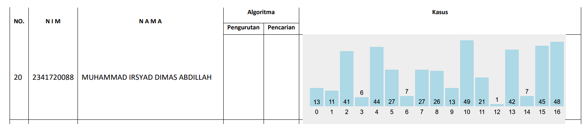

# <p align ="center"> LAPORAN UTS ALGORITMA DAN STRUKTUR DATA </p>

<br><br><br><br>

<p align="center">
    </p>

<br><br><br><br><br>

<p align = "center"> Nama : Muhammad Irsyad Dimas Abdillah </p>
<p align = "center"> Absen: 20 </p>
<p align = "center"> NIM  : 2341720088 </p>
<p align = "center"> Prodi: TEKNIK INFOMATIKA</p>
<p align = "center"> Kelas: 1B </p>

<br><br><br>

# Soal

## data nilai angka


Implementasikan pengurutan dan pencarian berdasarkan kasus yang diberikan! <br>
Metode pencarian dan pengurutan mengikuti ketentuan yang tercantum! <br>
Simulasi pengurutan dilakukan secara ascending dan descending! <br>
Nilai yang dicari merupakan nilai bebas ditentukan setiap mahasiswa dengan ketentuan empat kondisi, yaitu: <br>

    1) nilai yang dapat ditemukan (ditunjukkan pada lokasi index sebelum pengurutan);
    2)  nilai yang dapat ditemukan (ditunjukkan pada lokasi index setelah pengurutan secara ascending);
    3) nilai yang dapat ditemukan (ditunjukkan pada lokasi index setelah pengurutan secara descending);
    4) nilai tidak ditemukan.

Waktu pengerjaan di kelas adalah satu jam, selanjutnya dosen akan memanggil setiap mahasiswa untuk menunjukkan progress! <br>
Setelah pemeriksaan selesai, mahasiswa melanjutkan pengerjaan secara mandiri.
Kumpulkan hasil kode program melalui repo GitHub, laporan hasil pengerjaan dilakukan melalui file markdown (.md)! <br>
Perhatikan pengumpulan di repo dipisahkan dalam folder tersendiri! <br>
Perhatikan deadline pengumpulan, tidak ada toleransi ketrlambatan dalam bentuk alasan apapun! <br>

# Output

Disini saya menggunakan metode pengurutan 'SelectionSort' untuk melakukan pengurutan data secara ascending maupun descending. Dan untuk pencarian saya menggunakan metode 'BinarySearch' <br>

## Output jika data yang dicari ada pada data angka

```
    Data angka yang tersedia:
    13 11 41 6 44 27 7 27 26 13 49 21 1 42 7 45 48
    ========================================================================
    Masukkan angka yang akan dicari: 49
    ========================================================================
    data sebelum diurutkan:
    13 11 41 6 44 27 7 27 26 13 49 21 1 42 7 45 48
    Angka 49 ditemukan pada indeks: 10
    ========================================================================
    data setelah diurutkan secara ascending:
    1 6 7 7 11 13 13 21 26 27 27 41 42 44 45 48 49
    Angka 49 ditemukan pada indeks ke-16 setelah pengurutan ascending
    ========================================================================
    data setelah diurutkan secara descending:
    49 48 45 44 42 41 27 27 26 21 13 13 11 7 7 6 1
    Angka 49 ditemukan pada indeks ke-0 setelah pengurutan descending
    ========================================================================
```

## Output jika data yang dicari tidak ada pada data angka

```
Data angka yang tersedia:
13 11 41 6 44 27 7 27 26 13 49 21 1 42 7 45 48
========================================================================
Masukkan angka yang akan dicari: 99
========================================================================
data sebelum diurutkan:
13 11 41 6 44 27 7 27 26 13 49 21 1 42 7 45 48
Angka 99 tidak ditemukan dalam data angka.
========================================================================
data setelah diurutkan secara ascending:
1 6 7 7 11 13 13 21 26 27 27 41 42 44 45 48 49
Angka 99 tidak ditemukan pada data angka
========================================================================
data setelah diurutkan secara descending:
49 48 45 44 42 41 27 27 26 21 13 13 11 7 7 6 1
Angka 99 tidak ditemukan pada data angka
========================================================================
```
