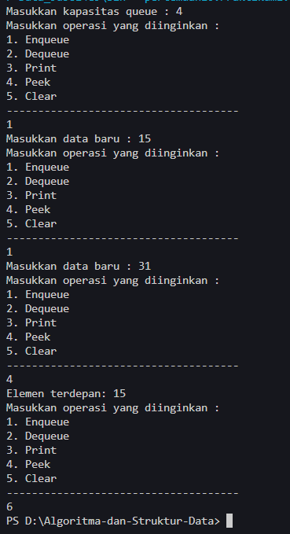
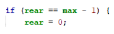
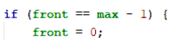
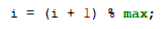
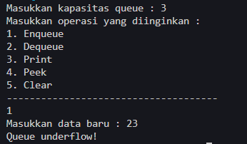
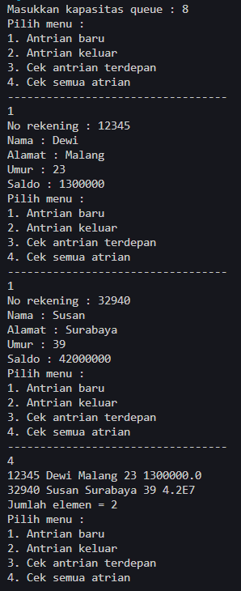
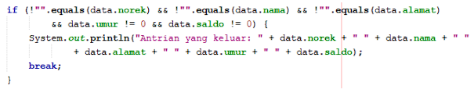
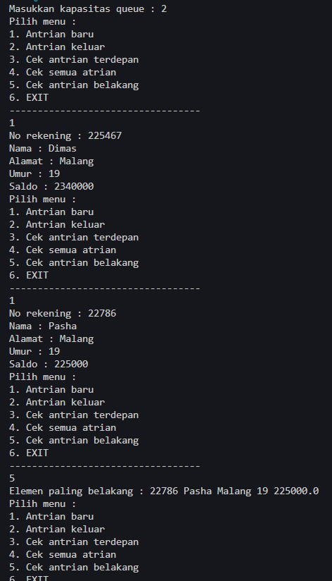

# <p align ="center"> LAPORAN PRAKTIKUM ALGORITMA DAN STRUKTUR DATA </p>

<br><br><br><br>

<p align="center">
    </p>

<br><br><br><br><br>

<p align = "center"> Nama : Muhammad Irsyad Dimas Abdillah </p>
<p align = "center"> Absen: 20 </p>
<p align = "center"> NIM  : 2341720088 </p>
<p align = "center"> Prodi: TEKNIK INFOMATIKA</p>
<p align = "center"> Kelas: 1B </p>

<br><br><br>

# Praktikum 1

Code<br>

```java
package pertemuan10.Praktikum1;

public class Queue20 {
    int[] data;
    int front;
    int rear;
    int size;
    int max;

    public Queue20(int n) {
        max = n;
        data = new int[max];
        size = 0;
        front = rear = -1;
    }

    public boolean IsEmpty() {
        if (size == 0) {
            return true;
        } else {
            return false;
        }
    }

    public boolean IsFull() {
        if (size == max) {
            return true;
        } else {
            return false;
        }
    }

    public void peek() {
        if (!IsEmpty()) {
            System.out.println("Elemen terdepan: " + data[front]);
        } else {
            System.out.println("Antrian kosong");
        }
    }

    public void print() {
        if (!IsEmpty()) {
            System.out.println("Queue masih kosong");
        } else {
            int i = front;
            while (i != rear) {
                System.out.println(data[i] + " ");
                i = (i + 1) % max;
            }
            System.out.println(data[i] + " ");
            System.out.println("Jumlah elemen = " + size);
        }
    }

    public void clear() {
        if (!IsEmpty()) {
            front = rear = -1;
            size = 0;
            System.out.println("Queue berhasil dikosongkan");
        } else {
            System.out.println("Queue masih kosong");
        }
    }

    public void Enqueue(int dt) {
        if (IsFull()) {
            System.out.println("Queue sudah penuh");
        } else {
            if (IsEmpty()) {
                front = rear = 0;
            } else {
                if (rear == max - 1) {
                    rear = 0;
                } else {
                    rear++;
                }
            }
            data[rear] = dt;
            size++;
        }
    }

    public int Dequeue() {
        int dt = 0;
        if (IsEmpty()) {
            System.out.println("Queue kosong");
        } else {
            dt = data[front];
            size--;
            if (IsEmpty()) {
                front = rear = -1;
            } else {
                if (front == max - 1) {
                    front = 0;
                } else {
                    front++;
                }
            }
        }
        return dt;
    }
}
```

```java
package pertemuan10.Praktikum1;

import java.util.Scanner;

public class QueueMain20 {
    public static void menu() {
        System.out.println("Masukkan operasi yang diinginkan : ");
        System.out.println("1. Enqueue");
        System.out.println("2. Dequeue");
        System.out.println("3. Print");
        System.out.println("4. Peek");
        System.out.println("5. Clear");
        System.out.println("-------------------------------------");
    }

    public static void main(String[] args) {
        Scanner sc = new Scanner(System.in);

        System.out.print("Masukkan kapasitas queue : ");
        int n = sc.nextInt();

        Queue20 Q = new Queue20(n);
        int pilih;
        do {
            menu();
            pilih = sc.nextInt();
            switch (pilih) {
                case 1:
                    System.out.print("Masukkan data baru : ");
                    int dataMasuk = sc.nextInt();
                    Q.Enqueue(dataMasuk);
                    break;
                case 2:
                    int dataKeluar = Q.Dequeue();
                    if (dataKeluar != -1) {
                        System.out.println("Data yang dikeluarkan : " + dataKeluar);
                        break;
                    }
                case 3:
                    Q.print();
                    break;
                case 4:
                    Q.peek();
                    break;
                case 5:
                    Q.clear();
                    break;
            }
        } while (pilih == 1 || pilih == 2 || pilih == 3 || pilih == 4 || pilih == 5);
    }
}

```

Output <br> 

## Pertanyaan

1. Pada konstruktor, mengapa nilai awal atribut front dan rear bernilai -1, sementara atribut size bernilai 0? <br>
   jawab: front dan rear diberi nilai awal -1 untuk menandakan bahwa antrian saat itu sedang kosong, karena front dan rear adalah posisi elemen pertama dan terakhir dalam antrian. Sedangkan size diberikan nilai awal 0 karena itu adalah jumlah elemen sebenarnya yang ada dalam antrian pada saat konstruksi.<br>
2. Pada method Enqueue, jelaskan maksud dan kegunaan dari potongan kode berikut!<br><br>
   jawab: potongan kode program tersebut bertujuan untuk mengecek apakah posisi terakhir dalam antrian sudah mencapai batas maksimum.<br>
3. Pada method Dequeue, jelaskan maksud dan kegunaan dari potongan kode berikut!<br><br>
   jawab: potongan kode tersebut bertujuan untuk memeriksa apakah front sudah mencapai batas maksimum dari array 'data'.<br>
4. Pada method print, mengapa pada proses perulangan variabel i tidak dimulai dari 0 (int i=0), melainkan int i=front? <br>
   jawab: perulangan dimulai dari i = front karena untuk menghindari iterasi ulang yang tidak perlu dari elemen-elemen yang telah dohapus sebelumnya dari antrian. Dengan demikian, proses mencetak elemen yang saat ini ada dalam antrian dimulai dari posisi front yang merupakan elemen pertama saat itu.<br>
5. Perhatikan kembali method print, jelaskan maksud dari potongan kode berikut!<br><br>
   jawab: potongan kode tersebut digunakan untuk menggeser indeks 'i' ke elemen berikutnya dalam array. Kode tersebut memastikan perulangan akan mencapai elemen terakhir dalam array.<br>
6. Tunjukkan potongan kode program yang merupakan queue overflow!<br>
   jawab: queue overflow terjadi ketika kita akan menambahkan queue kedalam antrian yang sudah penuh.

```java
    public boolean IsFull() {
        if (size == max) {
            return true;
        } else {
            return false;
        }
    }
```

<br>
7. Pada saat terjadi queue overflow dan queue underflow, program tersebut tetap dapat berjalan dan hanya menampilkan teks informasi. Lakukan modifikasi program sehingga pada saat terjadi queue overflow dan queue underflow, program dihentikan! <br>
jawab:

```java
    public boolean IsEmpty() {
        if (size == 0) {
            System.out.println("Queue underflow!");
            System.exit(0);
            return true;
        } else {
            return false;
        }
    }

    public boolean IsFull() {
        if (size == max) {
            System.out.println("Queue overflow!");
            System.exit(0);
            return true;
        } else {
            return false;
        }
    }
```

Output <br> 
<br>

# Praktikum 2

Code <br>

```java
package pertemuan10.Praktikum2;

public class Nasabah20 {
    String norek, nama, alamat;
    int umur;
    double saldo;

    Nasabah20() {

    }

    Nasabah20(String norek, String nama, String alamat, int umur, double saldo) {
        this.norek = norek;
        this.nama = nama;
        this.alamat = alamat;
        this.umur = umur;
        this.saldo = saldo;
    }
}
```

```java
package pertemuan10.Praktikum2;

public class Queue20 {
    Nasabah20[] data;
    int front, rear, size, max;

    Queue20(int n) {
        max = n;
        data = new Nasabah20[max];
        size = 0;
        front = rear = -1;
    }

    public boolean isFull() {
        if (size == max) {
            return true;
        } else {
            return false;
        }
    }

    public boolean isEmpty() {
        if (size == 0) {
            return true;
        } else {
            return false;
        }
    }

    void enqueue(Nasabah20 dt) {
        if (isFull()) {
            System.out.println("Queue sudah penuh");
            System.exit(1);
        } else {
            if (isEmpty()) {
                front = rear = 0;
            } else {
                if (rear == max - 1) {
                    rear = 0;
                } else {
                    rear++;
                }
            }
            data[rear] = dt;
            size++;
        }
    }

    public Nasabah20 dequeue() {
        Nasabah20 dt = new Nasabah20();
        if (isEmpty()) {
            System.out.println("Queue masih kosong");
            System.exit(1);
        } else {
            dt = data[front];
            size--;
            if (isEmpty()) {
                front = rear = -1;
            } else {
                if (front == max - 1) {
                    front = 0;
                } else {
                    front++;
                }
            }
        }
        return dt;
    }

    void peek() {
        if (!isEmpty()) {
            System.out.println("Elemen terdepan : " + data[front].norek + " " + data[front].nama + " "
                    + data[front].alamat + " " + data[front].umur + " " + data[front].saldo);
        } else {
            System.out.println("Queue masih kosong");
        }
    }

    void print() {
        if (isEmpty()) {
            System.out.println("Queue masih kosong");
        } else {
            int i = front;
            while (i != rear) {
                System.out.println(data[i].norek + " " + data[i].nama + " "
                        + data[i].alamat + " " + data[i].umur + " " + data[i].saldo);
                i = (i + 1) % max;
            }
            System.out.println(data[i].norek + " " + data[i].nama + " "
                    + data[i].alamat + " " + data[i].umur + " " + data[i].saldo);
            System.out.println("Jumlah elemen = " + size);
        }
    }

    void clear() {
        if (!isEmpty()) {
            front = rear = -1;
            size = 0;
            System.out.println("Queue berhasil dikosongkan");
        } else {
            System.out.println("Queue masih kosong");
        }
    }
}
```

```java
package pertemuan10.Praktikum2;

import java.util.Scanner;

public class QueueMain20 {
    public static void menu() {
        System.out.println("Pilih menu : ");
        System.out.println("1. Antrian baru");
        System.out.println("2. Antrian keluar");
        System.out.println("3. Cek antrian terdepan");
        System.out.println("4. Cek semua atrian");
        System.out.println("----------------------------------");
    }

    public static void main(String[] args) {
        Scanner sc = new Scanner(System.in);
        Scanner sc2 = new Scanner(System.in);
        System.out.print("Masukkan kapasitas queue : ");
        int jumlah = sc.nextInt();

        Queue20 Q = new Queue20(jumlah);

        int pilih = 0;
        do {
            menu();
            pilih = sc.nextInt();
            switch (pilih) {
                case 1:
                    System.out.print("No rekening : ");
                    String norek = sc2.nextLine();
                    System.out.print("Nama : ");
                    String nama = sc2.nextLine();
                    System.out.print("Alamat : ");
                    String alamat = sc2.nextLine();
                    System.out.print("Umur : ");
                    int umur = sc.nextInt();
                    sc.nextLine(); // tambahkan ini
                    System.out.print("Saldo : ");
                    int saldo = sc.nextInt();
                    sc.nextLine(); // dan ini
                    Nasabah20 nb = new Nasabah20(norek, nama, alamat, umur, saldo);
                    Q.enqueue(nb);
                    break;

                case 2:
                    Nasabah20 data = Q.dequeue();
                    if (!"".equals(data.norek) && !"".equals(data.nama) && !"".equals(data.alamat) && data.umur != 0
                            && data.saldo != 0) {
                        System.out.println("Data yang dikeluarkan : " + data.norek + " " + data.nama + " " + data.alamat
                                + " " + data.umur + " " + data.saldo);
                    }
                    break;
                case 3:
                    Q.peek();
                    break;
                case 4:
                    Q.print();
                    break;
                default:
                    break;
            }
        } while (pilih == 1 || pilih == 2 || pilih == 3 || pilih == 4);
    }
}
```

Output <br>

## Pertanyaan

1. Pada class QueueMain, jelaskan fungsi IF pada potongan kode program berikut! <br><br>
   jawab: Kode program memastikan bahwa data yang dikeluarkan dari antrian queue setelah melakukan operasi dequeue adalah data yang valid dan bukan merupakan data yang kosong, dan jika data yang dikeluarkan merupakan data yang valid, maka datanya akan dicetak pada layar. <br>
2. Lakukan modifikasi program dengan menambahkan method baru bernama peekRear pada class Queue yang digunakan untuk mengecek antrian yang berada di posisi belakang! Tambahkan pula daftar menu 5. Cek Antrian paling belakang pada class QueueMain sehingga method peekRear dapat dipanggil! <br>
   jawab: <br>
   Class Queue

```java
void peekRear() {
        if (!isEmpty()) {
            System.out.println("Elemen paling belakang : " + data[rear].norek + " " + data[rear].nama + " "
                    + data[rear].alamat + " " + data[rear].umur + " " + data[rear].saldo);
        } else {
            System.out.println("Queue masih kosong");
        }
    }
```

Class Main

```java
package pertemuan10.Praktikum2;

import java.util.Scanner;

public class QueueMain20 {
    public static void menu() {
        System.out.println("Pilih menu : ");
        System.out.println("1. Antrian baru");
        System.out.println("2. Antrian keluar");
        System.out.println("3. Cek antrian terdepan");
        System.out.println("4. Cek semua atrian");
        System.out.println("5. Cek antrian belakang");
        System.out.println("6. EXIT");
        System.out.println("----------------------------------");
    }

    public static void main(String[] args) {
        Scanner sc = new Scanner(System.in);
        Scanner sc2 = new Scanner(System.in);
        System.out.print("Masukkan kapasitas queue : ");
        int jumlah = sc.nextInt();

        Queue20 Q = new Queue20(jumlah);

        int pilih = 0;
        do {
            menu();
            pilih = sc.nextInt();
            switch (pilih) {
                case 1:
                    System.out.print("No rekening : ");
                    String norek = sc2.nextLine();
                    System.out.print("Nama : ");
                    String nama = sc2.nextLine();
                    System.out.print("Alamat : ");
                    String alamat = sc2.nextLine();
                    System.out.print("Umur : ");
                    int umur = sc.nextInt();
                    sc.nextLine(); // tambahkan ini
                    System.out.print("Saldo : ");
                    int saldo = sc.nextInt();
                    sc.nextLine(); // dan ini
                    Nasabah20 nb = new Nasabah20(norek, nama, alamat, umur, saldo);
                    Q.enqueue(nb);
                    break;

                case 2:
                    Nasabah20 data = Q.dequeue();
                    if (!"".equals(data.norek) && !"".equals(data.nama) && !"".equals(data.alamat) && data.umur != 0
                            && data.saldo != 0) {
                        System.out.println("Data yang dikeluarkan : " + data.norek + " " + data.nama + " " + data.alamat
                                + " " + data.umur + " " + data.saldo);
                    }
                    break;
                case 3:
                    Q.peek();
                    break;
                case 4:
                    Q.print();
                    break;
                case 5:
                    Q.peekRear();
                    break;
                case 6:
                    System.exit(1);
                    break;
                default:
                    break;
            }
        } while (pilih == 1 || pilih == 2 || pilih == 3 || pilih == 4 || pilih == 5 || pilih == 6);
    }
}
```

Output<br>
<br>

# Tugas

Semua Kode program di letakkan pada package Tugas untuk mempersingkat laporan. <br>

```
Masukkan kapasitas antrian : 4
1. Tambah antrian baru
2. Antrian keluar
3. Cek antrian terdepan
4. Cek semua antrian
5. Cek antrian belakang
6. Cari antrian pembeli
7. Exit
----------------------------------
1
Masukkan nama :
dimas
Masukkan noHp :
97969
1. Tambah antrian baru
2. Antrian keluar
3. Cek antrian terdepan
4. Cek semua antrian
5. Cek antrian belakang
6. Cari antrian pembeli
7. Exit
----------------------------------
1
Masukkan nama :
adil
Masukkan noHp :
987979
1. Tambah antrian baru
2. Antrian keluar
3. Cek antrian terdepan
4. Cek semua antrian
5. Cek antrian belakang
6. Cari antrian pembeli
7. Exit
----------------------------------
1
Masukkan nama :
pasha
Masukkan noHp :
87686
1. Tambah antrian baru
2. Antrian keluar
3. Cek antrian terdepan
4. Cek semua antrian
5. Cek antrian belakang
6. Cari antrian pembeli
7. Exit
----------------------------------
1
Masukkan nama :
Doni
Masukkan noHp :
321445
1. Tambah antrian baru
2. Antrian keluar
3. Cek antrian terdepan
4. Cek semua antrian
5. Cek antrian belakang
6. Cari antrian pembeli
7. Exit
----------------------------------
2
Antrian yang dikeluarkan : dimas 97969
1. Tambah antrian baru
2. Antrian keluar
3. Cek antrian terdepan
4. Cek semua antrian
5. Cek antrian belakang
6. Cari antrian pembeli
7. Exit
----------------------------------
3
Pembeli terdepan: adil 987979
1. Tambah antrian baru
2. Antrian keluar
3. Cek antrian terdepan
4. Cek semua antrian
5. Cek antrian belakang
6. Cari antrian pembeli
7. Exit
----------------------------------
4
adil 987979
pasha 87686
Doni 321445
Jumlah elemen = 3
1. Tambah antrian baru
2. Antrian keluar
3. Cek antrian terdepan
4. Cek semua antrian
5. Cek antrian belakang
6. Cari antrian pembeli
7. Exit
----------------------------------
5
Pembeli paling belakang : Doni 321445
1. Tambah antrian baru
2. Antrian keluar
3. Cek antrian terdepan
4. Cek semua antrian
5. Cek antrian belakang
6. Cari antrian pembeli
7. Exit
----------------------------------
6
Masukkan nama Pembeli :
pasha
Pembeli yang anda cari berada pada posisi ke 3
1. Tambah antrian baru
2. Antrian keluar
3. Cek antrian terdepan
4. Cek semua antrian
5. Cek antrian belakang
6. Cari antrian pembeli
7. Exit
----------------------------------
PS D:\Algoritma-dan-Struktur-Data>
```
