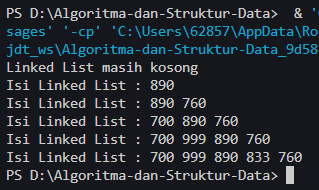
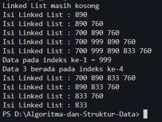
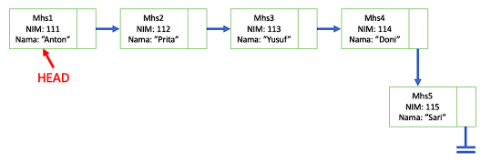
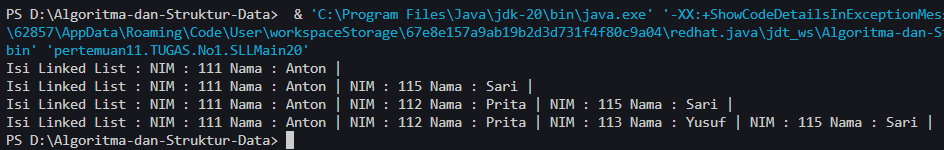
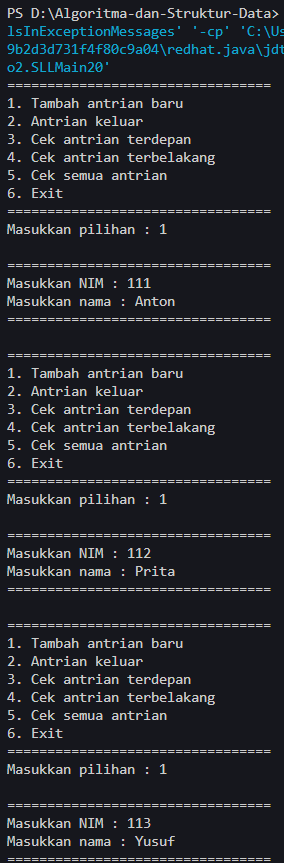
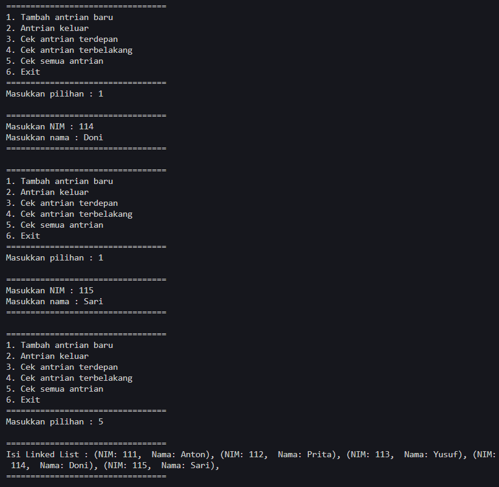

# <p align ="center"> LAPORAN PRAKTIKUM ALGORITMA DAN STRUKTUR DATA </p>

<br><br><br><br>

<p align="center">
    </p>

<br><br><br><br><br>

<p align = "center"> Nama : Muhammad Irsyad Dimas Abdillah </p>
<p align = "center"> Absen: 20 </p>
<p align = "center"> NIM  : 2341720088 </p>
<p align = "center"> Prodi: TEKNIK INFOMATIKA</p>
<p align = "center"> Kelas: 1B </p>

<br><br><br>

# Praktikum 1: Pembuatan Single Linked List

Code<br>

```java
package pertemuan11.minggu11;

public class Node20 {
    int data;
    Node20 next;

    Node20(int nilai, Node20 berikutnya) {
        data = nilai;
        next = berikutnya;
    }
}
```

```java
package pertemuan11.minggu11;

public class SingleLinkedList20 {
    Node20 head, tail;

    boolean isEmpty() {
        return head == null;
    }

    void print() {
        if (!isEmpty()) {
            Node20 bantu = head;
            System.out.print("Isi Linked List : ");
            while (bantu != null) {
                System.out.print(bantu.data + " ");
                bantu = bantu.next;
            }
            System.out.println("");
        } else {
            System.out.println("Linked List masih kosong");
        }
    }

    void addFirst(int input) {
        Node20 ndInput = new Node20(input, null);
        if (isEmpty()) {
            head = ndInput;
            tail = ndInput;
        } else {
            ndInput.next = head;
            head = ndInput;
        }
    }

    void addLast(int input) {
        Node20 ndInput = new Node20(input, null);
        if (isEmpty()) {
            head = ndInput;
        } else {
            tail.next = ndInput;
        }
        tail = ndInput;
    }

    void insertAfter(int key, int input) {
        Node20 ndInput = new Node20(input, null);
        Node20 temp = head;
        do {
            if (temp.data == key) {
                ndInput.next = temp.next;
                temp.next = ndInput;
                if (ndInput.next != null) {
                    tail = ndInput;
                    break;
                }
            }
            temp = temp.next;
        } while (temp == null);
    }

    void insertAt(int index, int input) {
        if (index < 0) {
            System.out.println("Index tidak boleh negatif");
            return;
        }
        if (index == 0) {
            addFirst(input);
            return;
        }
        Node20 ndInput = new Node20(input, null);
        Node20 temp = head;
        for (int i = 0; i < index - 1; i++) {
            if (temp == null) {
                System.out.println("Indeks melebihi panjang linked list");
                return;
            }
            temp = temp.next;
        }
        if (temp == null) {
            System.out.println("Indeks melebihi panjang linked list");
            return;
        }
        ndInput.next = temp.next;
        temp.next = ndInput;
        if (ndInput.next == null) {
            tail = ndInput;
        }
    }
}
```

```java
package pertemuan11.minggu11;

public class SLLMain20 {
    public static void main(String[] args) {
        SingleLinkedList20 singLL = new SingleLinkedList20();
        singLL.print();
        singLL.addFirst(890);
        singLL.print();
        singLL.addLast(760);
        singLL.print();
        singLL.addFirst(700);
        singLL.print();
        singLL.insertAfter(700, 999);
        singLL.print();
        singLL.insertAt(3, 833);
        singLL.print();
    }
}
```

Output<br>

## Pertanyaan

1. Mengapa hasil compile kode program di baris pertama menghasilkan “Linked List Kosong”?<br>
   Jawab: karena program melakukan print data kosong terlebih dahulu dan belum diinputkan nilai linked list. Kemudian setelah print, baru diinputkan datanya.<br>
2. Jelaskan kegunaan variable temp secara umum pada setiap method! <br>
   Jawab: variabel temp(temporary) digunakan sebagai tempat penyimpanan sementara dalam proses atau operasi tertentu sebelum nilai atau hasilnya ditransfer atau digunakan lebih lanjut dalam konteks suatu metode atau fungsi. <br>
3. Perhatikan class SingleLinkedList, pada method insertAt Jelaskan kegunaan kode berikut <br>

```java
if(temp.next.next==null) tail = temp.next;
```

Jawab: Kode diatas digunakan untuk memeriksa apakah node yang diikuti oleh temp adalah node terakhir dalam linked list. Jika ya, maka tail akan diatur ke node tersebut. ini digunakan untuk memperbarui nilai tail ketika menambahkan node baru di akhir linked list. <br>

# Praktikum 2: Modifikasi Elemen pada Single Linked List

Code<br>
Tambahan function pada class singleLinkedList<br>

```java
    int getData(int index) {
        Node20 tmp = head;
        for (int i = 0; i < index - 1; i++) {
            tmp = tmp.next;
        }
        return tmp.next.data;
    }

    int indexOf(int key) {
        Node20 tmp = head;
        int index = 0;
        while (tmp != null && tmp.data != key) {
            tmp = tmp.next;
            index++;
        }
        if (tmp == null) {
            return -1;
        } else {
            return index;
        }
    }

    void removeFirst() {
        if (isEmpty()) {
            System.out.println("Linked list masih kosong, tidak dapat dihapus");
        } else if (head == tail) {
            head = tail = null;
        } else {
            head = head.next;
        }
    }

    void removeLast() {
        if (isEmpty()) {
            System.out.println("Linked list masih kosong, tidak dapat dihapus");
        } else if (head == tail) {
            head = tail = null;
        } else {
            Node20 temp = head;
            while (temp.next == null) {
                temp = temp.next;
            }
            temp.next = null;
            tail = temp.next;
        }
    }

    void remove(int key) {
        if (isEmpty()) {
            System.out.println("Linked List masih kosong, tidak dapat dihapus");
        } else {
            Node20 temp = head;
            while (temp != null) {
                if (temp.data == key && temp == head) {
                    removeFirst();
                    break;
                } else if (temp.next.data == key) {
                    temp.next = temp.next.next;
                    if (temp.next == null) {
                        tail = temp;
                    }
                    break;
                }
                temp = temp.next;
            }
        }
    }

    public void removeAt(int index) {
        if (index == 0) {
            removeFirst();
        } else {
            Node20 temp = head;
            for (int i = 0; i < index; i++) {
                temp = temp.next;
            }
            temp.next = temp.next.next;
            if (temp.next == null) {
                tail = temp;
            }
        }
    }
}
```

```java
package pertemuan11.minggu11;

public class SLLMain20 {
    public static void main(String[] args) {
        SingleLinkedList20 singLL = new SingleLinkedList20();
        singLL.print();
        singLL.addFirst(890);
        singLL.print();
        singLL.addLast(760);
        singLL.print();
        singLL.addFirst(700);
        singLL.print();
        singLL.insertAfter(700, 999);
        singLL.print();
        singLL.insertAt(3, 833);
        singLL.print();

        System.out.println("Data pada indeks ke-1 = " + singLL.getData(1));
        System.out.println("Data 3 berada pada indeks ke-" + singLL.indexOf(760));

        singLL.remove(999);
        singLL.print();
        singLL.removeAt(0);
        singLL.print();
        singLL.removeFirst();
        singLL.print();
        singLL.removeLast();
        singLL.print();
    }
}
```

Output<br>

## Pertanyaan

1. Mengapa digunakan keyword break pada fungsi remove? Jelaskan! <br>
   jawab: keyword break digunakan untuk menghentikan iterasi setelah dilakukan proses penghapusan. Sehingga proses penghapusan dilakukan sekali pada elemen yang diinginkan dan tidak menghapus elemen lain yang tidak diiginkan. <br>

2. Jelaskan kegunaan kode dibawah pada method remove <br>

```java
else if (temp.next.data == key){
    temp.next = temp.next.next;
}
```

jawab: dalam method remove kode diatas berperan dalam mencari node yang memiliki nilai yang sama dengan nilai key. Seteleah node ditemukan, kemudian dilakukan operasi penghapusan dari linked list dengan mengubah referensi 'next' dari node saat temp ke node setelah node yang akan dihapus. <br>

# Tugas

1. Implementasikan ilustrasi Linked List Berikut. Gunakan 4 macam penambahan data yang telah dipelajari sebelumnya untuk menginputkan data. <br>
    <br>
   jawab: SOURCE CODE ada di folder tugas No1.<br>
   <br>
2. Buatlah implementasi program antrian layanan unit kemahasiswaan sesuai dengan kondisi yang ditunjukkan pada soal nomor 1! Ketentuan <br>
   a. Implementasi antrian menggunakan Queue berbasis Linked List! <br>
   b. Program merupakan proyek baru, bukan modifikasi dari soal nomor 1! <br>
   jawab: Antrian terdepan merupakan bagian head node, dan antrian terbelakang adalah tail node. **Untuk source code saya telah mengupload pada folder tugas No1. Dan dibawah ini adalah output dari source code tersebut:**<br>
   <br>
   <br>
   <br>
