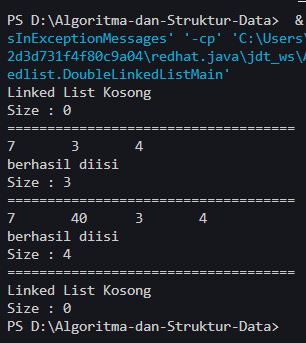
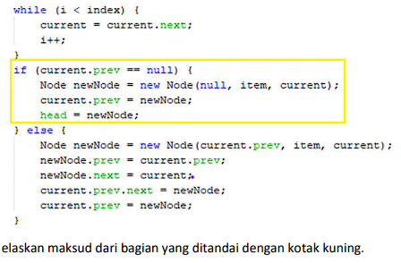
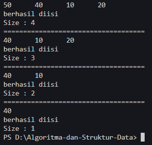
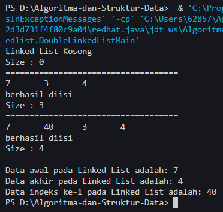
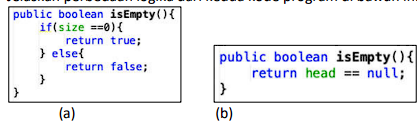

# <p align ="center"> LAPORAN PRAKTIKUM ALGORITMA DAN STRUKTUR DATA </p>

<br><br><br><br>

<p align="center">
    </p>

<br><br><br><br><br>

<p align = "center"> Nama : Muhammad Irsyad Dimas Abdillah </p>
<p align = "center"> Absen: 20 </p>
<p align = "center"> NIM  : 2341720088 </p>
<p align = "center"> Prodi: TEKNIK INFOMATIKA</p>
<p align = "center"> Kelas: 1B </p>

<br><br><br>

# Praktikum 1

Code<br>

```java
package pertemuan13.doublelinkedlist;

public class DoubleLinkedList {
    Node head;
    int size;

    public DoubleLinkedList() {
        head = null;
        size = 0;
    }

    public boolean isEmpty() {
        return head == null;
    }

    public void addFirst(int item) {
        if (isEmpty()) {
            head = new Node(null, item, null);
        } else {
            Node newNode = new Node(null, item, head);
            head.prev = newNode;
            head = newNode;
        }
        size++;
    }

    public void addLast(int item) {
        if (isEmpty()) {
            addFirst(item);
        } else {
            Node current = head;
            while (current.next != null) {
                current = current.next;
            }
            Node newNode = new Node(current, item, null);
            current.next = newNode;
            size++;
        }
    }

    public void add(int item, int index) throws Exception {
        if (isEmpty()) {
            addFirst(item);
        } else if (index < 0 || index > size) {
            throw new Exception("Nilai indeks di luar batas");
        } else {
            Node current = head;
            int i = 0;
            while (i < index) {
                current = current.next;
                i++;
            }
            if (current.prev == null) {
                Node newNode = new Node(null, item, current);
                current.prev = newNode;
                head = newNode;
            } else {
                Node newNode = new Node(current.prev, item, current);
                newNode.prev = current.prev;
                newNode.next = current;
                current.prev.next = newNode;
                current.prev = newNode;
            }
        }
        size++;
    }

    public int size() {
        return size;
    }

    public void clear() {
        head = null;
        size = 0;
    }

    public void print() {
        if (!isEmpty()) {
            Node tmp = head;
            while (tmp != null) {
                System.out.print(tmp.data + "\t");
                tmp = tmp.next;
            }
            System.out.println("\nberhasil diisi");
        } else {
            System.out.println("Linked List Kosong");
        }
    }
}
```

```java
package pertemuan13.doublelinkedlist;

public class DoubleLinkedListMain {
    public static void main(String[] args) {
        DoubleLinkedList dll = new DoubleLinkedList();
        dll.print();
        System.out.println("Size : " + dll.size());
        System.out.println("====================================");
        dll.addFirst(3);
        dll.addLast(4);
        dll.addFirst(7);
        dll.print();
        System.out.println("Size : " + dll.size());
        System.out.println("====================================");
        try {
            dll.add(40, 1);
        } catch (Exception e) {
            e.printStackTrace();
        }
        dll.print();
        System.out.println("Size : " + dll.size());
        System.out.println("====================================");
    }
}
```

Output<br> <br>

## Pertanyaan

1. Jelaskan perbedaan antara single linked list dengan double linked lists! <br>
   Jawab: Dalam Single LinkedList setiap node berisi data, dan next saja untuk referensi ke node berikutnya, untuk di akhir node merujuk pada null. Sedangkan pada Double LinkedList setiap node berisi prev, data, dan next, yang merujuk pada node sebelumnya dan node berikutnya. Double LinkedList juga memiliki node head yang memiliki prev bernilai null karena berada paling awal, dan node tail yang memiliki nilai next null karena berada pada paling akhir node. <br>
2. Perhatikan class Node, di dalamnya terdapat atribut next dan prev. Untuk apakah atribut tersebut?<br>
   Jawab: prev digunakan untuk merujuk pada node sebelumnya dalam list, sedangkan next digunakan untuk merujuk pada node setelahnya dalam list. Prev digunakan untuk bergerak menuju awal list, sedangkan next digunakan untuk menuju ke akhir list. <br>
3. Perhatikan konstruktor pada class DoubleLinkedLists. Apa kegunaan inisialisasi atribut head dan size seperti pada gambar berikut ini?<br>

```java
public DoubleLinkedList(){
    head = null;
    size = 0;
}
```

Jawab: konstruktor tersebut digunakan untuk membantu membuat objek DoubleLinkedList yang baru dan kosong tanpa menyimpan nilai apapun, sehingga head didefinisikan menjadi null dan size = 0 karena belum menyimpan data atau nilai apapun. <br> 4. Pada method addFirst(), kenapa dalam pembuatan object dari konstruktor class Node prev dianggap sama dengan null? <br>
Node newNode = new Node(null, item, head);<br>
Jawab: dalam kode diberikan nilai null untuk prev karena data baru yang akan ditambahkan berada pada head atau ujung awal dari list, sehingga data tersebut tidak memiliki node sebelumnya (prev node). <br> 5. Perhatikan pada method addFirst(). Apakah arti statement head.prev = newNode ?<br>
Jawab: Pada method addFirst(), statement head.prev = newNode digunakan untuk mengatur node sebelumnya (prev) dari node kepala (head) saat ini menjadi newNode.<br> 6. Perhatikan isi method addLast(), apa arti dari pembuatan object Node dengan mengisikan parameter prev dengan current, dan next dengan null? <br>
Node newNode = new Node(current, item, null);<br>
Jawab: Pada method addLast(), pembuatan objek Node dengan parameter prev diisi dengan current, dan next dengan null berarti kita membuat node baru di akhir list. current adalah node terakhir dalam list saat ini, jadi kita mengatur prev dari node baru menjadi current. Karena node baru ini akan menjadi node terakhir dalam list, next dari node ini diatur menjadi null.<br> 7. Pada method add(), terdapat potongan kode program sebagai berikut:
jelaskan maksud dari bagian yang ditandai dengan kotak kuning.<br>
Jawab: if(current.prev == null): Baris ini memeriksa apakah elemen sebelum elemen saat ini (current) adalah null, yang berarti current adalah elemen pertama dalam daftar (alias head atau kepala).
node newNode = new node (null, item, current);: Jika current adalah elemen pertama, baris ini membuat sebuah node baru dengan nilai item yang diberikan. node baru ini memiliki elemen sebelumnya (prev) sebagai null dan elemen berikutnya (next) sebagai current.
current.prev = newNode;: Baris ini mengatur elemen sebelumnya (prev) dari current menjadi node baru yang baru saja dibuat. Ini menghubungkan current dengan node baru dalam daftar.
head = newNode;: Karena node baru ini sekarang adalah elemen pertama dalam daftar, baris ini mengatur head dari daftar menjadi node baru.<br>

# Praktikum 2

Tambahan Code<br>

```java
    public void removeFirst() throws Exception {
        if (isEmpty()) {
            throw new Exception("Linked List masih kosong, tidak dapat dihapus!");
        } else if (size == 1) {
            removeLast();
        } else {
            head = head.next;
            head.prev = null;
            size--;
        }
    }

    public void removeLast() throws Exception {
        if (isEmpty()) {
            throw new Exception("Linked List masih kosong, tidak dapat dihapus!");
        } else if (head.next == null) {
            head = null;
            size--;
            return;
        }
        Node current = head;
        while (current.next.next != null) {
            current = current.next;
        }
        current.next = null;
        size--;
    }

    public void remove(int index) throws Exception {
        if (isEmpty() || index >= size) {
            throw new Exception("Nilai indeks di luar batas");
        } else if (index == 0) {
            removeFirst();
        } else {
            Node current = head;
            int i = 0;
            while (i < index) {
                current = current.next;
                i++;
            }
            if (current.next == null) {
                current.prev.next = null;
            } else if (current.prev == null) {
                current = current.next;
                current.prev = null;
                head = current;
            } else {
                current.prev.next = current.next;
                current.next.prev = current.prev;
            }
            size--;
        }
    }
```

```java
// tambahan kode praktikum 2
        dll.addLast(50);
        dll.addLast(40);
        dll.addLast(10);
        dll.addLast(20);
        dll.print();
        System.out.println("Size : " + dll.size());
        System.out.println("====================================");
        try {
            dll.removeFirst();
        } catch (Exception e) {
            e.printStackTrace();
        }
        dll.print();
        System.out.println("Size : " + dll.size());
        System.out.println("====================================");
        try {
            dll.removeLast();
        } catch (Exception e) {
            e.printStackTrace();
        }
        dll.print();
        System.out.println("Size : " + dll.size());
        System.out.println("====================================");
        try {
            dll.remove(1);
        } catch (Exception e) {
            e.printStackTrace();
        }
        dll.print();
        System.out.println("Size : " + dll.size());
```

Output<br>  <br>

## Pertanyaan

1. Apakah maksud statement berikut pada method removeFirst()?<br>
   head = head.next;<br>
   head.prev = null;<br>
   Jawab: bagian kode tersebut digunakan untuk menghapus elemen pertama dalam linked list. head = head.next; memindahkan kepala atau head ke elemen berikutnya dalam daftar, dan head.prev = null; memastikan bahwa elemen pertama baru tidak memiliki elemen sebelumnya (karena ini sekarang adalah elemen pertama dalam daftar).<br>
2. Bagaimana cara mendeteksi posisi data ada pada bagian akhir pada method removeLast()?<br>
   Jawab: ntuk mendeteksi posisi data pada bagian akhir dalam metode removeLast(), Anda biasanya akan melakukan iterasi atau bergerak melalui daftar dari head sampai Anda menemukan elemen di mana next adalah null. Ini menunjukkan bahwa Anda telah mencapai elemen terakhir dalam daftar.<br>
3. Jelaskan alasan potongan kode program di bawah ini tidak cocok untuk perintah remove!<br>

```java
Node tmp = head.next;

head.next = tmp.next;
tmp.next.prev = head;
```

Jawab: Potongan kode program ini tidak cocok untuk perintah remove karena ini hanya mengubah referensi next dari head dan prev dari tmp.next tanpa benar-benar menghapus node. Selain itu, kode ini mengasumsikan bahwa node yang akan dihapus selalu berada di posisi kedua, yang mungkin tidak selalu benar. <br> 4. Jelaskan fungsi kode program berikut ini pada fungsi remove!<br>

```java
current.prev.next = current.next;
current.next.prev = current.prev;
```

Jawab: Kode program ini adalah bagian dari fungsi remove yang digunakan untuk menghapus node tertentu (current) dari linked list. current.prev.next = current.next; memutuskan tautan antara node sebelum current dan current itu sendiri, dan sebaliknya menghubungkannya dengan node setelah current. current.next.prev = current.prev; melakukan hal yang sama, tetapi dalam arah yang berlawanan. Ini efektif menghapus current dari daftar.<br>

# Praktikum 3

Tambahan Code <br>

```java
    public int getFirst() throws Exception {
        if (isEmpty()) {
            throw new Exception("Linked List masih kosong");
        }
        return head.data;
    }

    public int getLast() throws Exception {
        if (isEmpty()) {
            throw new Exception("Linked List masih kosong");
        }
        Node tmp = head;
        while (tmp.next != null) {
            tmp = tmp.next;
        }
        return tmp.data;
    }

    public int get(int index) throws Exception {
        if (isEmpty() || index >= size) {
            throw new Exception("Nilai indeks di luar batas");
        }
        Node tmp = head;
        for (int i = 0; i < index; i++) {
            tmp = tmp.next;
        }
        return tmp.data;
    }
```

```java
 try {
            System.out.println("Data awal pada Linked List adalah: " + dll.getFirst());
            System.out.println("Data akhir pada Linked List adalah: " + dll.getLast());
            System.out.println("Data indeks ke-1 pada Linked List adalah: " + dll.get(1));
        } catch (Exception e) {
            e.printStackTrace();
        }
```

Output<br>  <br>

## Pertanyaan

1. Jelaskan method size() pada class DoubleLinkedLists!<br>
   Jawab: method size digunakan untuk menghitung jumlah node dalam list. method ini dilakukan dengan cara menginisialisasi penghitung ke 0 dan kemudian melakukan iterasi melalui daftar, menambahkan 1 ke penghitung untuk setiap node sampai akhir list.<br>
2. Jelaskan cara mengatur indeks pada double linked lists supaya dapat dimulai dari indeks ke-1!
   <br>
   Jawab: Untuk membuat indeks pada double linked list dimulai dari 1, bisa dengan cara mengurangi 1 dari indeks saat Anda mencoba mengakses elemen. <br>
3. Jelaskan perbedaan karakteristik fungsi Add pada Double Linked Lists dan Single Linked Lists!<br>
   Jawab: Pada SingleLinkedList, saat menambahkan elemen baru hanya perlu mengatur referensi next dari node baru ke node berikutnya. TSedangkan pada DoubleLinkedLists, saat menambahkan elemen baru perlu mengatur baik referensi next dan prev. Mengatur next dari node baru ke node berikutnya, dan prev dari node berikutnya ke node baru. Ini karena DoubleLinkedList memiliki dua arah, yang memungkinkan pergerakan maju dan mundur melalui daftar. <br>
4. Jelaskan perbedaan logika dari kedua kode program di bawah ini!
   <br>
   Jawab: Pada gambar (a) Metode isEmpty() ini memeriksa apakah ukuran (size) dari struktur data sama dengan 0. Jika size adalah 0, maka metode ini akan mengembalikan true, yang menunjukkan bahwa struktur data tersebut kosong. Jika tidak, metode ini akan mengembalikan false. Sedangkan pada gambar (b) Metode isEmpty() ini langsung mengembalikan hasil dari perbandingan: apakah referensi head dari struktur data sama dengan null. Jika head adalah null, ini berarti tidak ada elemen dalam struktur data, sehingga metode ini mengembalikan true. Jika tidak, metode ini akan mengembalikan false. <br>
