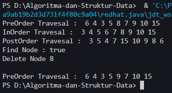
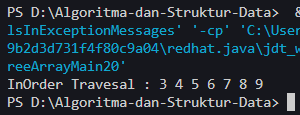

# <p align ="center"> LAPORAN PRAKTIKUM ALGORITMA DAN STRUKTUR DATA </p>

<br><br><br><br>

<p align="center">
    </p>

<br><br><br><br><br>

<p align = "center"> Nama : Muhammad Irsyad Dimas Abdillah </p>
<p align = "center"> Absen: 20 </p>
<p align = "center"> NIM  : 2341720088 </p>
<p align = "center"> Prodi: TEKNIK INFOMATIKA</p>
<p align = "center"> Kelas: 1B </p>

<br><br><br>

# Praktikum 1: Implementasi Binary Search Tree menggunakan Linked List

Code<br>

```java
package pertemuan14;

public class Node20 {
    int data;
    Node20 left;
    Node20 right;

    public Node20() {
    }

    Node20(Node20 left, int data, Node20 right) {
        this.left = null;
        this.data = data;
        this.right = null;
    }
}
```

```java
package pertemuan14;

public class BinaryTree20 {
    Node20 root;

    public BinaryTree20() {
        root = null;
    }

    boolean isEmpty() {
        return root == null; // kosong jika root == null
    }

    void add(int data) {
        if (isEmpty()) { // tree is empty
            root = new Node20(null, data, null);
        } else {
            Node20 current = root;
            while (true) {
                if (data < current.data) { // anak sebelah kiri harus nilai lebih kecil
                    if (current.left != null) { // cek apakah anak kiri ada
                        current = current.left;
                    } else {
                        current.left = new Node20(null, data, null);
                        break;
                    }
                } else if (data > current.data) { // anak sebelah kanan harus nilai lebih besar
                    if (current.right != null) { // cek apakah anak kanan ada
                        current = current.right;
                    } else {
                        current.right = new Node20(null, data, null); // membuat node baru di kanan
                        break;
                    }
                } else { // data is already exist
                    break;
                }
            }
        }
    }

    boolean find(int data) {
        boolean result = false;
        Node20 current = root;
        while (current != null) { // lanjut looping jika data != nulll
            if (current.data == data) { // cek current data = data
                result = true;
                break;
            } else if (data < current.data) { // jika data lebih kecil maka ke anak kiri
                current = current.left;
            } else {
                current = current.right; // jika data lbih besar maka ke anak kanan
            }
        }
        return result;
    }

    void traversePreOrder(Node20 node) {
        if (node != null) {
            System.out.print(" " + node.data);
            traversePreOrder(node.left);
            traversePreOrder(node.right);
        }
    }

    void traversePostOrder(Node20 node) {
        if (node != null) {
            traversePostOrder(node.left);
            traversePostOrder(node.right);
            System.out.print(" " + node.data);
        }
    }

    void traverseInOrder(Node20 node) {
        if (node != null) {
            traverseInOrder(node.left);
            System.out.print(" " + node.data);
            traverseInOrder(node.right);
        }
    }

    Node20 getSuccessor(Node20 del) {
        Node20 successor = del.right;
        Node20 successorParent = del;
        while (successor.left != null) {
            successorParent = successor;
            successor = successor.left;
        }
        if (successor != del.right) {
            successorParent.left = successor.right;
            successor.right = del.right;
        }
        return successor;
    }

    void delete(int data) {
        if (isEmpty()) {
            System.out.println("Tree is empty");
            return;
        }
        // find node (current) that will be deleted
        Node20 parent = root;
        Node20 current = root;
        boolean isLeftChild = false;
        while (current != null) {
            if (current.data == data) {
                break;
            } else if (data < current.data) {
                parent = current;
                current = current.left;
                isLeftChild = true;
            } else if (data > current.data) {
                parent = current;
                current = current.right;
                isLeftChild = false;
            }
        }

        // deletion
        if (current == null) {
            System.out.println("Could not find data!");
            return;
        } else {
            // if there is no child, simply delete it
            if (current.left == null && current.right == null) {
                if (current == root) {
                    root = null;
                } else {
                    if (isLeftChild) {
                        parent.left = null;
                    } else {
                        parent.right = null;
                    }
                }
            } else if (current.left == null) { // if there is 1 child (right)
                if (current == root) {
                    root = current.right;
                } else if (isLeftChild) {
                    parent.left = current.right;
                } else {
                    parent.right = current.right;
                }
            } else if (current.right == null) { // if there is 1 child (left)
                if (current == root) {
                    root = current.left;
                } else {
                    if (isLeftChild) {
                        parent.left = current.left;
                    } else {
                        parent.right = current.left;
                    }
                }
            } else { // if there is 2 childs
                Node20 successor = getSuccessor(current);
                if (current == root) {
                    root = successor;
                } else {
                    if (isLeftChild) {
                        parent.left = successor;
                    } else {
                        parent.right = successor;
                    }
                    successor.left = current.left;
                }
            }
        }
    }

}
```

```java
package pertemuan14;

public class BinaryTreeMain20 {
    public static void main(String[] args) {

        BinaryTree20 bt = new BinaryTree20();
        bt.add(6);
        bt.add(4);
        bt.add(8);
        bt.add(3);
        bt.add(5);
        bt.add(7);
        bt.add(9);
        bt.add(10);
        bt.add(15);
        System.out.print("PreOrder Travesal : ");
        bt.traversePreOrder(bt.root);
        System.out.println("");
        System.out.print("InOrder Travesal : ");
        bt.traverseInOrder(bt.root);
        System.out.println("");
        System.out.print("PostOrder Travesal : ");
        bt.traversePostOrder(bt.root);
        System.out.println("");
        System.out.println("Find Node : " + bt.find(5));
        System.out.println("Delete Node 8 ");
        bt.delete(8);
        System.out.println("");
        System.out.print("PreOrder Travesal : ");
        bt.traversePreOrder(bt.root);
        System.out.println("");
    }
}
```

Output <br> <br>

## Pertanyaan

1. Mengapa dalam binary search tree proses pencarian data bisa lebih efektif dilakukan dibanding binary tree biasa? <br>
   jawab: Karena struktur binary search tree memungkinkan untuk mengurangi ruang pencarian secara signifikan pada setiap langkah. Pada BST jika memiliki nilai lebih kecil dari current.data maka akan selalu diletakkan pada left child, sedangkan jika lebh besar dari current.data maka akan diletakkan pada right child. Hal itu membuat pencarian lebih mudah karena letak nilai terurut sesuai besar kecilnya. <br>
2. Untuk apakah di class Node, kegunaan dari atribut left dan right?<br>
   jawab: atribut left dan right pada kelas node digunakan untuk mendefinisikan anak sebelah kiri dan kanan dari current.data (node saat ini) dalam struktur BinaryTree.<br>
3. a. Untuk apakah kegunaan dari atribut root di dalam class BinaryTree? <br>
   jawab: root digunakan sebagai node awal dari binaryTree. Semua operasi akan dimulai dari node root. jadi, root adalah sebuah node paling atas dari struktur BinaryTree.<br>
   b. Ketika objek tree pertama kali dibuat, apakah nilai dari root? <br>
   jawab: ketika pertama kali membuat objek tree, nilai dari root adalah null, karena tree belum menyimpan nilai apapun didalam strukturnya.<br>
4. Ketika tree masih kosong, dan akan ditambahkan sebuah node baru, proses apa yang akan terjadi? <br>
   jawab: node yang baru ditambahkan akan menjadi node root dari tree. Berarti node root yang awalnya bernilai null, sekarang akan berubah merujuk pada node yang baru ditambahkan.<br>
5. Perhatikan method add(), di dalamnya terdapat baris program seperti di bawah ini. Jelaskan secara detil untuk apa baris program tersebut? <br>

```java
if(data<current.data){
 if(current.left!=null){
 current = current.left;
 }else{
 current.left = new Node(data);
 break;
 }
}
```

jawab: Kode 'if(data < current.data)' berguna untuk mengecek apakah data yang ditambahkan lebih kecil dari current.data. Jika ya maka data akan diletakkan pada left child. Kemudian pada kode 'if(current.left!=null)' berguna untuk memeriksa left child apakah sudah menyimpan nilai, jika ya, maka akan bergerak ke left child pada kode 'current = curent.left'. dan terakhir untuk kode 'else{current.left = new Node(data);break;', kode tersebut digunakan jika left child belum menyimpan nilai, maka data baru akan diletakkan dileft child yang kosong. Kemudian kode membuat node baru pada kode 'current.left = new node(data); <br>

# Praktikum 2: Implementasi binary tree dengan array

code

```java
package pertemuan14;

public class BinaryTreeArray20 {
    int[] data;
    int idxLast;

    public BinaryTreeArray20() {
        data = new int[10];
    }

    void populateData(int data[], int idxLast) {
        this.data = data;
        this.idxLast = idxLast;
    }

    void traverseInOrder(int idxStart) {
        if (idxStart <= idxLast) {
            traverseInOrder(2 * idxStart + 1);
            System.out.print(data[idxStart] + " ");
            traverseInOrder(2 * idxStart + 2);
        }
    }
}
```

```java
package pertemuan14;

public class BinaryTreeArrayMain20 {
    public static void main(String[] args) {
        BinaryTreeArray20 bta = new BinaryTreeArray20();

        int[] data = { 6, 4, 8, 3, 5, 7, 9, 0, 0, 0 };
        int idxLast = 6;
        bta.populateData(data, idxLast);
        System.out.print("InOrder Travesal : ");
        bta.traverseInOrder(0);
        System.out.print("\n");
    }
}
```

Output <br> <br>

## Pertanyaan

1. Apakah kegunaan dari atribut data dan idxLast yang ada di class BinaryTreeArray? <br>
   Jawab: Kegunaan dari idxLast adalah untuk menunjukkan indeks dari node terakhir yang ditambahkan dalam struktur binary tree array. Ini penting untuk mengetahui batas dari pohon saat melakukan operasi seperti traversal. Dengan kata lain, idxLast membantu kita mengetahui sampai sejauh mana kita harus melakukan iterasi melalui array saat melakukan operasi pada pohon. Jika indeks dari suatu node lebih besar dari idxLast, itu berarti node tersebut tidak ada dalam pohon. <br>
2. Apakah kegunaan dari method populateData()?<br>
   Jawab: Method tersebut digunakan untuk mengisi data ke dalam struktur binary tree. method ini menerima 2 parameter berupa data, dan idxLast. <br>
3. Apakah kegunaan dari method traverseInOrder()?<br>
   Jawab: method tersebut digunakan untuk melakukan travesal inOrder pada binary tree. dimana operasi tersebut untuk mengunjungi semua node pada tree dengan urutan kiri -> root -> kanan. Dalam konteks pohon biner pencarian (Binary Search Tree), traversal inorder akan menghasilkan nilai-nilai node dalam urutan yang terurut dari yang terkecil hingga terbesar. Ini karena dalam pohon biner pencarian, semua node di sub-pohon kiri dari suatu node memiliki nilai yang lebih kecil, dan semua node di sub-pohon kanan memiliki nilai yang lebih besar. <br>
4. Jika suatu node binary tree disimpan dalam array indeks 2, maka di indeks berapakah posisi left child dan rigth child masin-masing?<br>
   Jawab: maka left child dari node tersebut akan berada pada indeks 2*2+1 = 5, sedangkan right child akan berada pada indeks 2*2+2 = 6. <br>
5. Apa kegunaan statement int idxLast = 6 pada praktikum 2 percobaan nomor 4?<br>
   Jawab: statement tersebut menunjukkan bahwa terdapat 7 node dalam tree, dan node terakhir ditambahkan pada posisi indeks 6. Ini berguna untuk mengetahui batas tree saat melakukan operasi travesal atau penambahan node baru. Jika indeks dari suatu node lebih besar dari idxLast maka node tersebut tidak masuk dalam struktur tree.<br>

# Tugas Praktikum

1. Buat method di dalam class BinaryTree yang akan menambahkan node dengan cara
   rekursif.<br>
   jawab: <br>
2. Buat method di dalam class BinaryTree untuk menampilkan nilai paling kecil dan yang paling besar yang ada di dalam tree.<br>
   jawab: <br>
3. Buat method di dalam class BinaryTree untuk menampilkan data yang ada di leaf.<br>
   jawab: <br>
4. Buat method di dalam class BinaryTree untuk menampilkan berapa jumlah leaf yang ada di dalam tree.<br>
   jawab: <br>
5. Modifikasi class BinaryTreeArray, dan tambahkan : <br>
   • method add(int data) untuk memasukan data ke dalam tree <br>
   • method traversePreOrder() dan traversePostOrder() <br>
   jawab: <br>
