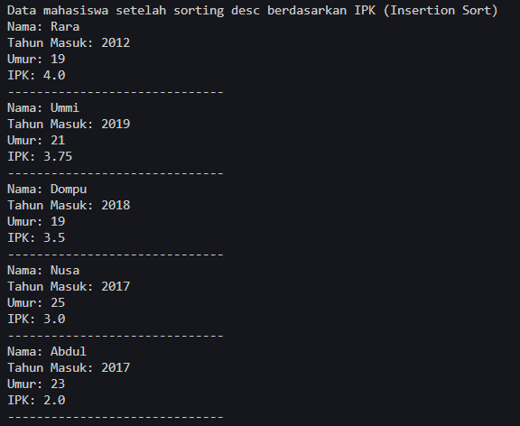

# <p align ="center"> LAPORAN PRAKTIKUM ALGORITMA DAN STRUKTUR DATA </p>

<br><br><br><br>

<p align="center">
    </p>

<br><br><br><br><br>

<p align = "center"> Nama : Muhammad Irsyad Dimas Abdillah </p>
<p align = "center"> Absen: 20 </p>
<p align = "center"> NIM  : 2341720088 </p>
<p align = "center"> Prodi: TEKNIK INFOMATIKA</p>
<p align = "center"> Kelas: 1B </p>

<br><br><br>

# Percobaan 1: Mengurutkan Data Mahasiswa Berdasarkan IPK Menggunakan Bubble Sort

Code<br>

```java
public class mahasiswa {
    String nama;
    int thnMasuk, umur;
    double IPK;

    mahasiswa(String n, int t, int u, double i) {
        nama = n;
        thnMasuk = t;
        umur = u;
        IPK = i;
    }

    void tampil() {
        System.out.println("Nama: " + nama);
        System.out.println("Tahun Masuk: " + thnMasuk);
        System.out.println("Umur: " + umur);
        System.out.println("IPK: " + IPK);
    }
}

```

```java
public class DaftarMahasiswaBerprestasi20 {
    mahasiswa[] listMhs = new mahasiswa[5];
    int idx;

    void tambah(mahasiswa m) {
        if (idx < listMhs.length) {
            listMhs[idx] = m;
            idx++;
        } else {
            System.out.println("Data sudah penuh");
        }
    }

    void tampil() {
        for (mahasiswa m : listMhs) {
            m.tampil();
            System.out.println("------------------------------");
        }
    }

    void bubbleSort() {
        for (int i = 0; i < listMhs.length - 1; i++) {
            for (int j = 1; j < listMhs.length - i; j++) {
                if (listMhs[j].IPK > listMhs[j - 1].IPK) { // descending
                    mahasiswa temp = listMhs[j];
                    listMhs[j] = listMhs[j - 1];
                    listMhs[j - 1] = temp;
                }
            }
        }
    }
}

```

```java
public class main20 {
    public static void main(String[] args) {
        DaftarMahasiswaBerprestasi20 list = new DaftarMahasiswaBerprestasi20();
        mahasiswa m1 = new mahasiswa("Nusa", 2017, 25, 3);
        mahasiswa m2 = new mahasiswa("Rara", 2012, 19, 4);
        mahasiswa m3 = new mahasiswa("Dompu", 2018, 19, 3.5);
        mahasiswa m4 = new mahasiswa("Abdul", 2017, 23, 2);
        mahasiswa m5 = new mahasiswa("Ummi", 2019, 21, 3.75);

        list.tambah(m1);
        list.tambah(m2);
        list.tambah(m3);
        list.tambah(m4);
        list.tambah(m5);

        System.out.println("Data mahasiswa sebelum sorting = ");
        list.tampil();

        System.out.println("Data mahasiswa setelah sorting desc berdasarkan IPK");
        list.bubbleSort();
        list.tampil();
    }
}
```

Output <br> <br>

## Pertanyaan

1. Terdapat di method apakah proses bubble sort?<br>
   jawab: Proses bubble sort terdapat pada method 'bubbleSort' pada class DaftarMahasiswaBerprestasi20 <br>

2. Di dalam method bubbleSort(), terdapat baris program seperti di bawah ini: <br>
    <br>
   Untuk apakah proses tersebut?<br>
   jawab: Proses tersebut adalah untuk menukar posisi kedua elemen dalam array listMhs. Penukaran posisi dilakukan berdasarkan nilai IPK dari kedua elemen yang dibandingkan. <br>
3. Perhatikan perulangan di dalam bubbleSort() di bawah ini: <br>
    <br>
   a. Apakah perbedaan antara kegunaan perulangan i dan perulangan j? <br>
   jawab: perulangan i digunakan sebagai kontrol jumlah iterasi keseluruhan bubble sort, perulangan ini akan berjalan sebanyak jumlah elemen array. sedangkan perulangan j melakukan kontrol dalam perbandingan elemen dalam setiap iterasi. perulangan dimulai dari indeks ke-2 hingga terakhir dikurangi dengan nilai i (listMhs.length - i). <br>
   b. Mengapa syarat dari perulangan i adalah i<listMhs.length-1 ? <br>
   jawab: syarat tersebut digunakan agar perulangan tidak melebihi batas array. perulangan i harus berhenti sebelum indeks terakhir karena indeks terakhir sudah dibandingkan dengan indeks sebelumnya. <br>
   c. Mengapa syarat dari perulangan j adalah j<listMhs.length-i ? <br>
   jawab: Syarat tersebut digunakan agar perulangan tidak membandingkan indeks yang sudah dibandingan pada iterasi sebelumnya. <br>
   d. Jika banyak data di dalam listMhs adalah 50, maka berapakali perulangan i akan berlangsung? Dan ada berapa Tahap bubble sort yang ditempuh? <br>
   jawab: maka perulangan i akan berjalan sebanyak 49 kali. <br>

   <br><br>

# Percobaan 2: Mengurutkan Data Mahasiswa Berdasarkan IPK Menggunakan Selection Sort

Code<br>

```java
public class DaftarMahasiswaBerprestasi20 {
    mahasiswa[] listMhs = new mahasiswa[5];
    int idx;

    void tambah(mahasiswa m) {
        if (idx < listMhs.length) {
            listMhs[idx] = m;
            idx++;
        } else {
            System.out.println("Data sudah penuh");
        }
    }

    void tampil() {
        for (mahasiswa m : listMhs) {
            m.tampil();
            System.out.println("------------------------------");
        }
    }

    void bubbleSort() {
        for (int i = 0; i < listMhs.length - 1; i++) {
            for (int j = 1; j < listMhs.length - i; j++) {
                if (listMhs[j].IPK > listMhs[j - 1].IPK) { // descending
                    mahasiswa temp = listMhs[j];
                    listMhs[j] = listMhs[j - 1];
                    listMhs[j - 1] = temp;
                }
            }
        }
    }

    void selectionSort() {
        for (int i = 0; i < listMhs.length - 1; i++) {
            int idxMin = i;
            for (int j = i + 1; j < listMhs.length; j++) {
                if (listMhs[j].IPK < listMhs[idxMin].IPK) { // ascending
                    idxMin = j;
                }
            }
            // swap
            mahasiswa temp = listMhs[i];
            listMhs[i] = listMhs[idxMin];
            listMhs[idxMin] = temp;
        }
    }
}

```

```java
public class main20 {
    public static void main(String[] args) {
        DaftarMahasiswaBerprestasi20 list = new DaftarMahasiswaBerprestasi20();
        mahasiswa m1 = new mahasiswa("Nusa", 2017, 25, 3);
        mahasiswa m2 = new mahasiswa("Rara", 2012, 19, 4);
        mahasiswa m3 = new mahasiswa("Dompu", 2018, 19, 3.5);
        mahasiswa m4 = new mahasiswa("Abdul", 2017, 23, 2);
        mahasiswa m5 = new mahasiswa("Ummi", 2019, 21, 3.75);

        list.tambah(m1);
        list.tambah(m2);
        list.tambah(m3);
        list.tambah(m4);
        list.tambah(m5);

        System.out.println("Data mahasiswa sebelum sorting = ");
        list.tampil();

        System.out.println("Data mahasiswa setelah sorting desc berdasarkan IPK");
        list.bubbleSort();
        list.tampil();

        System.out.println("Data mahasiswa setelah sorting asc berdasarkan IPK");
        list.selectionSort();
        list.tampil();
    }
}
```

Output <br>  <br>  <br>

## Pertanyaan

1. Di dalam method selection sort, terdapat baris program seperti di bawah ini: <br>
    <br>
   Untuk apakah proses tersebut, jelaskan! <br>
   jawab: Kode program dtersebut digunakan untuk mencari nilai IPK terkecil yang ada dalam array listMhs dengan melakukan perbandingan pada setiap indeks pada array-nya. <br>
   <br><br><br>

# Percobaan 3: Mengurutkan Data Mahasiswa Berdasarkan IPK Menggunakan Insertion Sort

Code<br>

```java
public class DaftarMahasiswaBerprestasi20 {
    mahasiswa[] listMhs = new mahasiswa[5];
    int idx;

    void tambah(mahasiswa m) {
        if (idx < listMhs.length) {
            listMhs[idx] = m;
            idx++;
        } else {
            System.out.println("Data sudah penuh");
        }
    }

    void tampil() {
        for (mahasiswa m : listMhs) {
            m.tampil();
            System.out.println("------------------------------");
        }
    }

    void bubbleSort() {
        for (int i = 0; i < listMhs.length - 1; i++) {
            for (int j = 1; j < listMhs.length - i; j++) {
                if (listMhs[j].IPK > listMhs[j - 1].IPK) { // descending
                    mahasiswa temp = listMhs[j];
                    listMhs[j] = listMhs[j - 1];
                    listMhs[j - 1] = temp;
                }
            }
        }
    }

    void selectionSort() {
        for (int i = 0; i < listMhs.length - 1; i++) {
            int idxMin = i;
            for (int j = i + 1; j < listMhs.length; j++) {
                if (listMhs[j].IPK < listMhs[idxMin].IPK) { // ascending
                    idxMin = j;
                }
            }
            // swap
            mahasiswa temp = listMhs[i];
            listMhs[i] = listMhs[idxMin];
            listMhs[idxMin] = temp;
        }
    }

        void insertionSort() {
        for (int i = 1; i < listMhs.length; i++) {
            mahasiswa temp = listMhs[i];
            int j = i;
            while (j > 0 && listMhs[j - 1].umur > temp.umur) {
                listMhs[j] = listMhs[j - 1];
                j--;
            }
            listMhs[j] = temp;
        }
    }
}

```

```java
public class main20 {
    public static void main(String[] args) {
        DaftarMahasiswaBerprestasi20 list = new DaftarMahasiswaBerprestasi20();
        mahasiswa m1 = new mahasiswa("Nusa", 2017, 25, 3);
        mahasiswa m2 = new mahasiswa("Rara", 2012, 19, 4);
        mahasiswa m3 = new mahasiswa("Dompu", 2018, 19, 3.5);
        mahasiswa m4 = new mahasiswa("Abdul", 2017, 23, 2);
        mahasiswa m5 = new mahasiswa("Ummi", 2019, 21, 3.75);

        list.tambah(m1);
        list.tambah(m2);
        list.tambah(m3);
        list.tambah(m4);
        list.tambah(m5);

        System.out.println("Data mahasiswa sebelum sorting = ");
        list.tampil();

        System.out.println("Data mahasiswa setelah sorting desc berdasarkan IPK");
        list.bubbleSort();
        list.tampil();

        System.out.println("Data mahasiswa setelah sorting asc berdasarkan IPK");
        list.selectionSort();
        list.tampil();

        System.out.println("Data mahasiswa setelah sorting asc berdasarkan IPK");
        list.insertionSort();
        list.tampil();
    }
}
```

Output <br> <br>  <br>  <br>

## Pertanyaan

1. Ubahlah fungsi pada InsertionSort sehingga fungsi ini dapat melaksanakan proses sorting dengan cara descending. <br>
   jawab:
   CODE

```java
public class DaftarMahasiswaBerprestasi20 {
    mahasiswa[] listMhs = new mahasiswa[5];
    int idx;

    void tambah(mahasiswa m) {
        if (idx < listMhs.length) {
            listMhs[idx] = m;
            idx++;
        } else {
            System.out.println("Data sudah penuh");
        }
    }

    void tampil() {
        for (mahasiswa m : listMhs) {
            m.tampil();
            System.out.println("------------------------------");
        }
    }

    void bubbleSort() {
        for (int i = 0; i < listMhs.length - 1; i++) {
            for (int j = 1; j < listMhs.length - i; j++) {
                if (listMhs[j].ipk < listMhs[j - 1].ipk) { // ascending
                    mahasiswa temp = listMhs[j];
                    listMhs[j] = listMhs[j - 1];
                    listMhs[j - 1] = temp;
                }
            }
        }
    }

    void selectionSort() {
        for (int i = 0; i < listMhs.length - 1; i++) {
            int idxMin = i;
            for (int j = i + 1; j < listMhs.length; j++) {
                if (listMhs[j].ipk < listMhs[idxMin].ipk) { // ascending
                    idxMin = j;
                }
            }
            // swap
            mahasiswa temp = listMhs[i];
            listMhs[i] = listMhs[idxMin];
            listMhs[idxMin] = temp;
        }
    }

    void insertionSort() {
        for (int i = 1; i < listMhs.length; i++) {
            mahasiswa temp = listMhs[i];
            int j = i;
            while (j > 0 && listMhs[j - 1].ipk < temp.ipk) { // rubah menjadi descending
                listMhs[j] = listMhs[j - 1];
                j--;
            }
            listMhs[j] = temp;
        }
    }
}
```

OUTPUT <br>  <br>  <br><br><br>

# Latihan Praktikum

Sebuah platform travel yang menyediakan layanan pemesanan kebutuhan travelling sedang mengembangkan backend untuk sistem pemesanan/reservasi akomodasi (penginapan), salah satu fiturnya adalah menampilkan daftar penginapan yang tersedia berdasarkan pilihan filter yang diinginkan user. Daftar penginapan ini harus dapat disorting berdasarkan: <br>

1. Harga dimulai dari harga termurah ke harga tertinggi. <br>
2. Rating bintang penginapan dari bintang tertinggi (5) ke terendah (1). <br>
   Buatlah proses sorting data untuk kedua filter tersebut dengan menggunakan algoritma
   bubble sort dan selection sort. <br>

 <br>

jawab: <br>

CODE

```java
package pertemuan6.latihanpraktikum;

public class HotelService20 {

    private Hotel20[] kamar;
    private int jumlahKamar;

    // Konstruktor untuk kelas HotelService20
    public HotelService20() {
        kamar = new Hotel20[100];
        jumlahKamar = 0;
    }

    // Metode untuk menambahkan hotel
    public void tambah(Hotel20 H) {
        kamar[jumlahKamar] = H;
        jumlahKamar++;
    }

    // Metode untuk menampilkan semua hotel
    public void tampilkanSemua() {
        for (int i = 0; i < jumlahKamar; i++) {
            System.out.println("Nama Hotel: " + kamar[i].nama + ", Kota: " + kamar[i].kota + ", Harga: "
                    + kamar[i].harga + ", Bintang: " + kamar[i].bintang);
        }
    }

    // Metode untuk mengurutkan hotel berdasarkan harga (Bubble Sort)
    public void urutkanHargaBubbleSort() {
        for (int i = 0; i < jumlahKamar - 1; i++) {
            for (int j = 0; j < jumlahKamar - i - 1; j++) {
                if (kamar[j].harga > kamar[j + 1].harga) {
                    Hotel20 temp = kamar[j];
                    kamar[j] = kamar[j + 1];
                    kamar[j + 1] = temp;
                }
            }
        }
    }

    // Metode untuk mengurutkan hotel berdasarkan harga (Selection Sort)
    public void urutkanHargaSelectionSort() {
        for (int i = 0; i < jumlahKamar - 1; i++) {
            int minIdx = i;
            for (int j = i + 1; j < jumlahKamar; j++) {
                if (kamar[j].harga < kamar[minIdx].harga) {
                    minIdx = j;
                }
            }
            Hotel20 temp = kamar[minIdx];
            kamar[minIdx] = kamar[i];
            kamar[i] = temp;
        }
    }

    // Metode untuk mengurutkan hotel berdasarkan rating bintang (Bubble Sort)
    public void urutkanBintangBubbleSort() {
        for (int i = 0; i < jumlahKamar - 1; i++) {
            for (int j = 0; j < jumlahKamar - i - 1; j++) {
                if (kamar[j].bintang < kamar[j + 1].bintang) {
                    Hotel20 temp = kamar[j];
                    kamar[j] = kamar[j + 1];
                    kamar[j + 1] = temp;
                }
            }
        }
    }

    // Metode untuk mengurutkan hotel berdasarkan rating bintang (Selection Sort)
    public void urutkanBintangSelectionSort() {
        for (int i = 0; i < jumlahKamar - 1; i++) {
            int maxIdx = i;
            for (int j = i + 1; j < jumlahKamar; j++) {
                if (kamar[j].bintang > kamar[maxIdx].bintang) {
                    maxIdx = j;
                }
            }
            Hotel20 temp = kamar[maxIdx];
            kamar[maxIdx] = kamar[i];
            kamar[i] = temp;
        }
    }
}
```

```java
package pertemuan6.latihanpraktikum;

public class Hotel20 {
    public String nama, kota;
    public int harga;
    public Byte bintang;

    public Hotel20(String nama, String kota, int harga, Byte bintang) {
        this.nama = nama;
        this.kota = kota;
        this.bintang = bintang;
        this.harga = harga;
    }
}
```

```java
package pertemuan6.latihanpraktikum;

import java.util.Scanner;

public class MainHotel20 {
    public static void main(String[] args) {
        Scanner sc = new Scanner(System.in);

        HotelService20 hotelService = new HotelService20();

        hotelService.tambah(new Hotel20("Flava Hotel", "Jakarta", 500000, (byte) 3));
        hotelService.tambah(new Hotel20("Horizon", "Bandung", 400000, (byte) 4));
        hotelService.tambah(new Hotel20("Boulevard Dreams", "Yogyakarta", 600000, (byte) 5));
        hotelService.tambah(new Hotel20("Sunday Vibes", "Surabaya", 450000, (byte) 2));
        hotelService.tambah(new Hotel20("Montana Hills", "Bali", 700000, (byte) 1));

        System.out.println("=============================================================");
        System.out.println("Pilih metode pengurutan yang ingin digunakan:");
        System.out.println("1. Pengurutan harga termurah ke harga tertinggi ");
        System.out.println("2. Pengurutan bintang tertinggi (5) ke terendah (1)");
        System.out.print("Pilihan: ");
        int pilihan = sc.nextInt();

        System.out.println("Sebelum pengurutan:");
        hotelService.tampilkanSemua();

        switch (pilihan) {
            case 1:
                System.out.println("\nSetelah pengurutan harga menggunakan Bubble Sort:");
                hotelService.urutkanHargaBubbleSort();
                hotelService.tampilkanSemua();
                System.out.println("\nSetelah pengurutan harga menggunakan Selection Sort:");
                hotelService.urutkanHargaSelectionSort();
                hotelService.tampilkanSemua();
                break;

            case 2:
                System.out.println("\nSetelah pengurutan bintang menggunakan Bubble Sort:");
                hotelService.urutkanBintangBubbleSort();
                hotelService.tampilkanSemua();
                System.out.println("\nSetelah pengurutan bintang menggunakan Selection Sort:");
                hotelService.urutkanBintangSelectionSort();
                hotelService.tampilkanSemua();
                break;

            default:
                System.out.println("Pilihan tidak valid.");
                break;
        }
    }
}
```

OUTPUT <br>  <br> 
