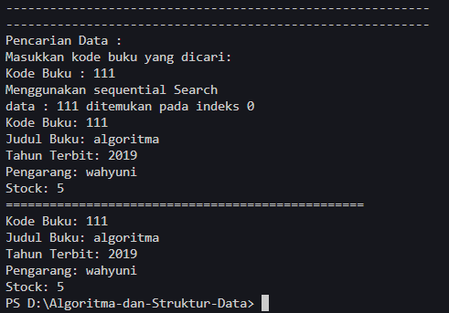
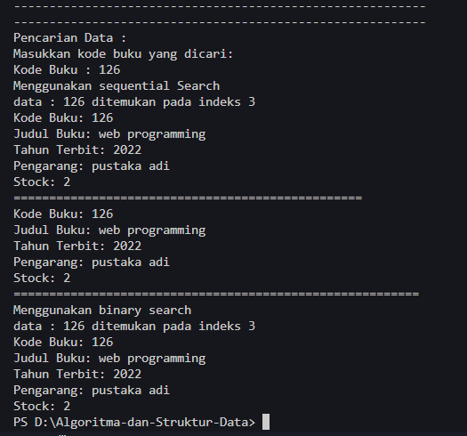
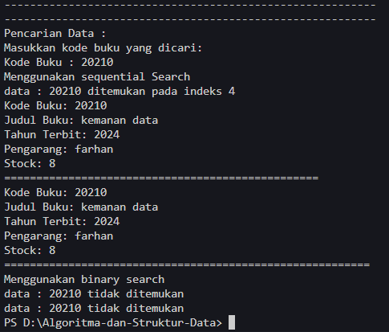
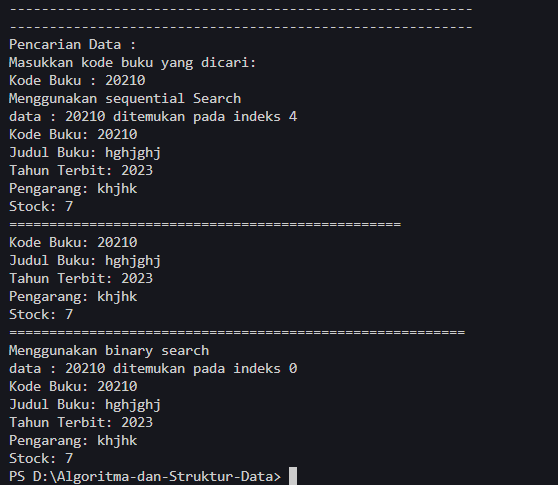
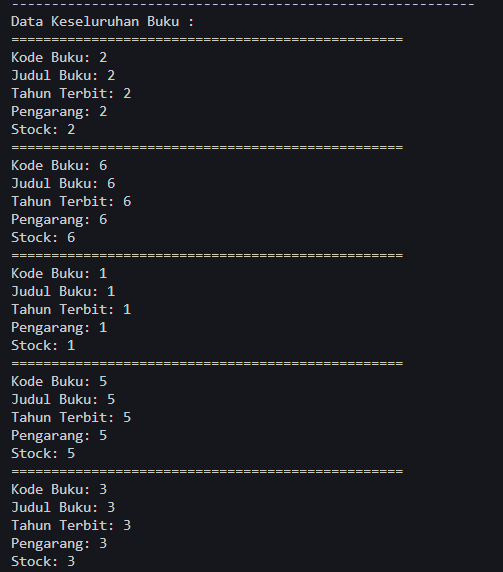
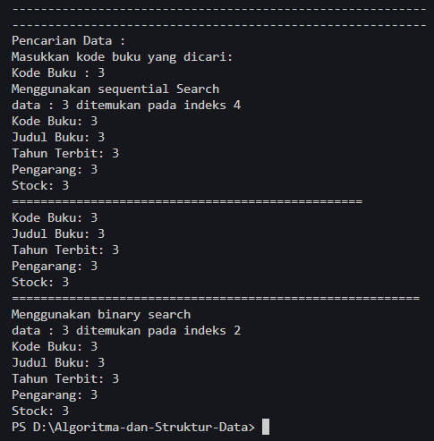
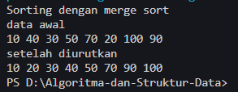
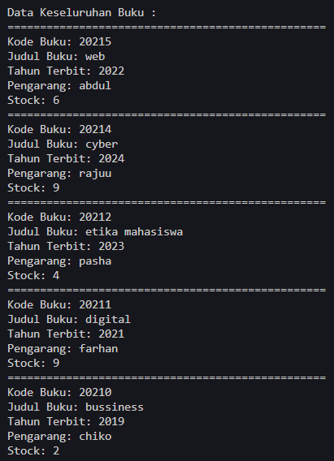
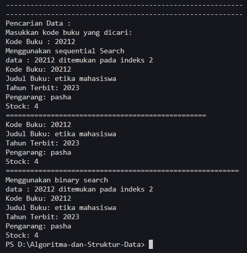

# <p align ="center"> LAPORAN PRAKTIKUM ALGORITMA DAN STRUKTUR DATA </p>

<br><br><br><br>

<p align="center">
    </p>

<br><br><br><br><br>

<p align = "center"> Nama : Muhammad Irsyad Dimas Abdillah </p>
<p align = "center"> Absen: 20 </p>
<p align = "center"> NIM  : 2341720088 </p>
<p align = "center"> Prodi: TEKNIK INFOMATIKA</p>
<p align = "center"> Kelas: 1B </p>

<br><br><br>

# Percobaan 1: Searching / Pencarian Menggunakan Agoritma Sequential Search

Code<br>

```java
package pertemuan7.TestSearching;

public class Buku20 {
    int kodeBuku;
    String judulBuku;
    int tahunTerbit;
    String pengarang;
    int stock;

    public Buku20(int kodeBuku, String judulBuku, int tahunTerbit, String pengarang, int stock) {
        this.kodeBuku = kodeBuku;
        this.judulBuku = judulBuku;
        this.tahunTerbit = tahunTerbit;
        this.pengarang = pengarang;
        this.stock = stock;
    }

    public void tampilDataBuku() {
        System.out.println("=================================================");
        System.out.println("Kode Buku: " + kodeBuku);
        System.out.println("Judul Buku: " + judulBuku);
        System.out.println("Tahun Terbit: " + tahunTerbit);
        System.out.println("Pengarang: " + pengarang);
        System.out.println("Stock: " + stock);
    }
}
```

```java
package pertemuan7.TestSearching;

public class PencarianBuku20 {
    Buku20 listBk[] = new Buku20[5];
    int idx;

    void tambah(Buku20 m) {
        if (idx < listBk.length) {
            listBk[idx] = m;
            idx++;
        } else {
            System.out.println("Data sudah penuh");
        }
    }

    void tampil() {
        for (Buku20 m : listBk) {
            m.tampilDataBuku();
        }
    }

    public int FindSeqSearch(int cari) {
        int posisi = 2;
        for (int j = 0; j < listBk.length; j++) {
            if (listBk[j].kodeBuku == cari) {
                posisi = j;
                break;
            }
        }
        return posisi;
    }

    void Tampilposisi(int x, int pos) {
        if (pos != -1) {
            System.out.println("data : " + x + " ditemukan pada indeks " + pos);
        } else {
            System.out.println("data : " + x + " tidak ditemukan");
        }
    }

    public void TampilData(int x, int pos) {
        if (pos != -1) {
            System.out.println("Kode Buku: " + listBk[pos].kodeBuku);
            System.out.println("Judul Buku: " + listBk[pos].judulBuku);
            System.out.println("Tahun Terbit: " + listBk[pos].tahunTerbit);
            System.out.println("Pengarang: " + listBk[pos].pengarang);
            System.out.println("Stock: " + listBk[pos].stock);
        } else {
            System.out.println("data : " + x + " tidak ditemukan");
        }
    }
}
```

```java
package pertemuan7.TestSearching;

import java.util.Scanner;

public class BukuMain20 {
    public static void main(String[] args) {
        Scanner s = new Scanner(System.in);
        Scanner s1 = new Scanner(System.in);

        PencarianBuku20 data = new PencarianBuku20();
        int jumBuku = 5;

        System.out.println("----------------------------------------------------------");
        System.out.println("Masukkan data Buku secara Urut dari KodeBuku Terkecil : ");
        for (int i = 0; i < jumBuku; i++) {
            System.out.println("----------------------------------------------------------");
            System.out.print("Kode Buku \t: ");
            int kodeBuku = s.nextInt();
            System.out.print("Judul Buku \t: ");
            String judulBuku = s1.nextLine();
            System.out.print("Tahun Terbit \t: ");
            int tahunTerbit = s.nextInt();
            System.out.print("Pengarang \t: ");
            String pengarang = s1.nextLine();
            System.out.print("Stock \t\t: ");
            int stock = s.nextInt();

            Buku20 m = new Buku20(kodeBuku, judulBuku, tahunTerbit, pengarang, stock);
            data.tambah(m);
        }

        System.out.println("----------------------------------------------------------");
        System.out.println("Data Keseluruhan Buku : ");
        data.tampil();

        System.out.println("----------------------------------------------------------");
        System.out.println("----------------------------------------------------------");
        System.out.println("Pencarian Data : ");
        System.out.println("Masukkan kode buku yang dicari: ");
        System.out.print("Kode Buku : ");
        int cari = s.nextInt();
        System.out.println("Menggunakan sequential Search");
        int posisi = data.FindSeqSearch(cari);
        data.Tampilposisi(cari, posisi);

        data.TampilData(cari, posisi);
    }
}

```

Output<br> <br>  <br>  <br>
Output tambahan <br>  <br> 

## Pertanyaan

1. Jelaskan fungsi break yang ada pada method FindSeqSearch! <br>
   jawab: Fungsi break pada method FindSeqSearch adalah untuk menghentikan perulangan for ketika elemen yang dicari sudah ketemu, dan memastikan nilai yang dikembalikan adalah posisi elemen yang dicari atau -1 elemen tidak ditemukan.
   <br>

2. Jika Data Kode Buku yang dimasukkan tidak terurut dari kecil ke besar. Apakah program masih dapat berjalan? Apakah hasil yang dikeluarkan benar? Tunjukkan hasil screenshoot untuk bukti dengan kode Buku yang acak. Jelaskan Mengapa hal tersebut bisa terjadi?<br>
   jawab: ya, program masih dpat berjalan dan outputnya tetap benar. Itu bisa terjadi karena seqeuential search tidak memerlukan data yang terurut. <br> 
   <br>

3. Buat method baru dengan nama FindBuku menggunakan konsep sequential search dengan tipe method dari FindBuku adalah BukuNoAbsen. Sehingga Anda bisa memanggil method tersebut pada class BukuMain seperti gambar berikut : <br>

```java
Buku dataBuku = data.FindBuku(cari);
dataBuku.tampilDataBuku();
```

<br>jawab: <br>
Method pada PencarianBuku20

```java
    public Buku20 FindBuku(int cari) {
        Buku20 buku = null;
        for (int j = 0; j < listBk.length; j++) {
            if (listBk[j].kodeBuku == cari) {
                buku = listBk[j];
                break;
            }
        }
        return buku;
    }
```

<br>
Main class

```java
    {
            Buku20 dataBuku = data.FindBuku(cari);
        if (dataBuku != null) {
            dataBuku.tampilDataBuku();
        } else {
            System.out.println("Buku dengan kode " + cari + " tidak ditemukan.");
        }
    }
```

<br>

Output<br> 

# Percobaan 2: Searching / Pencarian Menggunakan Binary Search

Code<br>

```java
package pertemuan7.TestSearching;

public class PencarianBuku20 {
    Buku20 listBk[] = new Buku20[5];
    int idx;

    void tambah(Buku20 m) {
        if (idx < listBk.length) {
            listBk[idx] = m;
            idx++;
        } else {
            System.out.println("Data sudah penuh");
        }
    }

    void tampil() {
        for (Buku20 m : listBk) {
            m.tampilDataBuku();
        }
    }

    public int FindSeqSearch(int cari) {
        int posisi = 2;
        for (int j = 0; j < listBk.length; j++) {
            if (listBk[j].kodeBuku == cari) {
                posisi = j;
                break;
            }
        }
        return posisi;
    }

    void Tampilposisi(int x, int pos) {
        if (pos != -1) {
            System.out.println("data : " + x + " ditemukan pada indeks " + pos);
        } else {
            System.out.println("data : " + x + " tidak ditemukan");
        }
    }

    public void TampilData(int x, int pos) {
        if (pos != -1) {
            System.out.println("Kode Buku: " + listBk[pos].kodeBuku);
            System.out.println("Judul Buku: " + listBk[pos].judulBuku);
            System.out.println("Tahun Terbit: " + listBk[pos].tahunTerbit);
            System.out.println("Pengarang: " + listBk[pos].pengarang);
            System.out.println("Stock: " + listBk[pos].stock);
        } else {
            System.out.println("data : " + x + " tidak ditemukan");
        }
    }

    public Buku20 FindBuku(int cari) {
        Buku20 buku = null;
        for (int j = 0; j < listBk.length; j++) {
            if (listBk[j].kodeBuku == cari) {
                buku = listBk[j];
                break;
            }
        }
        return buku;
    }

    public int FindBinarySearch(int cari, int left, int right) {
        int mid;
        if (right >= left) {
            mid = (left + right) / 2;
            if (listBk[mid].kodeBuku == cari) {
                return mid;
            } else if (listBk[mid].kodeBuku > cari) {
                return FindBinarySearch(cari, left, mid - 1);
            } else {
                return FindBinarySearch(cari, mid + 1, right);
            }
        }
        return -1;
    }
}
```

```java
package pertemuan7.TestSearching;

import java.util.Scanner;

public class BukuMain20 {
    public static void main(String[] args) {
        Scanner s = new Scanner(System.in);
        Scanner s1 = new Scanner(System.in);

        PencarianBuku20 data = new PencarianBuku20();
        int jumBuku = 5;

        System.out.println("----------------------------------------------------------");
        System.out.println("Masukkan data Buku secara Urut dari KodeBuku Terkecil : ");
        for (int i = 0; i < jumBuku; i++) {
            System.out.println("----------------------------------------------------------");
            System.out.print("Kode Buku \t: ");
            int kodeBuku = s.nextInt();
            System.out.print("Judul Buku \t: ");
            String judulBuku = s1.nextLine();
            System.out.print("Tahun Terbit \t: ");
            int tahunTerbit = s.nextInt();
            System.out.print("Pengarang \t: ");
            String pengarang = s1.nextLine();
            System.out.print("Stock \t\t: ");
            int stock = s.nextInt();

            Buku20 m = new Buku20(kodeBuku, judulBuku, tahunTerbit, pengarang, stock);
            data.tambah(m);
        }

        System.out.println("----------------------------------------------------------");
        System.out.println("Data Keseluruhan Buku : ");
        data.tampil();

        System.out.println("----------------------------------------------------------");
        System.out.println("----------------------------------------------------------");
        System.out.println("Pencarian Data : ");
        System.out.println("Masukkan kode buku yang dicari: ");
        System.out.print("Kode Buku : ");
        int cari = s.nextInt();
        System.out.println("Menggunakan sequential Search");
        int posisi = data.FindSeqSearch(cari);
        data.Tampilposisi(cari, posisi);

        data.TampilData(cari, posisi);

        Buku20 dataBuku = data.FindBuku(cari);
        if (dataBuku != null) {
            dataBuku.tampilDataBuku();
        } else {
            System.out.println("Buku dengan kode " + cari + " tidak ditemukan.");
        }

        System.out.println("=========================================================");
        System.out.println("Menggunakan binary search");
        posisi = data.FindBinarySearch(cari, 0, jumBuku-1);
        data.Tampilposisi(cari, posisi);
        data.TampilData(cari, posisi);
    }
}
```

Output<br> 

## Pertanyaan

1. Tunjukkan pada kode program yang mana proses divide dijalankan!<br>
   jawab: proses divide dijalankan ketika menghitung nilai tengah (mid) dari pencarian menggunakan operasi (left + right) / 2. Operasi ini membagi pencarian menjadi dua bagian.
   <br>

2. Tunjukkan pada kode program yang mana proses conquer dijalankan!<br>
   jawab: proses conquer terjadi ketika melakukan dua pemanggilan rekursif ke metode FindBinarySearch dengan memperbarui nilai left dan right sesuai dengan hasil perbandingan nilai tengah listBk[mid].kodeBuku dengan cari. <br>

3. Jika Kode Buku yang dimasukkan dari Kode Buku terbesar ke terkecil (missal : 20215, 20214,20212, 20211, 20210) dan elemen yang dicari adalah 20210. Bagaimana hasil dari binary search? Apakah sesuai? Jika tidak sesuai maka ubahlah kode program binary seach agar hasilnya sesuai!<br>
   jawab: tidak sesuai <br> <br>
   Kode yang telah dirubah. Disini ditambahkan program berupa bubble sort untuk mengurutkan inputan pengguna dari kodeBuku terkecil, sehingga meskipun pengguna menginputkan kode yang tidak diurutkan, program tetap bisa berjalan tanpa error. <br>

```java
    public int FindBinarySearch(int cari, int left, int right) {
        bubbleSortBuku();
        int mid;
        if (right >= left) {
            mid = (left + right) / 2;
            if (listBk[mid].kodeBuku == cari) {
                return mid;
            } else if (listBk[mid].kodeBuku > cari) {
                return FindBinarySearch(cari, left, mid - 1);
            } else {
                return FindBinarySearch(cari, mid + 1, right);
            }
        }
        return -1;
    }

    void bubbleSortBuku() {
        for (int i = 0; i < listBk.length - 1; i++) {
            for (int j = 1; j < listBk.length - i; j++) {
                if (listBk[j].kodeBuku < listBk[j - 1].kodeBuku) {
                    Buku20 tmp = listBk[j];
                    listBk[j] = listBk[j - 1];
                    listBk[j - 1] = tmp;
                }
            }
        }
    }
```

```java
        Buku20 dataBuku = data.FindBuku(cari);
        if (dataBuku != null) {
            dataBuku.tampilDataBuku();
        } else {
            System.out.println("Buku dengan kode " + cari + " tidak ditemukan.");
        }

        System.out.println("=========================================================");
        System.out.println("Menggunakan binary search");
        data.bubbleSortBuku();
        posisi = data.FindBinarySearch(cari, 0, jumBuku - 1);
        data.Tampilposisi(cari, posisi);
        data.TampilData(cari, posisi);
```

Output<br> 

4. Jika data Kode Buku yang dimasukkan tidak urut. Apakah program masih dapat berjalan? Mengapa demikian! Tunjukkan hasil screenshoot untuk bukti dengan kode Buku yang acak. Jelaskan Mengapa hal tersebut bisa terjadi? <br>
   jawab: Tidak, program binarySearch tidak akan bisa berjalan karena BinarySearch memerlukan data yang terurut dari data terkecil menuju data terbesar. Sama seperti sebelumnya, kita perlu menambahkan program untuk mengurutkan data input dari pengguna sehingga program dapat berjalan seperti semestinya. <br>
   Input<br> <br>
   Output<br>

# Percobaan 3: Percobaan Pengayaan Divide and Conquer

Code<br>

```java
package pertemuan7.MergeSortTest;

public class MergeSorting20 {
    public void mergeSort(int[] data) {
        sort(data, 0, data.length - 1);
    }

    public void merge(int[] data, int left, int middle, int right) {
        int[] temp = new int[data.length];
        for (int i = left; i <= right; i++) {
            temp[i] = data[i];
        }
        int a = left;
        int b = middle + 1;
        int c = left;

        while (a <= middle && b <= right) {
            if (temp[a] < temp[b]) {
                data[c] = temp[a];
                a++;
            } else {
                data[c] = temp[b];
                b++;
            }
            c++;
        }

        int s = middle - a;
        for (int i = 0; i <= s; i++) {
            data[c + i] = temp[a + i];
        }
    }

    public void sort(int data[], int left, int right) {
        if (left < right) {
            int middle = (left + right) / 2;
            sort(data, left, middle);
            sort(data, middle + 1, right);
            merge(data, left, middle, right);
        }
    }

    public void printArray(int arr[]) {
        for (int i = 0; i < arr.length; i++) {
            System.out.print(arr[i] + " ");
        }
        System.out.println();
    }
}

```

```java
package pertemuan7.MergeSortTest;

public class MergeSortMain20 {
    public static void main(String[] args) {
        int data[] = { 10, 40, 30, 50, 70, 20, 100, 90 };
        System.out.println("Sorting dengan merge sort");
        MergeSorting20 mSort = new MergeSorting20();
        System.out.println("data awal");
        mSort.printArray(data);
        mSort.mergeSort(data);
        System.out.println("setelah diurutkan");
        mSort.printArray(data);
    }
}
```

Output<br>

# Latihan Praktikum

1. Modifikasi percobaan searching diatas dengan ketentuan berikut ini: <br>

- Ubah tipe data dari kode Buku yang awalnya int menjadi String <br>
- Tambahkan method untuk pencarian kode Buku (bertipe data String) dengan menggunakan sequential search dan binary search. <br>
  jawab: <br>

```java
package pertemuan7.TestSearching;

public class Buku20 {
    String kodeBuku;
    String judulBuku;
    int tahunTerbit;
    String pengarang;
    int stock;

    public Buku20(String kodeBuku, String judulBuku, int tahunTerbit, String pengarang, int stock) {
        this.kodeBuku = kodeBuku;
        this.judulBuku = judulBuku;
        this.tahunTerbit = tahunTerbit;
        this.pengarang = pengarang;
        this.stock = stock;
    }

    public void tampilDataBuku() {
        System.out.println("=================================================");
        System.out.println("Kode Buku: " + kodeBuku);
        System.out.println("Judul Buku: " + judulBuku);
        System.out.println("Tahun Terbit: " + tahunTerbit);
        System.out.println("Pengarang: " + pengarang);
        System.out.println("Stock: " + stock);
    }
}
```

```java
package pertemuan7.TestSearching;

public class PencarianBuku20 {
    Buku20 listBk[] = new Buku20[5];
    int idx;

    void tambah(Buku20 m) {
        if (idx < listBk.length) {
            listBk[idx] = m;
            idx++;
        } else {
            System.out.println("Data sudah penuh");
        }
    }

    void tampil() {
        for (Buku20 m : listBk) {
            m.tampilDataBuku();
        }
    }

    public int FindSeqSearch(int cari) {
        int posisi = 2;
        for (int j = 0; j < listBk.length; j++) {
            if (Integer.parseInt(listBk[j].kodeBuku) == cari) {
                posisi = j;
                break;
            }
        }
        return posisi;
    }

    void Tampilposisi(int x, int pos) {
        if (pos != -1) {
            System.out.println("data : " + x + " ditemukan pada indeks " + pos);
        } else {
            System.out.println("data : " + x + " tidak ditemukan");
        }
    }

    public void TampilData(int x, int pos) {
        if (pos != -1) {
            System.out.println("Kode Buku: " + listBk[pos].kodeBuku);
            System.out.println("Judul Buku: " + listBk[pos].judulBuku);
            System.out.println("Tahun Terbit: " + listBk[pos].tahunTerbit);
            System.out.println("Pengarang: " + listBk[pos].pengarang);
            System.out.println("Stock: " + listBk[pos].stock);
        } else {
            System.out.println("data : " + x + " tidak ditemukan");
        }
    }

    public Buku20 FindBuku(int cari) {
        Buku20 buku = null;
        for (int j = 0; j < listBk.length; j++) {
            if (Integer.parseInt(listBk[j].kodeBuku) == cari) {
                buku = listBk[j];
                break;
            }
        }
        return buku;
    }

    public int FindBinarySearch(int cari, int left, int right) {
        bubbleSortBuku();
        int mid;
        if (right >= left) {
            mid = (left + right) / 2;
            if (Integer.parseInt(listBk[mid].kodeBuku) == cari) {
                return mid;
            } else if (Integer.parseInt(listBk[mid].kodeBuku) > cari) {
                return FindBinarySearch(cari, left, mid - 1);
            } else {
                return FindBinarySearch(cari, mid + 1, right);
            }
        }
        return -1;
    }

    void bubbleSortBuku() {
        for (int i = 0; i < listBk.length - 1; i++) {
            for (int j = 1; j < listBk.length - i; j++) {
                if (Integer.parseInt(listBk[j].kodeBuku) < Integer.parseInt(listBk[j - 1].kodeBuku)) {
                    Buku20 tmp = listBk[j];
                    listBk[j] = listBk[j - 1];
                    listBk[j - 1] = tmp;
                }
            }
        }
    }
}
```

```java
package pertemuan7.TestSearching;

import java.util.Scanner;

public class BukuMain20 {
    public static void main(String[] args) {
        Scanner s = new Scanner(System.in);
        Scanner s1 = new Scanner(System.in);

        PencarianBuku20 data = new PencarianBuku20();
        int jumBuku = 5;

        for (int i = 0; i < jumBuku; i++) {
            System.out.println("----------------------------------------------------------");
            System.out.println("Masukkan data Buku secara Urut dari KodeBuku Terkecil : ");
            System.out.println("----------------------------------------------------------");
            System.out.print("Kode Buku \t: ");
            String kodeBuku = s1.nextLine();
            System.out.print("Judul Buku \t: ");
            String judulBuku = s1.nextLine();
            System.out.print("Tahun Terbit \t: ");
            int tahunTerbit = s.nextInt();
            System.out.print("Pengarang \t: ");
            String pengarang = s1.nextLine();
            System.out.print("Stock \t\t: ");
            int stock = s.nextInt();

            Buku20 m = new Buku20(kodeBuku, judulBuku, tahunTerbit, pengarang, stock);
            data.tambah(m);
        }

        System.out.println("----------------------------------------------------------");
        System.out.println("Data Keseluruhan Buku : ");
        data.tampil();

        System.out.println("----------------------------------------------------------");
        System.out.println("----------------------------------------------------------");
        System.out.println("Pencarian Data : ");
        System.out.println("Masukkan kode buku yang dicari: ");
        System.out.print("Kode Buku : ");
        int cari = s.nextInt();
        System.out.println("Menggunakan sequential Search");
        int posisi = data.FindSeqSearch(cari);
        data.Tampilposisi(cari, posisi);

        data.TampilData(cari, posisi);

        Buku20 dataBuku = data.FindBuku(cari);
        if (dataBuku != null) {
            dataBuku.tampilDataBuku();
        } else {
            System.out.println("Buku dengan kode " + cari + " tidak ditemukan.");
        }

        System.out.println("=========================================================");
        System.out.println("Menggunakan binary search");
        data.bubbleSortBuku();
        posisi = data.FindBinarySearch(cari, 0, jumBuku - 1);
        data.Tampilposisi(cari, posisi);
        data.TampilData(cari, posisi);
    }
}
```

<br>

Output<br>  <br> 

2. Modifikasi percobaan searching diatas dengan ketentuan berikut ini: <br>

- Tambahkan method pencarian judul buku menggunakan sequential search dan binary
  search. Sebelum dilakukan searching dengan binary search data harus dilakukan pengurutan dengan menggunakan algoritma Sorting (bebas pilih algoritma sorting apapun)! Sehingga ketika input data acak, maka algoritma searching akan tetap berjalan <br>
- Buat aturan untuk mendeteksi hasil pencarian judul buku yang lebih dari 1 hasil dalam bentuk kalimat peringatan! Pastikan algoritma yang diterapkan sesuai dengan kasus yang diberikan! <br>
  jawab: <br>
