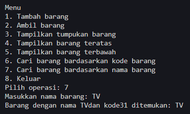

# <p align ="center"> LAPORAN PRAKTIKUM ALGORITMA DAN STRUKTUR DATA </p>

<br><br><br><br>

<p align="center">
    </p>

<br><br><br><br><br>

<p align = "center"> Nama : Muhammad Irsyad Dimas Abdillah </p>
<p align = "center"> Absen: 20 </p>
<p align = "center"> NIM  : 2341720088 </p>
<p align = "center"> Prodi: TEKNIK INFOMATIKA</p>
<p align = "center"> Kelas: 1B </p>

<br><br><br>

# Percobaan 1: Penyimpanan Tumpukan Barang dalam Gudang

Code<br>

```java
package pertemuan8.fileJava;

public class Barang20 {
    int kode;
    String nama;
    String kategori;

    Barang20(int kode, String nama, String kategori) {
        this.kode = kode;
        this.nama = nama;
        this.kategori = kategori;
    }
}

```

```java
package pertemuan8.fileJava;

public class Gudang20 {
    Barang20[] tumpukan;
    int size;
    int top;

    public Gudang20(int kapasitas) {
        size = kapasitas;
        tumpukan = new Barang20[size];
        top = -1;
    }

    public boolean cekKosong() {
        if (top == -1) {
            return true;
        } else {
            return false;
        }
    }

    public boolean cekPenuh() {
        if (top == size - 1) {
            return true;
        } else {
            return false;
        }
    }

    public void tambahBarang(Barang20 brg) {
        if (!cekPenuh()) {
            top++;
            tumpukan[top] = brg;
            System.out.println("Barang " + brg.nama + " berhasil ditambahkan ke Gudang");
        } else {
            System.out.println("Gagal! Tumpukan barang di Gudang sudah penuh");
        }
    }

    public Barang20 ambilBarang() {
        if (!cekKosong()) {
            Barang20 delete = tumpukan[top];
            top--;
            System.out.println("Barang " + delete.nama + " diambil dari Gudang");
            return delete;
        } else {
            System.out.println("Gagal! Tumpukan barang di Gudang masih kosong");
            return null;
        }
    }

    public Barang20 lihatBarangTeratas() {
        if (!cekKosong()) {
            Barang20 barangTeratas = tumpukan[top];
            System.out.println("Barang teratas " + barangTeratas.nama);
            return barangTeratas;
        } else {
            System.out.println("Tumpukan barang kosong");
            return null;
        }
    }

    public void tampilkanBarang() {
        if (!cekKosong()) {
            System.out.println("Rincian tumpukan barang di Gudang:");
            for (int i = top; i >= 0; i--) {
                System.out.printf("Kode %d: %s (Kategori %s)\n", tumpukan[i].kode, tumpukan[i].nama,
                        tumpukan[i].kategori);
            }
        } else {
            System.out.println("Tumpukan barang kosong");
        }
    }
}

```

```java
package pertemuan8.fileJava;

import java.util.Scanner;

public class Utama20 {
    public static void main(String[] args) {
        Gudang20 gudang = new Gudang20(7);
        Scanner scanner = new Scanner(System.in);

        while (true) {
            System.out.println("\nMenu");
            System.out.println("1. Tambah barang");
            System.out.println("2. Ambil barang");
            System.out.println("3. Tampilkan tumpukan barang");
            System.out.println("4. Keluar");
            System.out.print("Pilih operasi: ");
            int pilihan = scanner.nextInt();
            scanner.nextLine();

            switch (pilihan) {
                case 1:
                    System.out.print("Masukkan kode barang: ");
                    int kode = scanner.nextInt();
                    scanner.nextLine();
                    System.out.print("Masukkan nama barang: ");
                    String nama = scanner.nextLine();
                    System.out.print("Masukkan nama kategori: ");
                    String kategori = scanner.nextLine();
                    Barang20 barangBaru = new Barang20(kode, nama, kategori);
                    gudang.tambahBarang(barangBaru);
                    break;

                case 2:
                    gudang.ambilBarang();
                    break;

                case 3:
                    gudang.tampilkanBarang();
                    break;

                case 4:
                    // exit program
                    return;

                default:
                    System.out.println("Pilihan tidak valid. Silahkan coba lagi");
            }
        }
    }
}

```

Output<br> <br> <br>

## Pertanyaan

1. Lakukan perbaikan pada kode program, sehingga keluaran yang dihasilkan sama dengan verifikasi hasil percobaan! Bagian mana saja yang perlu diperbaiki? <br>
   jawab: perbaikan perlu dilakukan pada bagian methods tampilkanBarang, pada bagian perulangannya, yang awalnya menggunakan int i = 0; diganti menggunakan int i = top; agar menampilkan barang sesuai urutan stack nya. <br>
   Code

```java
public void tampilkanBarang() {
        if (!cekKosong()) {
            System.out.println("Rincian tumpukan barang di Gudang:");
            for (int i = top; i >= 0; i--) {
                System.out.printf("Kode %d: %s (Kategori %s)\n", tumpukan[i].kode, tumpukan[i].nama,
                        tumpukan[i].kategori);
            }
        } else {
            System.out.println("Tumpukan barang kosong");
        }
    }
```

2. Berapa banyak data barang yang dapat ditampung di dalam tumpukan? Tunjukkan potongan kode programnya! <br>
   jawab: ada 7 data barang yang dapat ditampung dalam tumpukan.<br>

```java
Gudang20 gudang = new Gudang20(7);
```

3. Mengapa perlu pengecekan kondisi !cekKosong() pada method tampilkanBarang? Kalau kondisi tersebut dihapus, apa dampaknya? <br>
   jawab: methods tersebut berguna untuk mengecek apakah tumpukan kosong atau tidak sebelum menampilkan barang didalam tumpukan. Jika dihapus, maka proram tidak akan mengecek apakah tumpukan kosong atau ada barangnya, dan akan selalu menampilkan output "Rincian tumpukan barang di Gudang:" <br>

```java
    public void tampilkanBarang() {
        System.out.println("Rincian tumpukan barang di Gudang:");
        for (int i = top; i >= 0; i--) {
            System.out.printf("Kode %d: %s (Kategori %s)\n", tumpukan[i].kode, tumpukan[i].nama,
                    tumpukan[i].kategori);
        }
    }
```

Output<br> 

4. Modifikasi kode program pada class Utama sehingga pengguna juga dapat memilih operasi lihat barang teratas, serta dapat secara bebas menentukan kapasitas gudang!<br>
   jawab: <br>
   Code

```java
package pertemuan8.fileJava;

import java.util.Scanner;

public class Utama20 {
    public static void main(String[] args) {
        Scanner scanner = new Scanner(System.in);

        System.out.print("Masukkan kapasitas gudang: ");
        int kapasitas = scanner.nextInt();
        scanner.nextLine();

        Gudang20 gudang = new Gudang20(kapasitas);

        while (true) {
            System.out.println("\nMenu");
            System.out.println("1. Tambah barang");
            System.out.println("2. Ambil barang");
            System.out.println("3. Tampilkan tumpukan barang");
            System.out.println("4. Tampilkan barang teratas");
            System.out.println("5. Keluar");
            System.out.print("Pilih operasi: ");
            int pilihan = scanner.nextInt();
            scanner.nextLine();

            switch (pilihan) {
                case 1:
                    System.out.print("Masukkan kode barang: ");
                    int kode = scanner.nextInt();
                    scanner.nextLine();
                    System.out.print("Masukkan nama barang: ");
                    String nama = scanner.nextLine();
                    System.out.print("Masukkan nama kategori: ");
                    String kategori = scanner.nextLine();
                    Barang20 barangBaru = new Barang20(kode, nama, kategori);
                    gudang.tambahBarang(barangBaru);
                    break;

                case 2:
                    gudang.ambilBarang();
                    break;

                case 3:
                    gudang.tampilkanBarang();
                    break;

                case 4:
                    gudang.lihatBarangTeratas();
                    break;

                case 5:
                    // exit program
                    break;

                default:
                    System.out.println("Pilihan tidak valid. Silahkan coba lagi");
            }
        }
    }
}
```

Output<br>

5. Commit dan push kode program ke Github <br>
   jawab: Sudah <br>

# Percobaan 2: Konversi Kode Barang ke Biner

Code<br>

```java
package pertemuan8.fileJava;

public class StackKonversi20 {
    int size;
    int[] tumpukanBiner;
    int top;

    public StackKonversi20() {
        this.size = 32; // asumsi 32bit
        this.tumpukanBiner = new int[size];
        this.top = -1;
    }

    public boolean isEmpty() {
        return top == -1;
    }

    public boolean isFull() {
        return top == size - 1;
    }

    public void push(int data) {
        if (isFull()) {
            System.out.println("Stack penuh");
        } else {
            top++;
            tumpukanBiner[top] = data;
        }
    }

    public int pop() {
        if (isEmpty()) {
            System.out.println("Stack kosong");
            return -1;
        } else {
            int data = tumpukanBiner[top];
            top--;
            return data;
        }
    }
}
```

```java
package pertemuan8.fileJava;

public class Gudang20 {
    Barang20[] tumpukan;
    int size;
    int top;

    public Gudang20(int kapasitas) {
        size = kapasitas;
        tumpukan = new Barang20[size];
        top = -1;
    }

    public boolean cekKosong() {
        if (top == -1) {
            return true;
        } else {
            return false;
        }
    }

    public boolean cekPenuh() {
        if (top == size - 1) {
            return true;
        } else {
            return false;
        }
    }

    public void tambahBarang(Barang20 brg) {
        if (!cekPenuh()) {
            top++;
            tumpukan[top] = brg;
            System.out.println("Barang " + brg.nama + " berhasil ditambahkan ke Gudang");
        } else {
            System.out.println("Gagal! Tumpukan barang di Gudang sudah penuh");
        }
    }

    public Barang20 ambilBarang() {
        if (!cekKosong()) {
            Barang20 delete = tumpukan[top];
            top--;
            System.out.println("Barang " + delete.nama + " diambil dari Gudang");
            System.out.println("Kode unik dalam biner: " + konversiDesimalkeBiner(delete.kode));
            return delete;
        } else {
            System.out.println("Gagal! Tumpukan barang di Gudang masih kosong");
            return null;
        }
    }

    public Barang20 lihatBarangTeratas() {
        if (!cekKosong()) {
            Barang20 barangTeratas = tumpukan[top];
            System.out.println("Barang teratas " + barangTeratas.nama);
            return barangTeratas;
        } else {
            System.out.println("Tumpukan barang kosong");
            return null;
        }
    }

    public void tampilkanBarang() {
        if (!cekKosong()) {
            System.out.println("Rincian tumpukan barang di Gudang:");
            for (int i = top; i >= 0; i--) {
                System.out.printf("Kode %d: %s (Kategori %s)\n", tumpukan[i].kode, tumpukan[i].nama,
                        tumpukan[i].kategori);
            }
        } else {
            System.out.println("Tumpukan barang kosong");
        }
    }

    public String konversiDesimalkeBiner(int kode) {
        StackKonversi20 stack = new StackKonversi20();
        while (kode > 0) {
            int sisa = kode % 2;
            stack.push(sisa);
            kode = kode / 2;
        }
        String biner = new String();
        while (!stack.isEmpty()) {
            biner += stack.pop();
        }
        return biner;
    }
}

```

Output<br>

## Pertanyaan

1. Pada method konversiDesimalKeBiner, ubah kondisi perulangan menjadi while (kode != 0), bagaimana hasilnya? Jelaskan alasannya! <br>
   jawab: hasilnya akan tetap sama, karena bagian kode while(kode>0) ataupun while(kode!= 0) berguna untuk memastikan bahwa proses konversi tetap belanjut ketika masih ada angka desimal yang belum dikonversi. <br>
   Code

```java
    public String konversiDesimalkeBiner(int kode) {
        StackKonversi20 stack = new StackKonversi20();
        while (kode != 0) {
            int sisa = kode % 2;
            stack.push(sisa);
            kode = kode / 2;
        }
        String biner = new String();
        while (!stack.isEmpty()) {
            biner += stack.pop();
        }
        return biner;
    }
```

Output<br> 

2. Jelaskan alur kerja dari method konversiDesimalKeBiner!<br>
   jawab: pertama methods akan membuat objek 'StackKonversi20' yang akan digunakan sebagai media menyimpan sisa pembagian. kemudian kode melakukan iterasi selama kode != 0. dalam setiap iterasi, menghitung sisa pembagian sisa dari kode dibagi 2 dan memasukkan sisa tersebut ke dalam stack. mengubah nilai 'kode' menjadi hasil pembagian 'kode'/2. setelah iterasi selesai, kode melakukan pembacaan sisa-sisa yang telah dimasukkan ke dalam stack dan membentuk bilangan biner dengan mengambil sisa-sisa tersebut dari stack dan menambahkannya ke dalam string biner. kemudian mengembalikan hasil konversi dalam bentuk String biner. <br>

# Percobaan 3: Penyimpanan Tumpukan Barang dalam Gudang

Code<br>

```java
package pertemuan8.fileJava;

public class Postfix20 {
    int n, top;
    char[] stack;

    public Postfix20(int total) {
        n = total;
        top = -1;
        stack = new char[n];
        push('(');
    }

    public void push(char data) {
        top++;
        stack[top] = data;
    }

    public char pop() {
        char item = stack[top];
        top--;
        return item;
    }

    public boolean IsOperand(char c) {
        if ((c >= 'A' && c <= 'Z') || (c >= 'a' && c <= 'z') || (c >= '0' && c <= '9') || c == ' ' || c == '.') {
            return true;
        } else {
            return false;
        }
    }

    public boolean IsOperator(char c) {
        if (c == '^' || c == '%' || c == '/' || c == '*' || c == '-' || c == '+') {
            return true;
        } else {
            return false;
        }
    }

    public int derajat(char c) {
        switch (c) {
            case '^':
                return 3;
            case '%':
                return 2;
            case '/':
                return 2;
            case '*':
                return 2;
            case '+':
                return 1;
            case '-':
                return 1;
            default:
                return 0;
        }
    }

    public String konversi(String Q) {
        String P = "";
        char c;
        for (int i = 0; i < Q.length(); i++) {
            c = Q.charAt(i);
            if (IsOperand(c)) {
                P = P + c;
            }
            if (c == '(') {
                push(c);
            }
            if (c == ')') {
                while (stack[top] != '(') {
                    P = P + pop();
                }
                pop();
            }
            if (IsOperator(c)) {
                while (derajat(stack[top]) >= derajat(c)) {
                    P = P + pop();
                }
                push(c);
            }
        }
        return P;
    }
}

```

```java
package pertemuan8.fileJava;

import java.util.Scanner;

public class Postfixmain20 {
    public static void main(String[] args) {
        Scanner sc = new Scanner(System.in);
        String P, Q;

        System.out.println("Masukkan ekspresi matematika (infix): ");
        Q = sc.nextLine();
        Q = Q.trim();
        Q = Q + ")";

        int total = Q.length();
        Postfix20 post = new Postfix20(total);
        P = post.konversi(Q);
        System.out.println("Postfix: " + P);
    }
}

```

Output<br> 

## Pertanyaan

1. Pada method derajat, mengapa return value beberapa case bernilai sama? Apabila return value diubah dengan nilai berbeda-beda setiap case-nya, apa yang terjadi? <br>
   jawab: Return value yang sama pada beberapa case seperti operator %, /, dan _ yang mengembalikan nilai 2 menunjukkan prioritas yang setara dari operator-operator tersebut dalam ekspresi matematika. Ini berarti bahwa operator %, /, dan _ memiliki prioritas yang sama, namun di bawah operator ^ yang memiliki prioritas lebih tinggi dengan nilai return 4. <br>
2. Jelaskan alur kerja method konversi! <br>
   jawab: Pertama, string kosong `P` digunakan untuk menyimpan hasil konversi dari ekspresi infix ke postfix. Kemudian, setiap karakter dari string `Q` diiterasi. Jika karakter tersebut adalah operand, maka karakter tersebut ditambahkan ke string `P`. Jika karakter adalah "(", maka tanda kurung tersebut dimasukkan ke dalam stack. Jika karakter adalah ")", maka dilakukan pengosongan stack sampai menemukan "(". Setiap karakter yang dikeluarkan dari stack dimasukkan ke dalam string `P`. Jika karakter adalah operator, dilakukan pengecekan prioritas operator dalam stack. Jika prioritas operator dalam stack lebih tinggi atau sama dengan operator saat ini, maka operator dalam stack dimasukkan ke dalam string `P`. Hal ini diulangi hingga prioritas operator dalam stack lebih rendah dari operator saat ini. Kemudian, operator saat ini dimasukkan ke dalam stack. Setelah iterasi selesai, hasil konversi yang disimpan dalam string `P` dikembalikan. <br>
3. Pada method konversi, apa fungsi dari potongan kode berikut? <br>

```java
c =Q.charAt(i);
```

jawab: Kode diatas berfungsi untuk mengambil karakter dari String 'Q' pada indeks ke i dan menyimpannya pada variabel 'c'. Tujuannya untuk memproses setiap karakter secara berurutan dalam string 'Q' saat iterasi dilakukan dalam loop for. Dengan melakukan ini, kode dapat memeriksa dan mengelola setiap karakter secara terpisah untuk konversi ekspresi infix ke postfix.<br>

# Latihan Praktikum

Perhatikan dan gunakan kembali kode program pada Percobaan 1. Tambahkan dua method berikut pada class Gudang: <br>
• Method lihatBarangTerbawah digunakan untuk mengecek barang pada tumpukan terbawah <br>
• Method cariBarang digunakan untuk mencari ada atau tidaknya barang berdasarkan kode barangnya atau nama barangnya <br>
Jawab: <br>
Code

```java
    public Barang20 lihatBarangTeratas() {
        if (!cekKosong()) {
            Barang20 barangTeratas = tumpukan[top];
            System.out.println("Barang teratas " + barangTeratas.nama);
            return barangTeratas;
        } else {
            System.out.println("Tumpukan barang kosong");
            return null;
        }
    }

    public Barang20 lihatBarangTerbawah(){
        if (!cekKosong()) {
            Barang20 barangTerbawah = tumpukan[0];
            System.out.println("Barang terbawah " + barangTerbawah.nama);
            return barangTerbawah;
        } else {
            System.out.println("Tumpukan barang kosong");
            return null;
        }
    }

    public Barang20 cariBarangKode(int kodeBarang) {
        for (int i = 0; i <= top; i++) {
            if (tumpukan[i].kode == kodeBarang) {
                return tumpukan[i];
            }
        }
        return null;
    }

    public Barang20 cariBarangNama(String namaBarang) {
        for (int i = 0; i <= top; i++) {
            if (tumpukan[i].nama.equals(namaBarang)) {
                return tumpukan[i];
            }
        }
        return null;
    }
```

```java
package pertemuan8.fileJava;

import java.util.Scanner;

public class Utama20 {
    public static void main(String[] args) {
        Scanner scanner = new Scanner(System.in);

        System.out.print("Masukkan kapasitas gudang: ");
        int kapasitas = scanner.nextInt();
        scanner.nextLine();

        Gudang20 gudang = new Gudang20(kapasitas);
        int kode = 0;
        String nama = " ";

        while (true) {
            System.out.println("\nMenu");
            System.out.println("1. Tambah barang");
            System.out.println("2. Ambil barang");
            System.out.println("3. Tampilkan tumpukan barang");
            System.out.println("4. Tampilkan barang teratas");
            System.out.println("5. Tampilkan barang terbawah");
            System.out.println("6. Cari barang bardasarkan kode barang");
            System.out.println("7. Cari barang bardasarkan nama barang");
            System.out.println("8. Keluar");
            System.out.print("Pilih operasi: ");
            int pilihan = scanner.nextInt();
            scanner.nextLine();

            switch (pilihan) {
                case 1:
                    System.out.print("Masukkan kode barang: ");
                    kode = scanner.nextInt();
                    scanner.nextLine();
                    System.out.print("Masukkan nama barang: ");
                    nama = scanner.nextLine();
                    System.out.print("Masukkan nama kategori: ");
                    String kategori = scanner.nextLine();
                    Barang20 barangBaru = new Barang20(kode, nama, kategori);
                    gudang.tambahBarang(barangBaru);
                    break;

                case 2:
                    gudang.ambilBarang();
                    break;

                case 3:
                    gudang.tampilkanBarang();
                    break;

                case 4:
                    gudang.lihatBarangTeratas();
                    break;

                case 5:
                    gudang.lihatBarangTerbawah();
                    break;

                case 6:
                    System.out.print("Masukkan kode barang: ");
                    kode = scanner.nextInt();
                    scanner.nextLine();
                    Barang20 barangDitemukan = gudang.cariBarangKode(kode);
                    if (barangDitemukan != null) {
                        System.out.println("Barang dengan kode " + kode + " ditemukan: " + barangDitemukan.nama);
                    } else {
                        System.out.println("Barang dengan kode " + kode + " tidak ditemukan.");
                    }
                    break;

                case 7:
                    System.out.print("Masukkan nama barang: ");
                    nama = scanner.nextLine();
                    barangDitemukan = gudang.cariBarangNama(nama);
                    if (barangDitemukan != null) {
                        System.out.println("Barang dengan nama " + nama + " dan kode " + kode + " ditemukan: "
                                + barangDitemukan.nama);
                    } else {
                        System.out.println("Barang dengan nama " + nama + " tidak ditemukan.");
                    }
                    break;

                case 8:
                    // exit program
                    break;

                default:
                    System.out.println("Pilihan tidak valid. Silahkan coba lagi");
            }
        }
    }
}
```

Output<br>  <br>  <br> 
